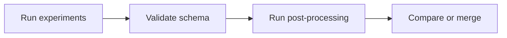

# Add Your Results

Contribute new experiments to the shared OGAL benchmark.

!!! abstract "What you can add"
    - New AL strategies
    - New datasets
    - New learner models
    - Extended hyperparameter grids

---

## Quick Overview



---

## Run Identity (Primary Key)

Each experiment is uniquely identified by:

```
(EXP_DATASET, EXP_STRATEGY, EXP_LEARNER_MODEL, EXP_BATCH_SIZE, 
 EXP_START_POINT, EXP_TRAIN_TEST_BUCKET_SIZE, EXP_RANDOM_SEED)
```

Plus a unique `EXP_UNIQUE_ID` integer assigned during workload creation.

---

## 1. Run Your Experiments

```bash
# Create workload with your configuration
python 01_create_workload.py --EXP_TITLE my_new_experiment

# Run experiments (local or HPC)
python 02_run_experiment.py --EXP_TITLE my_new_experiment --WORKER_INDEX 0
# ... or submit to SLURM
```

For full pipeline details, see [Runbook](reference/runbook.md).

---

## 2. Validate Results Schema

```bash
export OGAL_OUTPUT=/path/to/results

# Check schema compliance
python scripts/validate_results_schema.py --results_path ${OGAL_OUTPUT}/my_new_experiment

# Check for duplicates against existing data
python scripts/validate_results_schema.py \
    --results_path ${OGAL_OUTPUT}/my_new_experiment \
    --compare_with ${OGAL_OUTPUT}/full_exp_jan
```

### Required Files

| File | Must Have |
|------|-----------|
| `05_done_workload.csv` | All identity fields + `EXP_UNIQUE_ID` |
| `<STRATEGY>/<DATASET>/accuracy.csv.xz` | `EXP_UNIQUE_ID` + cycle columns |
| `<STRATEGY>/<DATASET>/weighted_f1-score.csv.xz` | Same schema |

See [Results Schema](reference/results_schema.md) for complete field definitions.

---

## 3. Run Post-Processing

Generate derived metrics:

```bash
# Dataset categorizations
python 03_calculate_dataset_categorizations.py \
    --EXP_TITLE my_new_experiment \
    --SAMPLES_CATEGORIZER _ALL \
    --EVA_MODE local

# Advanced metrics (AUC, etc.)
python 04_calculate_advanced_metrics.py \
    --EXP_TITLE my_new_experiment \
    --COMPUTED_METRICS _ALL \
    --EVA_MODE local
```

---

## 4. Compare or Merge

### Option A: Keep Separate (Recommended)

```bash
python -m eva_scripts.final_leaderboard --EXP_TITLE full_exp_jan
python -m eva_scripts.final_leaderboard --EXP_TITLE my_new_experiment
```

### Option B: Merge Workloads

!!! warning "Back up first"
    Always back up existing data before merging.

```bash
python -m scripts.merge_two_workloads \
    --EXP_TITLE full_exp_jan \
    --SECOND_MERGE_PATH ${OGAL_OUTPUT}/my_new_experiment
```

---

## Worked Example: Adding a New Strategy

### 1. Add to Enum

In [`resources/data_types.py`](https://github.com/jgonsior/olympic-games-of-active-learning/blob/main/resources/data_types.py):

```python
class AL_STRATEGY(IntEnum):
    # ... existing strategies ...
    MY_NEW_STRATEGY = 100  # Choose an unused ID (check max existing ID first)
```

!!! tip "Finding an unused ID"
    Check the current maximum: `max(s.value for s in AL_STRATEGY)`

### 2. Add Strategy Mapping

```python
al_strategy_to_python_classes_mapping[AL_STRATEGY.MY_NEW_STRATEGY] = (
    MyStrategyClass,
    {"param": "value"}  # Default parameters
)
```

### 3. Use in Experiment

```yaml
# resources/exp_config.yaml
my_experiment:
  EXP_GRID_STRATEGY:
    - ALIPY_RANDOM
    - MY_NEW_STRATEGY
```

### 4. Run and Validate

```bash
python 01_create_workload.py --EXP_TITLE my_experiment
python 02_run_experiment.py --EXP_TITLE my_experiment --WORKER_INDEX 0
python scripts/validate_results_schema.py --results_path ${OGAL_OUTPUT}/my_experiment
```
