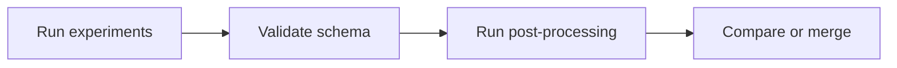

# Add Your Results

Contribute new experiments to the shared OGAL benchmark.

!!! abstract "What you can add"
    - New AL strategies
    - New datasets
    - New learner models
    - Extended hyperparameter grids

---

## Quick Overview



---

## 1. Run Your Experiments

Follow the standard pipeline:

```bash
# Create workload with your configuration
python 01_create_workload.py --EXP_TITLE my_new_experiment

# Run experiments (local or HPC)
python 02_run_experiment.py --EXP_TITLE my_new_experiment --WORKER_INDEX 0
# ... or submit to SLURM
```

For full pipeline details, see [Runbook](reference/runbook.md).

---

## 2. Validate Results Schema

Before sharing or merging, validate your results:

```bash
# Define OGAL_OUTPUT (or use your configured OUTPUT_PATH)
export OGAL_OUTPUT=/path/to/results

# Check schema compliance
python scripts/validate_results_schema.py --results_path ${OGAL_OUTPUT}/my_new_experiment

# Check for duplicates against existing data
python scripts/validate_results_schema.py \
    --results_path ${OGAL_OUTPUT}/my_new_experiment \
    --compare_with ${OGAL_OUTPUT}/full_exp_jan
```

!!! tip "Sanity check"
    If validation fails with "missing columns", see [Results Schema](reference/results_schema.md) for required fields.

### Required Files

| File | Must Have |
|------|-----------|
| `05_done_workload.csv` | All identity fields + `EXP_UNIQUE_ID` |
| `<STRATEGY>/<DATASET>/accuracy.csv.xz` | `EXP_UNIQUE_ID` + cycle columns |
| `<STRATEGY>/<DATASET>/weighted_f1-score.csv.xz` | Same schema |

---

## 3. Run Post-Processing

Generate derived metrics:

```bash
# Dataset categorizations
python 03_calculate_dataset_categorizations.py \
    --EXP_TITLE my_new_experiment \
    --SAMPLES_CATEGORIZER _ALL \
    --EVA_MODE local

# Advanced metrics (AUC, etc.)
python 04_calculate_advanced_metrics.py \
    --EXP_TITLE my_new_experiment \
    --COMPUTED_METRICS _ALL \
    --EVA_MODE local
```

---

## 4. Compare or Merge

### Option A: Keep Separate (Recommended)

Run evaluation scripts independently and compare:

```bash
python -m eva_scripts.final_leaderboard --EXP_TITLE full_exp_jan
python -m eva_scripts.final_leaderboard --EXP_TITLE my_new_experiment
```

### Option B: Merge Workloads

!!! warning "Back up first"
    Always back up existing data before merging.

```bash
python -m scripts.merge_two_workloads \
    --EXP_TITLE full_exp_jan \
    --SECOND_MERGE_PATH ${OGAL_OUTPUT}/my_new_experiment
```

!!! tip "Sanity check"
    After merging, verify `05_done_workload.csv` contains entries from both experiments.

---

## Adding New Strategies/Datasets

For extending OGAL with new components:

| To Add | See |
|--------|-----|
| New AL strategy | [Research Reuse Guide](reference/research_reuse.md#adding-a-new-al-strategy) |
| New dataset | [Research Reuse Guide](reference/research_reuse.md#adding-a-new-dataset) |
| New learner model | [Research Reuse Guide](reference/research_reuse.md#adding-a-new-learner-model) |
| New metric | [Research Reuse Guide](reference/research_reuse.md#adding-a-new-metric) |

---

## Run Identity (Primary Key)

Each experiment is uniquely identified by:

```
(EXP_DATASET, EXP_STRATEGY, EXP_LEARNER_MODEL, EXP_BATCH_SIZE, 
 EXP_START_POINT, EXP_TRAIN_TEST_BUCKET_SIZE, EXP_RANDOM_SEED)
```

Plus a unique `EXP_UNIQUE_ID` integer.

---

## Detailed Protocol

For the complete data enrichment protocol including provenance tracking and troubleshooting, see [Data Enrichment Reference](reference/data_enrichment.md).
