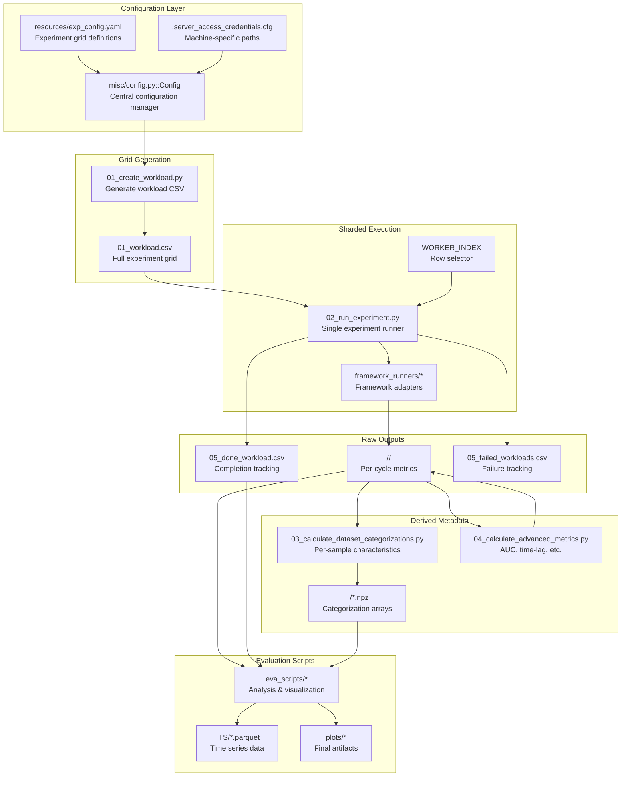

# Architecture Overview

This document explains OGAL's internal architecture, design rationale, and the key abstractions that enable large-scale Active Learning benchmarking.

---

## Design Goals

OGAL is architected around five primary goals:

| Goal | Description | Key Mechanism |
|------|-------------|---------------|
| **HPC Parallelism** | Run millions of experiments across cluster nodes | Workload sharding via `WORKER_INDEX` |
| **Resumability** | Continue interrupted experiments without re-running completed work | Completion tracking files (`05_done_workload.csv`, `05_failed_workloads.csv`) |
| **Reproducibility** | Same inputs always produce same outputs | Fixed random seeds, deterministic grid generation, saved configs |
| **Shared Dataset Enrichment** | Add new results to existing datasets safely | Schema contracts, validation, provenance tracking |
| **Unified API** | Single interface across AL frameworks | Framework adapters with consistent protocol |

(source: design rationale inferred from `misc/config.py::Config`, `01_create_workload.py`, `framework_runners/base_runner.py::AL_Experiment`)

---

## System Architecture Diagram



---

## Core Abstractions

### 1. Configuration Manager

The `Config` class is the central configuration spine that governs all data flow.

**Source:** `misc/config.py::Config`

**Key responsibilities:**
- Load configuration from multiple sources (CLI, INI, YAML)
- Resolve paths based on `RUNNING_ENVIRONMENT` (local vs HPC)
- Load workload row when `WORKER_INDEX` is provided
- Save experiment configuration for reproducibility

**Configuration loading order (highest priority first):**
1. CLI arguments
2. Server credentials (`.server_access_credentials.cfg`)
3. Experiment YAML (`resources/exp_config.yaml[EXP_TITLE]`)
4. Workload row (when `WORKER_INDEX` provided)
5. Default values

(source: [`misc/config.py::Config.__init__`](https://github.com/jgonsior/olympic-games-of-active-learning/blob/main/misc/config.py#L171-L176), lines 171-176; `misc/config.py::Config._setup_everything`, lines 182-202)

### 2. Workload/Grid Generation

The workload system converts a hyperparameter grid into a shardable CSV.

**Source:** `01_create_workload.py::_generate_exp_param_grid`

**Process:**
1. Read `EXP_GRID_*` parameters from config
2. Generate Cartesian product via `sklearn.model_selection.ParameterGrid`
3. Shuffle rows (distribute long-running jobs across workers)
4. Assign unique `EXP_UNIQUE_ID` to each row
5. Filter incompatible combinations (binary-only strategies, decision boundary models)
6. Write to `01_workload.csv`

(source: [`01_create_workload.py::_generate_exp_param_grid`](https://github.com/jgonsior/olympic-games-of-active-learning/blob/main/01_create_workload.py#L40-L98), lines 40-98)

**Workload columns:**
- `EXP_UNIQUE_ID`: Integer primary key (row index after shuffle)
- `EXP_DATASET`: Dataset enum value
- `EXP_STRATEGY`: Strategy enum value
- `EXP_LEARNER_MODEL`: Learner model enum value
- `EXP_BATCH_SIZE`: Query batch size
- `EXP_RANDOM_SEED`: Random seed
- `EXP_START_POINT`: Initial labeled set index
- `EXP_TRAIN_TEST_BUCKET_SIZE`: Train/test split bucket
- `EXP_NUM_QUERIES`: Number of AL cycles

### 3. Sharded Execution

Each worker processes a single row from the workload CSV.

**Source:** [`02_run_experiment.py`](https://github.com/jgonsior/olympic-games-of-active-learning/blob/main/02_run_experiment.py), `misc/config.py::Config.load_workload`

**Mechanism:**
1. `WORKER_INDEX` selects row from `01_workload.csv`
2. Config loads that row's hyperparameters
3. Appropriate framework adapter is instantiated
4. AL loop executes with per-cycle metric recording
5. Results written to `<STRATEGY>/<DATASET>/`
6. Row appended to `05_done_workload.csv` on success

```python
# From misc/config.py::Config.load_workload (lines 393-422)
workload_df = pd.read_csv(
    self.WORKLOAD_FILE_PATH,
    header=0,
    index_col=None,
    skiprows=lambda x: x not in [0, self.WORKER_INDEX + 1],
)
workload = workload_df.iloc[0].to_dict()
# ... load hyperparameters as config attributes
```

**HPC Integration:**
- SLURM job arrays: Each array index = `WORKER_INDEX`
- `SLURM_ITERATIONS_PER_BATCH`: Multiple experiments per job
- Generated via `create_AL_experiment_slurm_files()` (source: [`01_create_workload.py`](https://github.com/jgonsior/olympic-games-of-active-learning/blob/main/01_create_workload.py#L321-L348), lines 321-348)

### 4. Framework Adapters

Each AL framework has an adapter that implements the unified experiment interface.

**Base class:** `framework_runners/base_runner.py::AL_Experiment`

| Adapter | Source | Framework |
|---------|--------|-----------|
| `ALIPY_AL_Experiment` | [`framework_runners/alipy_runner.py`](https://github.com/jgonsior/olympic-games-of-active-learning/blob/main/framework_runners/alipy_runner.py) | ALiPy |
| `LIBACT_Experiment` | [`framework_runners/libact_runner.py`](https://github.com/jgonsior/olympic-games-of-active-learning/blob/main/framework_runners/libact_runner.py) | libact |
| `SMALLTEXT_AL_Experiment` | [`framework_runners/smalltext_runner.py`](https://github.com/jgonsior/olympic-games-of-active-learning/blob/main/framework_runners/smalltext_runner.py) | small-text |
| `SKACTIVEML_AL_Experiment` | [`framework_runners/skactiveml_runner.py`](https://github.com/jgonsior/olympic-games-of-active-learning/blob/main/framework_runners/skactiveml_runner.py) | scikit-activeml |
| `PLAYGROUND_AL_Experiment` | [`framework_runners/playground_runner.py`](https://github.com/jgonsior/olympic-games-of-active-learning/blob/main/framework_runners/playground_runner.py) | Google Playground |
| `OPTIMAL_AL_Experiment` | [`framework_runners/optimal_runner.py`](https://github.com/jgonsior/olympic-games-of-active-learning/blob/main/framework_runners/optimal_runner.py) | Oracle strategies |

**Unified AL Loop (from `base_runner.py`):**
```python
# Source: framework_runners/base_runner.py::AL_Experiment (conceptual flow)
1. Load dataset and create train/test splits
2. Initialize the learner model
3. For each iteration:
    a. Run metric pre-hooks
    b. Query the AL strategy for samples to label
    c. Run metric post-hooks
    d. Retrain the model with new labels
    e. Record metrics
4. Save all metrics to CSV files
```

(source: [`framework_runners/base_runner.py`](https://github.com/jgonsior/olympic-games-of-active-learning/blob/main/framework_runners/base_runner.py), docstring lines 1-22)

### 5. Result Writing & Schema

Metrics are recorded per AL cycle and saved to compressed CSV files.

**Source:** `metrics/base_metric.py::Base_Metric`

**Output structure:**
```
OUTPUT_PATH/<EXP_TITLE>/
├── <STRATEGY_NAME>/
│   └── <DATASET_NAME>/
│       ├── accuracy.csv.xz
│       ├── weighted_f1-score.csv.xz
│       ├── selected_indices.csv.xz
│       ├── query_selection_time.csv.xz
│       └── ...
```

**Per-cycle metric schema:**
```
EXP_UNIQUE_ID, 0, 1, 2, 3, ..., N
12345, 0.72, 0.78, 0.82, 0.85, ..., 0.95
```

Where columns 0-N are AL cycle indices and values are metric measurements.

(source: [`metrics/base_metric.py::Base_Metric.save_metrics`](https://github.com/jgonsior/olympic-games-of-active-learning/blob/main/metrics/base_metric.py))

### 6. Post-Processing Stages

After raw experiments complete, derived metrics are computed:

| Stage | Script | Purpose | Output |
|-------|--------|---------|--------|
| 3 | [`03_calculate_dataset_categorizations.py`](https://github.com/jgonsior/olympic-games-of-active-learning/blob/main/03_calculate_dataset_categorizations.py) | Per-sample characteristics | `_<CATEGORIZER>/<DATASET>.npz` |
| 4 | [`04_calculate_advanced_metrics.py`](https://github.com/jgonsior/olympic-games-of-active-learning/blob/main/04_calculate_advanced_metrics.py) | AUC, time-lag, distance metrics | `full_auc_*.csv.xz`, etc. |
| 5 | [`05_analyze_partially_run_workload.py`](https://github.com/jgonsior/olympic-games-of-active-learning/blob/main/05_analyze_partially_run_workload.py) | Completion analysis | Statistics |

(source: [`03_calculate_dataset_categorizations.py`](https://github.com/jgonsior/olympic-games-of-active-learning/blob/main/03_calculate_dataset_categorizations.py), `04_calculate_advanced_metrics.py`)

### 7. Eva Scripts Integration

Evaluation scripts consume raw and derived outputs to produce final artifacts.

**Source:** [`eva_scripts/`](https://github.com/jgonsior/olympic-games-of-active-learning/blob/main/eva_scripts)

**Key integration points:**
- Read `05_done_workload.csv` to identify completed experiments
- Read per-cycle metrics from `<STRATEGY>/<DATASET>/`
- Create time series parquets in `_TS/`
- Generate plots in [`plots/`](https://github.com/jgonsior/olympic-games-of-active-learning/blob/main/plots)

(source: [`eva_scripts/*.py`](https://github.com/jgonsior/olympic-games-of-active-learning/blob/main/eva_scripts/*.py), `misc/helpers.py::create_fingerprint_joined_timeseries_csv_files`)

---

## Failure Recovery & Idempotency

OGAL is designed for safe resumption of interrupted experiments.

### Completion Indicators

| File | Purpose | Source |
|------|---------|--------|
| `05_done_workload.csv` | Successfully completed experiments | `framework_runners/base_runner.py::AL_Experiment.run_experiment` |
| `05_failed_workloads.csv` | Experiments that raised exceptions | `framework_runners/base_runner.py::AL_Experiment.run_experiment` |
| `05_started_oom_workloads.csv` | Experiments presumed killed by OOM | `framework_runners/base_runner.py::AL_Experiment.run_experiment` |

(source: [`misc/config.py`](https://github.com/jgonsior/olympic-games-of-active-learning/blob/main/misc/config.py#L123-L125), lines 123-125; `framework_runners/base_runner.py`)

### OOM Detection Mechanism

Before each experiment starts:
1. Row is written to `05_started_oom_workloads.csv`
2. Experiment runs
3. On success: Row removed from OOM file, added to done file
4. If process is killed (OOM), row remains in OOM file

(source: [`framework_runners/base_runner.py::AL_Experiment.run_experiment`](https://github.com/jgonsior/olympic-games-of-active-learning/blob/main/framework_runners/base_runner.py), conceptual flow based on file operations)

### Resume Logic

When [`01_create_workload.py`](https://github.com/jgonsior/olympic-games-of-active-learning/blob/main/01_create_workload.py) is re-run on an existing experiment:

```python
# From 01_create_workload.py::create_workload (lines 101-223)
1. Load existing 05_done_workload.csv
2. Load existing 05_failed_workloads.csv
3. Load existing 05_started_oom_workloads.csv
4. Remove completed/failed/OOM rows from new workload
5. Write remaining work to 01_workload.csv
```

This ensures:
- Completed experiments are never re-run
- Failed experiments are excluded (unless `RERUN_FAILED_WORKLOADS=True`)
- OOM experiments are excluded

(source: [`01_create_workload.py::create_workload`](https://github.com/jgonsior/olympic-games-of-active-learning/blob/main/01_create_workload.py#L101-L223), lines 101-223)

### Idempotency Guarantees

| Operation | Idempotent? | Mechanism |
|-----------|-------------|-----------|
| Workload generation | Yes | Filtered by completion files |
| Experiment execution | Yes | Checked against done files |
| Metric file writing | Configurable | `OVERWRITE_EXISTING_METRIC_FILES` flag |
| Dataset categorization | Yes | Checks `samples_categorization_path.exists()` |

(source: [`misc/config.py::Config.OVERWRITE_EXISTING_METRIC_FILES`](https://github.com/jgonsior/olympic-games-of-active-learning/blob/main/misc/config.py); `metrics/computed/base_samples_categorizer.py::Base_Samples_Categorizer.categorize_samples`, lines 48-58)

---

## Performance Optimizations

### Grid Shuffling

Workload rows are shuffled before assignment to distribute:
- Long-running strategies across workers
- Large datasets across time
- Resource-intensive experiments evenly

```python
# From 01_create_workload.py::_generate_exp_param_grid (line 94)
open_workload_df = open_workload_df.sample(frac=1).reset_index(drop=True)
```

(source: [`01_create_workload.py::_generate_exp_param_grid`](https://github.com/jgonsior/olympic-games-of-active-learning/blob/main/01_create_workload.py#L94), line 94)

### Enum-Based IDs

All categorical values use integer enums instead of strings:
- Faster joins and comparisons
- Stable across code refactoring
- Smaller file sizes
- No string drift issues

(source: [`resources/data_types.py::AL_STRATEGY`](https://github.com/jgonsior/olympic-games-of-active-learning/blob/main/resources/data_types.py), `DATASET`, `LEARNER_MODEL`)

### Compression

Metric files are compressed with xz:
- Significant space savings for large experiments
- Transparent to pandas read operations

(source: [`metrics/base_metric.py::Base_Metric.save_metrics`](https://github.com/jgonsior/olympic-games-of-active-learning/blob/main/metrics/base_metric.py))

### Lazy Loading

Time series parquets are created on-demand:
- Initial creation via `create_fingerprint_joined_timeseries_csv_files()`
- Subsequent reads from cached parquet files

(source: [`misc/helpers.py::create_fingerprint_joined_timeseries_csv_files`](https://github.com/jgonsior/olympic-games-of-active-learning/blob/main/misc/helpers.py))

---

## Cross-References

- **[Configuration](configuration.md)**: Detailed config file reference
- **[Data Model](data_model.md)**: Schema definitions and field meanings
- **[Dataset Metadata](dataset_metadata.md)**: Auto-computed categorizations
- **[Eva Scripts](eva_scripts.md)**: Evaluation script catalog
- **[HPC Setup](hpc.md)**: SLURM job configuration
