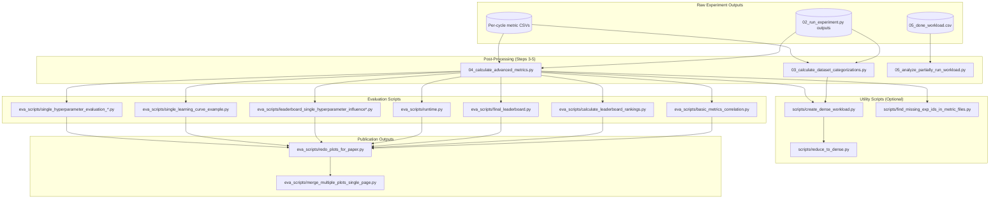

# Evaluation Pipeline

This document provides a canonical step-by-step guide from raw experiment outputs to final plots/tables. This is the authoritative reference for reproducing and interpreting analysis results.

!!! tip "Related Documentation"
    - **[Eva Scripts Reference](eva_scripts.md)**: Detailed catalog of all evaluation scripts with I/O schemas
    - **[Data Enrichment](data_enrichment.md)**: Protocol for adding new results to the shared dataset
    - **[Results Format](results_format.md)**: Output paths, file formats, and schemas

## Pipeline Overview

The evaluation pipeline transforms raw experiment results into interpretable outputs:



---

## Prerequisites: Raw Experiment Results

Before running evaluation, ensure the main pipeline (Steps 0-2) has completed:

| Prerequisite | Path | Verification |
|--------------|------|--------------|
| Completed experiments | `OUTPUT_PATH/<EXP_TITLE>/05_done_workload.csv` | `wc -l` shows expected count |
| Per-cycle metrics | `OUTPUT_PATH/<EXP_TITLE>/<STRATEGY>/<DATASET>/*.csv` | Files exist for all combinations |
| Configuration | `OUTPUT_PATH/<EXP_TITLE>/00_config.yaml` | YAML loads without errors |

---

## Step 1: Dataset Categorizations

**Script:** [`03_calculate_dataset_categorizations.py`](https://github.com/jgonsior/olympic-games-of-active-learning/blob/main/03_calculate_dataset_categorizations.py)  
(source: [`03_calculate_dataset_categorizations.py`](https://github.com/jgonsior/olympic-games-of-active-learning/blob/main/03_calculate_dataset_categorizations.py))

### Purpose

Computes per-sample characteristics that enable analysis of which sample types benefit from different AL strategies. These are computed once per dataset, independent of strategy.

### Execution

```bash
# Create workload for HPC execution
python 03_calculate_dataset_categorizations.py \
    --EXP_TITLE your_experiment \
    --SAMPLES_CATEGORIZER _ALL \
    --EVA_MODE create

# Run locally (small experiments)
python 03_calculate_dataset_categorizations.py \
    --EXP_TITLE your_experiment \
    --SAMPLES_CATEGORIZER _ALL \
    --EVA_MODE local
```

### Required Inputs

| Input | Path | Source |
|-------|------|--------|
| Experiment results | `OUTPUT_PATH/<EXP_TITLE>/<STRATEGY>/<DATASET>/*.csv` | From [`02_run_experiment.py`](https://github.com/jgonsior/olympic-games-of-active-learning/blob/main/02_run_experiment.py) |
| Dataset files | `DATASETS_PATH/<dataset>.csv` | From [`00_download_datasets.py`](https://github.com/jgonsior/olympic-games-of-active-learning/blob/main/00_download_datasets.py) |

### Outputs Produced

| Output | Path | Format |
|--------|------|--------|
| Workload definition | `OUTPUT_PATH/<EXP_TITLE>/workloads/DATASET_CATEGORIZATIONS/01_open.csv` | CSV |
| Categorization results | `OUTPUT_PATH/<EXP_TITLE>/<STRATEGY>/<DATASET>/<CATEGORIZER>.csv.xz` | Compressed CSV |

### Available Categorizers

(source: [`resources/data_types.py::SAMPLES_CATEGORIZER`](https://github.com/jgonsior/olympic-games-of-active-learning/blob/main/resources/data_types.py))

| Categorizer | Description |
|-------------|-------------|
| `COUNT_WRONG_CLASSIFICATIONS` | How often each sample is misclassified across experiments |
| `SWITCHES_CLASS_OFTEN` | Prediction instability metric |
| `CLOSENESS_TO_DECISION_BOUNDARY` | Distance to model decision boundary |
| `REGION_DENSITY` | Local density of samples in feature space |
| `MELTING_POT_REGION` | Mixed-class neighborhood indicator |
| `OUTLIERNESS` | Outlier score per sample |
| `AVERAGE_UNCERTAINTY` | Average model uncertainty for sample |

---

## Step 2: Advanced Metrics

**Script:** [`04_calculate_advanced_metrics.py`](https://github.com/jgonsior/olympic-games-of-active-learning/blob/main/04_calculate_advanced_metrics.py)  
(source: [`04_calculate_advanced_metrics.py`](https://github.com/jgonsior/olympic-games-of-active-learning/blob/main/04_calculate_advanced_metrics.py))

### Purpose

Computes derived metrics from raw per-cycle results, including AUC-based aggregations, time-lag analysis, and distance metrics.

### Execution

```bash
# Create workload for HPC execution
python 04_calculate_advanced_metrics.py \
    --EXP_TITLE your_experiment \
    --COMPUTED_METRICS _ALL \
    --EVA_MODE create

# Run locally (small experiments)
python 04_calculate_advanced_metrics.py \
    --EXP_TITLE your_experiment \
    --COMPUTED_METRICS _ALL \
    --EVA_MODE local
```

### Required Inputs

| Input | Path | Source |
|-------|------|--------|
| Per-cycle metrics | `OUTPUT_PATH/<EXP_TITLE>/<STRATEGY>/<DATASET>/*.csv` | From [`02_run_experiment.py`](https://github.com/jgonsior/olympic-games-of-active-learning/blob/main/02_run_experiment.py) |
| Dataset categorizations | `OUTPUT_PATH/<EXP_TITLE>/<STRATEGY>/<DATASET>/<CATEGORIZER>.csv.xz` | From Step 1 |

### Outputs Produced

| Output | Path | Format |
|--------|------|--------|
| Workload definition | `OUTPUT_PATH/<EXP_TITLE>/workloads/advanced_metrics/01_open.csv` | CSV |
| AUC metrics | `OUTPUT_PATH/<EXP_TITLE>/<STRATEGY>/<DATASET>/full_auc_*.csv.xz` | Compressed CSV |
| First-5 average | `OUTPUT_PATH/<EXP_TITLE>/<STRATEGY>/<DATASET>/first_5_*.csv.xz` | Compressed CSV |
| Last-5 average | `OUTPUT_PATH/<EXP_TITLE>/<STRATEGY>/<DATASET>/last_5_*.csv.xz` | Compressed CSV |
| Final value | `OUTPUT_PATH/<EXP_TITLE>/<STRATEGY>/<DATASET>/final_value_*.csv.xz` | Compressed CSV |
| Ramp-up AUC | `OUTPUT_PATH/<EXP_TITLE>/<STRATEGY>/<DATASET>/ramp_up_auc_*.csv.xz` | Compressed CSV |
| Plateau AUC | `OUTPUT_PATH/<EXP_TITLE>/<STRATEGY>/<DATASET>/plateau_auc_*.csv.xz` | Compressed CSV |
| Time-lag metrics | `OUTPUT_PATH/<EXP_TITLE>/<STRATEGY>/<DATASET>/*_time_lag.csv.xz` | Compressed CSV |
| Distance metrics | `OUTPUT_PATH/<EXP_TITLE>/<STRATEGY>/<DATASET>/avg_dist_*.csv.xz` | Compressed CSV |

### Available Computed Metrics

(source: [`resources/data_types.py::COMPUTED_METRIC`](https://github.com/jgonsior/olympic-games-of-active-learning/blob/main/resources/data_types.py))

| Metric | Description |
|--------|-------------|
| `STANDARD_AUC` | Area under full learning curve (must run last) |
| `DISTANCE_METRICS` | Pairwise distance analysis between samples |
| `MISMATCH_TRAIN_TEST` | Train/test distribution divergence |
| `CLASS_DISTRIBUTIONS` | Class balance analysis |
| `METRIC_DROP` | Performance degradation points |
| `TIMELAG_METRIC` | Time-lag correlation analysis |

---

## Step 3: Analysis of Partial Results

**Script:** [`05_analyze_partially_run_workload.py`](https://github.com/jgonsior/olympic-games-of-active-learning/blob/main/05_analyze_partially_run_workload.py)  
(source: [`05_analyze_partially_run_workload.py`](https://github.com/jgonsior/olympic-games-of-active-learning/blob/main/05_analyze_partially_run_workload.py))

### Purpose

Analyzes experiment completion status, timing statistics, and identifies patterns in success/failure rates.

### Execution

```bash
python 05_analyze_partially_run_workload.py --EXP_TITLE your_experiment
```

### Required Inputs

| Input | Path | Source |
|-------|------|--------|
| Completed workload | `OUTPUT_PATH/<EXP_TITLE>/05_done_workload.csv` | From [`02_run_experiment.py`](https://github.com/jgonsior/olympic-games-of-active-learning/blob/main/02_run_experiment.py) |
| Failed workload | `OUTPUT_PATH/<EXP_TITLE>/05_failed_workloads.csv` | From [`02_run_experiment.py`](https://github.com/jgonsior/olympic-games-of-active-learning/blob/main/02_run_experiment.py) |
| Timing data | `OUTPUT_PATH/<EXP_TITLE>/<STRATEGY>/<DATASET>/query_selection_time.csv` | From [`02_run_experiment.py`](https://github.com/jgonsior/olympic-games-of-active-learning/blob/main/02_run_experiment.py) |

### Outputs Produced

Analysis statistics printed to console. Use this to verify experiment completion before proceeding.

---

## Step 4: Data Validation and Cleanup (Optional)

Before running evaluation scripts, validate data integrity.

### Find Missing Experiment IDs

```bash
python -m scripts.find_missing_exp_ids_in_metric_files --EXP_TITLE your_experiment
```

**Output:** `OUTPUT_PATH/<EXP_TITLE>/07_missing_exp_ids.csv`

(source: [`scripts/find_missing_exp_ids_in_metric_files.py`](https://github.com/jgonsior/olympic-games-of-active-learning/blob/main/scripts/find_missing_exp_ids_in_metric_files.py))

### Create Dense Workload

For large experiments, create a subset with complete hyperparameter coverage:

```bash
python -m scripts.create_dense_workload --EXP_TITLE your_experiment
```

**Output:** `OUTPUT_PATH/<EXP_TITLE>/06_dense_workload.csv`

(source: [`scripts/create_dense_workload.py`](https://github.com/jgonsior/olympic-games-of-active-learning/blob/main/scripts/create_dense_workload.py))

### Reduce Files to Dense Subset

```bash
python -m scripts.reduce_to_dense --EXP_TITLE your_experiment
```

(source: [`scripts/reduce_to_dense.py`](https://github.com/jgonsior/olympic-games-of-active-learning/blob/main/scripts/reduce_to_dense.py))

---

## Step 5: Evaluation Scripts

These scripts generate the analyses for the research paper.

### 5.1 Basic Metrics Correlation

**Script:** [`eva_scripts/basic_metrics_correlation.py`](https://github.com/jgonsior/olympic-games-of-active-learning/blob/main/eva_scripts/basic_metrics_correlation.py)

```bash
python -m eva_scripts.basic_metrics_correlation --EXP_TITLE your_experiment
```

**Required Inputs:**

- `OUTPUT_PATH/<EXP_TITLE>/<STRATEGY>/<DATASET>/accuracy.csv`
- `OUTPUT_PATH/<EXP_TITLE>/<STRATEGY>/<DATASET>/weighted_f1-score.csv`
- Other standard metric files

**Outputs:**

| Output | Path |
|--------|------|
| Correlation matrix | `OUTPUT_PATH/<EXP_TITLE>/plots/basic_metrics/Standard Metrics.parquet` |

(source: [`eva_scripts/basic_metrics_correlation.py`](https://github.com/jgonsior/olympic-games-of-active-learning/blob/main/eva_scripts/basic_metrics_correlation.py#L26-L45), lines 26-45)

### 5.2 Leaderboard Rankings

**Script:** [`eva_scripts/calculate_leaderboard_rankings.py`](https://github.com/jgonsior/olympic-games-of-active-learning/blob/main/eva_scripts/calculate_leaderboard_rankings.py)

```bash
python -m eva_scripts.calculate_leaderboard_rankings --EXP_TITLE your_experiment
```

**Outputs:**

| Output | Path |
|--------|------|
| Leaderboard data | `OUTPUT_PATH/<EXP_TITLE>/plots/final_leaderboard/*.parquet` |

### 5.3 Final Leaderboard

**Script:** [`eva_scripts/final_leaderboard.py`](https://github.com/jgonsior/olympic-games-of-active-learning/blob/main/eva_scripts/final_leaderboard.py)

```bash
python -m eva_scripts.final_leaderboard --EXP_TITLE your_experiment
```

**Required Inputs:**

- Time series correlation files in `OUTPUT_PATH/<EXP_TITLE>/_TS/`
- AUC metrics from Step 2

**Outputs:**

| Output | Path |
|--------|------|
| Rank heatmap data | `OUTPUT_PATH/<EXP_TITLE>/plots/final_leaderboard/rank_sparse_zero_full_auc_weighted_f1-score.parquet` |

(source: [`eva_scripts/final_leaderboard.py`](https://github.com/jgonsior/olympic-games-of-active-learning/blob/main/eva_scripts/final_leaderboard.py#L34-L71), lines 34-71)

### 5.4 Runtime Analysis

**Script:** [`eva_scripts/runtime.py`](https://github.com/jgonsior/olympic-games-of-active-learning/blob/main/eva_scripts/runtime.py)

```bash
# Create workload for HPC execution
python 03_calculate_dataset_categorizations.py \
    --EXP_TITLE your_experiment \
    --SAMPLES_CATEGORIZER _ALL \
    --EVA_MODE create

# Run locally (small experiments)
python 03_calculate_dataset_categorizations.py \
    --EXP_TITLE your_experiment \
    --SAMPLES_CATEGORIZER _ALL \
    --EVA_MODE local
```000000

**Required Inputs:**

- `OUTPUT_PATH/<EXP_TITLE>/<STRATEGY>/<DATASET>/query_selection_time.csv`

**Outputs:**

| Output | Path |
|--------|------|
| Runtime data | `OUTPUT_PATH/<EXP_TITLE>/plots/runtime/query_selection_time.parquet` |

### 5.5 AUC Metric Correlation

**Script:** [`eva_scripts/auc_metric_correlation.py`](https://github.com/jgonsior/olympic-games-of-active-learning/blob/main/eva_scripts/auc_metric_correlation.py)

```bash
# Create workload for HPC execution
python 03_calculate_dataset_categorizations.py \
    --EXP_TITLE your_experiment \
    --SAMPLES_CATEGORIZER _ALL \
    --EVA_MODE create

# Run locally (small experiments)
python 03_calculate_dataset_categorizations.py \
    --EXP_TITLE your_experiment \
    --SAMPLES_CATEGORIZER _ALL \
    --EVA_MODE local
```111111

**Required Inputs:**

- AUC metrics from Step 2 (`full_auc_*.csv.xz` files)

**Outputs:**

| Output | Path |
|--------|------|
| AUC correlation matrix | `OUTPUT_PATH/<EXP_TITLE>/plots/AUC/auc_weighted_f1-score.parquet` |

### 5.6 Hyperparameter Influence Analysis

**Scripts:**  
- [`eva_scripts/leaderboard_single_hyperparameter_influence.py`](https://github.com/jgonsior/olympic-games-of-active-learning/blob/main/eva_scripts/leaderboard_single_hyperparameter_influence.py)  
- [`eva_scripts/leaderboard_single_hyperparameter_influence_analyze.py`](https://github.com/jgonsior/olympic-games-of-active-learning/blob/main/eva_scripts/leaderboard_single_hyperparameter_influence_analyze.py)

```bash
# Create workload for HPC execution
python 03_calculate_dataset_categorizations.py \
    --EXP_TITLE your_experiment \
    --SAMPLES_CATEGORIZER _ALL \
    --EVA_MODE create

# Run locally (small experiments)
python 03_calculate_dataset_categorizations.py \
    --EXP_TITLE your_experiment \
    --SAMPLES_CATEGORIZER _ALL \
    --EVA_MODE local
```222222

**Outputs:**

| Output | Path |
|--------|------|
| Kendall τ heatmaps | `OUTPUT_PATH/<EXP_TITLE>/plots/leaderboard_single_hyperparameter_influence/*_kendall.parquet` |

### 5.7 Single Hyperparameter Evaluation

**Scripts:**  
- [`eva_scripts/single_hyperparameter_evaluation_metric.py`](https://github.com/jgonsior/olympic-games-of-active-learning/blob/main/eva_scripts/single_hyperparameter_evaluation_metric.py) (metric-based heatmaps)  
- [`eva_scripts/single_hyperparameter_evaluation_indices.py`](https://github.com/jgonsior/olympic-games-of-active-learning/blob/main/eva_scripts/single_hyperparameter_evaluation_indices.py) (queried samples heatmaps)

```bash
# Create workload for HPC execution
python 03_calculate_dataset_categorizations.py \
    --EXP_TITLE your_experiment \
    --SAMPLES_CATEGORIZER _ALL \
    --EVA_MODE create

# Run locally (small experiments)
python 03_calculate_dataset_categorizations.py \
    --EXP_TITLE your_experiment \
    --SAMPLES_CATEGORIZER _ALL \
    --EVA_MODE local
```333333

**Outputs:**

| Output | Path |
|--------|------|
| Metric heatmaps | `OUTPUT_PATH/<EXP_TITLE>/plots/single_hyperparameter/*/single_hyper_*.parquet` |
| Indices heatmaps | `OUTPUT_PATH/<EXP_TITLE>/plots/single_hyperparameter/*/single_indice_*.parquet` |

### 5.7 Learning Curve Examples

**Script:** [`eva_scripts/single_learning_curve_example.py`](https://github.com/jgonsior/olympic-games-of-active-learning/blob/main/eva_scripts/single_learning_curve_example.py)

```bash
# Create workload for HPC execution
python 03_calculate_dataset_categorizations.py \
    --EXP_TITLE your_experiment \
    --SAMPLES_CATEGORIZER _ALL \
    --EVA_MODE create

# Run locally (small experiments)
python 03_calculate_dataset_categorizations.py \
    --EXP_TITLE your_experiment \
    --SAMPLES_CATEGORIZER _ALL \
    --EVA_MODE local
```444444

**Outputs:**

| Output | Path |
|--------|------|
| Exemplary curve | `OUTPUT_PATH/<EXP_TITLE>/plots/single_learning_curve/single_exemplary_learning_curve.parquet` |

(source: [`eva_scripts/single_learning_curve_example.py`](https://github.com/jgonsior/olympic-games-of-active-learning/blob/main/eva_scripts/single_learning_curve_example.py#L58-L65), lines 58-65)

---

## Step 6: Publication-Ready Plots

**Script:** [`eva_scripts/redo_plots_for_paper.py`](https://github.com/jgonsior/olympic-games-of-active-learning/blob/main/eva_scripts/redo_plots_for_paper.py)  
(source: [`eva_scripts/redo_plots_for_paper.py`](https://github.com/jgonsior/olympic-games-of-active-learning/blob/main/eva_scripts/redo_plots_for_paper.py))

This script reads intermediate Parquet files and generates publication-quality PDFs.

### Execution

```bash
# Create workload for HPC execution
python 03_calculate_dataset_categorizations.py \
    --EXP_TITLE your_experiment \
    --SAMPLES_CATEGORIZER _ALL \
    --EVA_MODE create

# Run locally (small experiments)
python 03_calculate_dataset_categorizations.py \
    --EXP_TITLE your_experiment \
    --SAMPLES_CATEGORIZER _ALL \
    --EVA_MODE local
```555555

### Required Inputs

The following Parquet files must exist from previous steps:

(source: [`eva_scripts/redo_plots_for_paper.py`](https://github.com/jgonsior/olympic-games-of-active-learning/blob/main/eva_scripts/redo_plots_for_paper.py#L35-L75), lines 35-75)

| Input File | Source Script |
|------------|---------------|
| `plots/runtime/query_selection_time.parquet` | [`eva_scripts/runtime.py`](https://github.com/jgonsior/olympic-games-of-active-learning/blob/main/eva_scripts/runtime.py) |
| `plots/basic_metrics/Standard Metrics.parquet` | [`eva_scripts/basic_metrics_correlation.py`](https://github.com/jgonsior/olympic-games-of-active-learning/blob/main/eva_scripts/basic_metrics_correlation.py) |
| `plots/AUC/auc_weighted_f1-score.parquet` | [`eva_scripts/auc_metric_correlation.py`](https://github.com/jgonsior/olympic-games-of-active-learning/blob/main/eva_scripts/auc_metric_correlation.py) |
| `plots/final_leaderboard/rank_*.parquet` | [`eva_scripts/final_leaderboard.py`](https://github.com/jgonsior/olympic-games-of-active-learning/blob/main/eva_scripts/final_leaderboard.py) |
| `plots/single_learning_curve/*.parquet` | [`eva_scripts/single_learning_curve_example.py`](https://github.com/jgonsior/olympic-games-of-active-learning/blob/main/eva_scripts/single_learning_curve_example.py) |
| `plots/single_hyperparameter/*/*.parquet` | `eva_scripts/single_hyperparameter_evaluation_*.py` |
| `plots/leaderboard_single_hyperparameter_influence/*.parquet` | [`eva_scripts/leaderboard_single_hyperparameter_influence_analyze.py`](https://github.com/jgonsior/olympic-games-of-active-learning/blob/main/eva_scripts/leaderboard_single_hyperparameter_influence_analyze.py) |

### Outputs

Publication-ready PDFs in `OUTPUT_PATH/<EXP_TITLE>/plots/` with same names as input Parquets.

---

## Step 7: Merge Multi-Plot Figures (Optional)

**Script:** [`eva_scripts/merge_multiple_plots_single_page.py`](https://github.com/jgonsior/olympic-games-of-active-learning/blob/main/eva_scripts/merge_multiple_plots_single_page.py)

```bash
# Create workload for HPC execution
python 03_calculate_dataset_categorizations.py \
    --EXP_TITLE your_experiment \
    --SAMPLES_CATEGORIZER _ALL \
    --EVA_MODE create

# Run locally (small experiments)
python 03_calculate_dataset_categorizations.py \
    --EXP_TITLE your_experiment \
    --SAMPLES_CATEGORIZER _ALL \
    --EVA_MODE local
```666666

Combines related heatmaps into single-page figures for the paper.

---

## Paper Artifact Mapping

This section maps paper figures/tables to the scripts and output files that produce them.

### Research Paper: arXiv:2506.03817

| Paper Figure | Description | Script(s) | Output File(s) |
|--------------|-------------|-----------|----------------|
| Fig. 2 | Example learning curves (cluttered vs ambiguous) | [`eva_scripts/single_learning_curve_example.py`](https://github.com/jgonsior/olympic-games-of-active-learning/blob/main/eva_scripts/single_learning_curve_example.py) | `plots/single_learning_curve/weighted_f1-score.parquet` |
| Fig. 3 | Aggregation metrics illustration | [`eva_scripts/single_learning_curve_example.py`](https://github.com/jgonsior/olympic-games-of-active-learning/blob/main/eva_scripts/single_learning_curve_example.py) | `plots/single_learning_curve/single_exemplary_learning_curve.parquet` |
| Fig. 4+ (blue) | Metric-based heatmaps | [`eva_scripts/single_hyperparameter_evaluation_metric.py`](https://github.com/jgonsior/olympic-games-of-active-learning/blob/main/eva_scripts/single_hyperparameter_evaluation_metric.py) | `plots/single_hyperparameter/*/single_hyper_*.parquet` |
| Fig. 4+ (green) | Queried samples heatmaps | [`eva_scripts/single_hyperparameter_evaluation_indices.py`](https://github.com/jgonsior/olympic-games-of-active-learning/blob/main/eva_scripts/single_hyperparameter_evaluation_indices.py) | `plots/single_hyperparameter/*/single_indice_*.parquet` |
| Fig. 4+ (orange) | Leaderboard invariance heatmaps | [`eva_scripts/leaderboard_single_hyperparameter_influence_analyze.py`](https://github.com/jgonsior/olympic-games-of-active-learning/blob/main/eva_scripts/leaderboard_single_hyperparameter_influence_analyze.py) | `plots/leaderboard_single_hyperparameter_influence/*_kendall.parquet` |
| Final Table | Strategy rankings | [`eva_scripts/final_leaderboard.py`](https://github.com/jgonsior/olympic-games-of-active-learning/blob/main/eva_scripts/final_leaderboard.py) | `plots/final_leaderboard/rank_sparse_zero_full_auc_weighted_f1-score.parquet` |
| Runtime | Runtime bar chart | [`eva_scripts/runtime.py`](https://github.com/jgonsior/olympic-games-of-active-learning/blob/main/eva_scripts/runtime.py) | `plots/runtime/query_selection_time.parquet` |

### Research Question Mapping

| RQ | Question | Primary Script(s) |
|----|----------|-------------------|
| **RQ1** | What influence do hyperparameters have? | `single_hyperparameter_evaluation_*.py`, `leaderboard_single_hyperparameter_influence*.py` |
| **RQ2** | Which hyperparameters should be included? | `leaderboard_scenarios.py` (optional), `workload_reduction.py` (optional) |

!!! note "RQ2 Supplementary Scripts"
    The scripts `leaderboard_scenarios.py` and `workload_reduction.py` are used for extended RQ2 analysis studying minimal hyperparameter grids. They are not required for basic paper reproduction. See [Reproducing the Paper](reproducing_paper.md) for detailed usage of these scripts.

---

## Interpretation Guide

### What Each Output Artifact Represents

| Artifact | Interpretation |
|----------|----------------|
| `full_auc_*.csv` | Overall performance across entire learning curve; higher = better |
| `ramp_up_auc_*.csv` | Early-phase performance (first iterations); indicates fast learners |
| `plateau_auc_*.csv` | Late-phase performance (saturation); indicates final accuracy |
| `*_kendall.parquet` | Kendall τ correlation; 1.0 = identical rankings, 0 = uncorrelated |
| `rank_*.parquet` | Strategy rankings per dataset; lower rank = better performance |
| `query_selection_time.parquet` | Strategy computational cost; higher = slower |

### Common Pitfalls

| Pitfall | How to Detect | Resolution |
|---------|---------------|------------|
| Mixing incompatible runs | Different `EXP_TITLE` in analysis | Use consistent `--EXP_TITLE` |
| Differing metrics | Mismatched column names | Verify metric file columns |
| Missing seeds/splits | Sparse workload entries | Check `05_done_workload.csv` coverage |
| Incomplete post-processing | Missing AUC files | Rerun [`04_calculate_advanced_metrics.py`](https://github.com/jgonsior/olympic-games-of-active-learning/blob/main/04_calculate_advanced_metrics.py) |
| Corrupted CSV files | Pandas read errors | Run [`scripts/find_broken_file.py`](https://github.com/jgonsior/olympic-games-of-active-learning/blob/main/scripts/find_broken_file.py) |

### Validating Pipeline Completeness

Before generating plots, verify:

```bash
# Create workload for HPC execution
python 03_calculate_dataset_categorizations.py \
    --EXP_TITLE your_experiment \
    --SAMPLES_CATEGORIZER _ALL \
    --EVA_MODE create

# Run locally (small experiments)
python 03_calculate_dataset_categorizations.py \
    --EXP_TITLE your_experiment \
    --SAMPLES_CATEGORIZER _ALL \
    --EVA_MODE local
```777777

---

## Complete Evaluation Command Sequence

For a complete evaluation run, execute in order:

```bash
# Create workload for HPC execution
python 03_calculate_dataset_categorizations.py \
    --EXP_TITLE your_experiment \
    --SAMPLES_CATEGORIZER _ALL \
    --EVA_MODE create

# Run locally (small experiments)
python 03_calculate_dataset_categorizations.py \
    --EXP_TITLE your_experiment \
    --SAMPLES_CATEGORIZER _ALL \
    --EVA_MODE local
```888888

---

## Deprecated: analyse_results Directory

!!! warning "Deprecation Notice"
    The [`analyse_results/`](https://github.com/jgonsior/olympic-games-of-active-learning/blob/main/analyse_results) directory is **deprecated** and not actively maintained. Use [`eva_scripts/`](https://github.com/jgonsior/olympic-games-of-active-learning/blob/main/eva_scripts) for all analysis and visualization tasks. The scripts in [`analyse_results/`](https://github.com/jgonsior/olympic-games-of-active-learning/blob/main/analyse_results) may not work with current data formats.
