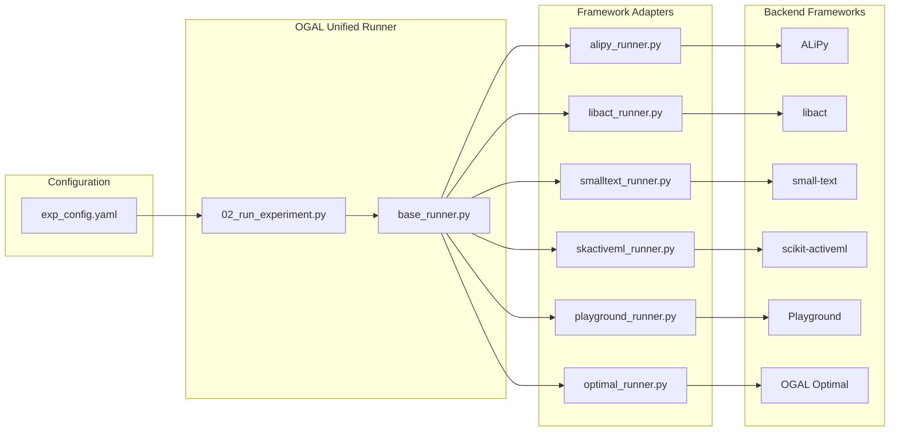

# Frameworks Reference

This page documents the backend AL frameworks that OGAL integrates. OGAL provides a **unified wrapper** that runs strategies from all these frameworks under a consistent protocol.

!!! info "Strategy-First Approach"
    For most use cases, refer to the **[Strategy Catalog](strategies.md)** instead. This page is for understanding the underlying framework implementations.

---

## The OGAL Unified Wrapper

OGAL's key innovation is providing a **single API** for running AL experiments across multiple frameworks:

- **Consistent protocol**: Same train/test splits, seeds, budgets, and metrics across all frameworks
- **Unified output schema**: All strategies produce the same output format
- **Framework-agnostic configuration**: Configure by strategy name, not framework details



(source: `framework_runners/base_runner.py::AL_Experiment`; `resources/data_types.py::AL_framework_to_classes_mapping`)

---

## Framework Summary

| Framework | Strategies | Upstream | OGAL Fork | Adapter |
|-----------|------------|----------|-----------|---------|
| ALiPy | 14 | [NUAA-AL/ALiPy](https://github.com/NUAA-AL/ALiPy) | [jgonsior/ALiPy](https://github.com/jgonsior/ALiPy) | `alipy_runner.py` |
| libact | 9 | [ntucllab/libact](https://github.com/ntucllab/libact) | [jgonsior/libact](https://github.com/jgonsior/libact) | `libact_runner.py` |
| small-text | 9 | [webis-de/small-text](https://github.com/webis-de/small-text) | None (PyPI) | `smalltext_runner.py` |
| scikit-activeml | 14 | [scikit-activeml/scikit-activeml](https://github.com/scikit-activeml/scikit-activeml) | [jgonsior/scikit-activeml](https://github.com/jgonsior/scikit-activeml) | `skactiveml_runner.py` |
| Playground | 9 | [google/active-learning](https://github.com/google/active-learning) | [jgonsior/active-learning](https://github.com/jgonsior/active-learning) | `playground_runner.py` |
| OPTIMAL | 4 | N/A (OGAL-native) | N/A | `optimal_runner.py` |

(source: `pyproject.toml`, lines 39-42; `resources/data_types.py::AL_STRATEGY`)

---

## ALiPy

**Active Learning in Python (ALiPy)** is a comprehensive AL toolkit from NUAA.

| Property | Value |
|----------|-------|
| **Upstream** | [https://github.com/NUAA-AL/ALiPy](https://github.com/NUAA-AL/ALiPy) |
| **OGAL Fork** | [https://github.com/jgonsior/ALiPy](https://github.com/jgonsior/ALiPy) |
| **Dependency** | `alipy = {git = "https://github.com/jgonsior/ALiPy.git"}` |
| **Adapter** | `framework_runners/alipy_runner.py::ALIPY_AL_Experiment` |
| **Strategies** | 14 (Random, Uncertainty variants, QBC, EER, Graph Density, Coreset, BMDR, SPAL, LAL, Density-Weighted) |

### Why a Fork?

OGAL uses a fork of ALiPy to ensure compatibility with the experiment protocol and to fix any issues encountered during large-scale experiments. The fork maintains API compatibility with upstream.

(source: `pyproject.toml`, line 39)

---

## libact

**libact** is a pool-based AL library from NTU CL Lab.

| Property | Value |
|----------|-------|
| **Upstream** | [https://github.com/ntucllab/libact](https://github.com/ntucllab/libact) |
| **OGAL Fork** | [https://github.com/jgonsior/libact](https://github.com/jgonsior/libact) |
| **Dependency** | `libact = {git = "https://github.com/jgonsior/libact"}` |
| **Adapter** | `framework_runners/libact_runner.py::LIBACT_Experiment` |
| **Strategies** | 9 (Uncertainty variants, QBC, DWUS, QUIRE, EER, Hierarchical, ALBL) |

### Why a Fork?

OGAL uses a fork of libact for Python 3.11 compatibility and to resolve dependency conflicts with other frameworks.

(source: `pyproject.toml`, line 42)

---

## small-text

**small-text** is a lightweight AL library for text classification.

| Property | Value |
|----------|-------|
| **Upstream** | [https://github.com/webis-de/small-text](https://github.com/webis-de/small-text) |
| **OGAL Fork** | None (uses PyPI package) |
| **Dependency** | `small-text = "^1.3.2"` |
| **Adapter** | `framework_runners/smalltext_runner.py::SMALLTEXT_AL_Experiment` |
| **Strategies** | 9 (Least Confidence, Prediction Entropy, Breaking Ties, Embedding KMeans, Coreset variants, Contrastive AL, Discriminative AL, Random) |

### No Fork Needed

small-text is used directly from PyPI without modifications. OGAL adapts its API through the `SMALLTEXT_AL_Experiment` adapter.

(source: `pyproject.toml`, line 32)

---

## scikit-activeml

**scikit-activeml** is a scikit-learn compatible AL library.

| Property | Value |
|----------|-------|
| **Upstream** | [https://github.com/scikit-activeml/scikit-activeml](https://github.com/scikit-activeml/scikit-activeml) |
| **OGAL Fork** | [https://github.com/jgonsior/scikit-activeml](https://github.com/jgonsior/scikit-activeml) |
| **Dependency** | `scikit-activeml = {git = "https://github.com/jgonsior/scikit-activeml"}` |
| **Adapter** | `framework_runners/skactiveml_runner.py::SKACTIVEML_AL_Experiment` |
| **Strategies** | 14 (Uncertainty variants, QBC, Monte Carlo EER, Value of Information, QUIRE, Discriminative AL, Probabilistic AL, Cost Embedding) |

### Why a Fork?

OGAL uses a fork of scikit-activeml to ensure compatibility with the specific scikit-learn version and to fix issues encountered during experiments.

(source: `pyproject.toml`, line 41)

---

## Google Active Learning Playground

**Playground** is Google's active learning research codebase.

| Property | Value |
|----------|-------|
| **Upstream** | [https://github.com/google/active-learning](https://github.com/google/active-learning) |
| **OGAL Fork** | [https://github.com/jgonsior/active-learning](https://github.com/jgonsior/active-learning) |
| **Dependency** | `playground = {git = "https://github.com/jgonsior/active-learning.git"}` |
| **Adapter** | `framework_runners/playground_runner.py::PLAYGROUND_AL_Experiment` |
| **Strategies** | 9 (Graph Density, Hierarchical Cluster, Informative+Diverse, k-Center Greedy, Margin, Mixture, MCM, Uniform, Bandit) |

### Why a Fork?

OGAL uses a fork of the Google playground to adapt it for use as a Python package (the original is a research codebase not designed for pip installation).

(source: `pyproject.toml`, line 40)

---

## OGAL Optimal Strategies

OGAL includes native implementations of oracle/optimal strategies for baseline comparisons:

| Property | Value |
|----------|-------|
| **Upstream** | N/A (OGAL-native) |
| **OGAL Fork** | N/A |
| **Adapter** | `framework_runners/optimal_runner.py::OPTIMAL_AL_Experiment` |
| **Strategies** | 4 (Beam Search Optimal, True Optimal, Greedy 10, Greedy 20) |

These strategies serve as oracle baselines that require knowledge of the full dataset labels to make optimal decisions.

(source: `optimal_query_strategies/`)

---

## Adapter Architecture

Each framework adapter inherits from `AL_Experiment` and implements:

```python
# framework_runners/base_runner.py
class AL_Experiment(ABC):
    @abstractmethod
    def get_AL_strategy(self):
        """Instantiate the AL strategy with framework-specific configuration."""
        pass
    
    @abstractmethod
    def query_AL_strategy(self) -> SampleIndiceList:
        """Query the strategy for samples to label in this iteration."""
        pass
```

The unified runner (`02_run_experiment.py`) loads the appropriate adapter based on the strategy prefix (e.g., `ALIPY_` → `ALIPY_AL_Experiment`).

(source: `framework_runners/base_runner.py::AL_Experiment`, lines 53-100)

---

## Framework Mapping in Code

The framework-to-adapter mapping is defined in `resources/data_types.py`:

```python
AL_framework_to_classes_mapping = {
    AL_FRAMEWORK.ALIPY: (ALIPY_AL_Experiment, {}),
    AL_FRAMEWORK.OPTIMAL: (OPTIMAL_AL_Experiment, {}),
    AL_FRAMEWORK.LIBACT: (LIBACT_Experiment, {}),
    AL_FRAMEWORK.PLAYGROUND: (PLAYGROUND_AL_Experiment, {}),
    AL_FRAMEWORK.SMALLTEXT: (SMALLTEXT_AL_Experiment, {}),
    AL_FRAMEWORK.SKACTIVEML: (SKACTIVEML_AL_Experiment, {}),
}
```

(source: `resources/data_types.py::AL_framework_to_classes_mapping`, lines 480-487)

---

## Cross-References

- **[Strategy Catalog](strategies.md)**: Complete list of all strategies (strategy-first)
- **[Pipeline](pipeline.md)**: How experiments are executed
- **[Configuration](configuration.md)**: Experiment configuration options
- **[Research Reuse](research_reuse.md)**: Adding new frameworks/strategies
