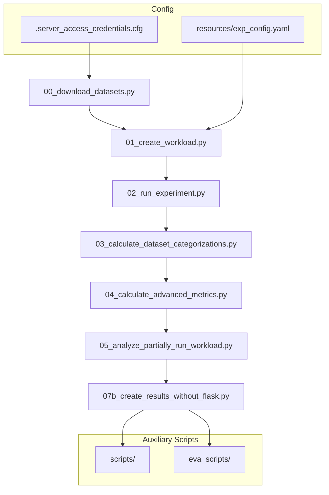

# OGAL Documentation

Welcome to the **Olympic Games of Active Learning (OGAL)** documentation. This framework provides a comprehensive benchmarking system for evaluating Active Learning query strategies at scale.

## What is OGAL?

OGAL is a large-scale experimental framework designed to systematically evaluate Active Learning (AL) strategies. As described in the research paper ([arXiv:2506.03817](https://arxiv.org/abs/2506.03817)), AL is rarely used in real-world applications due to complexity and lack of trust in its effectiveness. This framework addresses these challenges by:

- Compiling a **hyperparameter grid of 4.6+ million combinations**
- Recording performance across the **largest conducted AL study to date**
- Analyzing the **impact of each hyperparameter** on experiment results

### Paper Terminology

The paper defines an AL experiment as **E = (𝒮, D, 𝒯, ℐ, M, b, c, ℒ)** — a combination of hyperparameters:

| Symbol | Term | OGAL Parameter |
|--------|------|----------------|
| 𝔻 | Dataset | `EXP_GRID_DATASET` |
| 𝕊 | AL Strategy (Query Strategy) | `EXP_GRID_STRATEGY` |
| 𝕃 | Learner Model | `EXP_GRID_LEARNER_MODEL` |
| 𝔹 | Batch Size | `EXP_GRID_BATCH_SIZE` |
| 𝕋 | Train-Test-Split | `EXP_GRID_TRAIN_TEST_BUCKET_SIZE` |
| 𝕀 | Initial Start Set | `EXP_GRID_START_POINT` |
| c | AL Cycles | `EXP_GRID_NUM_QUERIES` |

The framework evaluates:

- **28 AL strategies (𝕊)** from 5 frameworks (ALiPy, libact, small-text, scikit-activeml, playground)
- **92 datasets (𝔻)** from OpenML, Kaggle, and UCI
- **3 learner models (𝕃)**: Random Forest, MLP, SVM
- **6 batch sizes (𝔹)**: 1, 5, 10, 20, 50, 100
- **5 train-test splits (𝕋) × 20 start sets (𝕀)** per dataset

## Quick Links

| Document | Description |
|----------|-------------|
| [Pipeline](pipeline.md) | Step-by-step guide to the sequential experiment pipeline |
| [Reproducing the Paper](reproducing_paper.md) | Complete workflow to reproduce OPARA archive results |
| [Scripts & Evaluation](scripts.md) | Utility scripts and evaluation analysis scripts |
| [Configuration](configuration.md) | Shared configuration system explained |
| [Results Format](results_format.md) | Output paths, file formats, and result schemas |
| [HPC Setup](hpc.md) | Running experiments on HPC clusters with SLURM |
| [Research Reuse](research_reuse.md) | Extending the framework for your research |
| [Contributing](contributing.md) | Development setup and contribution guidelines |

## Paper & Archived Artifacts

| Resource | Link |
|----------|------|
| **Research Paper** | [arXiv:2506.03817](https://arxiv.org/abs/2506.03817) - "Survey of Active Learning Hyperparameters" |
| GitHub Repository | [jgonsior/olympic-games-of-active-learning](https://github.com/jgonsior/olympic-games-of-active-learning) |
| Archived Data (DOI) | [10.25532/OPARA-862](https://doi.org/10.25532/OPARA-862) - Raw experiment results |
| **Reproduction Guide** | [Reproducing the Paper](reproducing_paper.md) - Complete workflow to regenerate results |

### Paper Abstract

> Annotating data is a time-consuming and costly task, but it is inherently required for supervised machine learning. Active Learning (AL) is an established method that minimizes human labeling effort by iteratively selecting the most informative unlabeled samples for expert annotation. Despite being known for decades, AL is still rarely used in real-world applications due to complexity and lack of trust in its effectiveness. We hypothesize that both reasons share the same culprit: **the large hyperparameter space of AL**. This mostly unexplored hyperparameter space often leads to misleading and irreproducible AL experiment results.

The DOI reference (OPARA-862) provides the raw experiment results (~terabytes of data) for long-term preservation and reproducibility. See [Reproducing the Paper](reproducing_paper.md) for the exact configuration (`full_exp_jan`) used to generate these results.

## Pipeline Overview

OGAL follows a strict sequential execution order:



See [Pipeline Documentation](pipeline.md) for complete details on each step.

## Quickstart

```bash
# 1. Setup environment
conda create --name al_olympics_env --file conda-linux-64.lock
conda activate al_olympics_env
poetry install

# 2. Configure paths (create .server_access_credentials.cfg)

# 3. Create and run a small test workload
python 01_create_workload.py --EXP_TITLE test
python 02_run_experiment.py --EXP_TITLE test --WORKER_INDEX 0
```

## Repository Structure

### Active Code

| Directory | Purpose |
|-----------|---------|
| `datasets/` | Dataset loading utilities |
| `framework_runners/` | AL framework adapters (ALiPy, libact, etc.) |
| `optimal_query_strategies/` | Oracle strategy implementations |
| `metrics/` | Metric computation modules |
| `resources/` | Configuration and templates |
| `scripts/` | Utility, conversion, and maintenance scripts |
| `eva_scripts/` | Evaluation, visualization, and paper figure scripts |
| `misc/` | Shared utilities (config, logging, helpers) |

### Deprecated

| Directory | Status |
|-----------|--------|
| `analyse_results/` | **Deprecated / not used.** |

## License

AGPL-3.0. See [LICENSE](https://github.com/jgonsior/olympic-games-of-active-learning/blob/main/LICENSE) for details.
