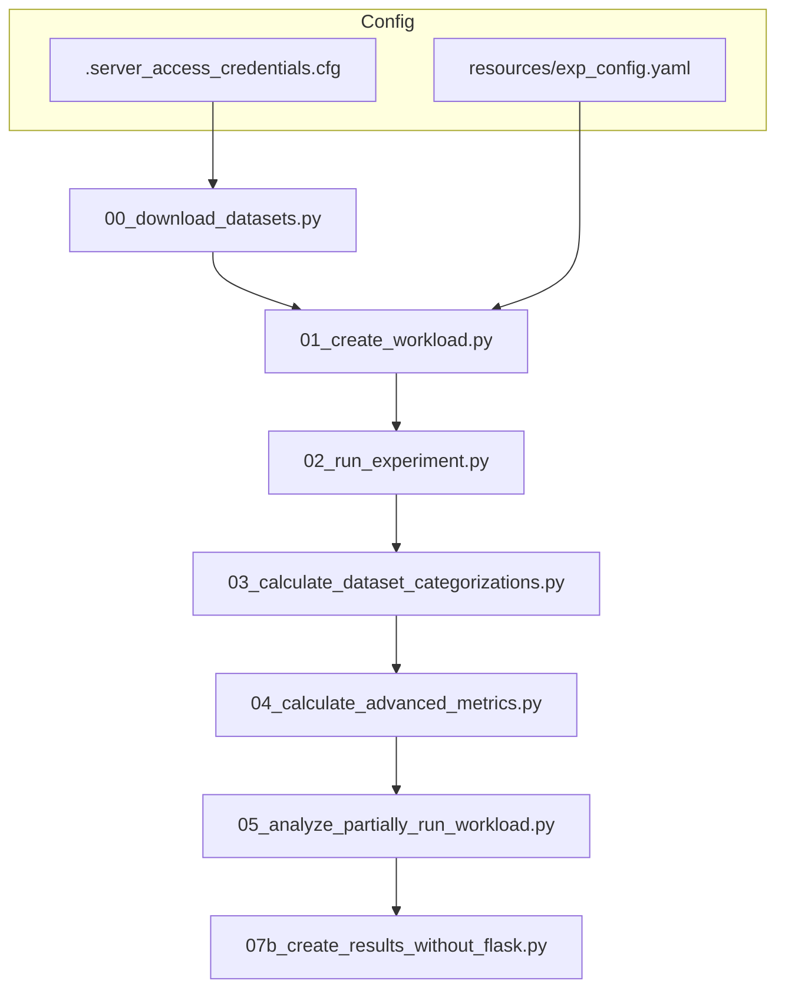

# OGAL Documentation

Welcome to the **Olympic Games of Active Learning (OGAL)** documentation. This framework provides a comprehensive benchmarking system for evaluating Active Learning query strategies at scale.

## What is OGAL?

OGAL is a large-scale experimental framework designed to systematically evaluate Active Learning (AL) strategies across:

- **50+ AL strategies** from multiple frameworks
- **90+ datasets** from OpenML and Kaggle
- **Multiple learner models** (RF, MLP, SVM, etc.)
- **Extensive hyperparameter variations**

The framework implements a **sequential pipeline** that handles everything from dataset acquisition to final result visualization.

## Quick Links

| Document | Description |
|----------|-------------|
| [Pipeline](pipeline.md) | Step-by-step guide to the sequential experiment pipeline |
| [Configuration](configuration.md) | Shared configuration system explained |
| [Results Format](results_format.md) | Output paths, file formats, and result schemas |
| [HPC Setup](hpc.md) | Running experiments on HPC clusters with SLURM |
| [Research Reuse](research_reuse.md) | Extending the framework for your research |
| [Contributing](contributing.md) | Development setup and contribution guidelines |

## Paper & Archived Artifacts

| Resource | Link |
|----------|------|
| **Research Paper** | [arXiv:2506.03817](https://arxiv.org/abs/2506.03817) |
| GitHub Repository | [jgonsior/olympic-games-of-active-learning](https://github.com/jgonsior/olympic-games-of-active-learning) |
| Archived Companion (DOI) | [10.25532/OPARA-862](https://doi.org/10.25532/OPARA-862) |

The research paper (arXiv:2506.03817) describes the methodology, experimental design, and key findings. The DOI reference provides the canonical archived companion for long-term preservation, frozen snapshots, and released experimental bundles.

## Pipeline Overview

OGAL follows a strict sequential execution order:



See [Pipeline Documentation](pipeline.md) for complete details on each step.

## Quickstart

```bash
# 1. Setup environment
conda create --name al_olympics_env --file conda-linux-64.lock
conda activate al_olympics_env
poetry install

# 2. Configure paths (create .server_access_credentials.cfg)

# 3. Create and run a small test workload
python 01_create_workload.py --EXP_TITLE test
python 02_run_experiment.py --EXP_TITLE test --WORKER_INDEX 0
```

## Repository Structure

### Active Code

| Directory | Purpose |
|-----------|---------|
| `datasets/` | Dataset loading utilities |
| `framework_runners/` | AL framework adapters |
| `optimal_query_strategies/` | Oracle strategy implementations |
| `metrics/` | Metric computation modules |
| `resources/` | Configuration and templates |
| `scripts/` | Utility and maintenance scripts |
| `eva_scripts/` | Evaluation and plotting scripts |
| `misc/` | Shared utilities |

### Deprecated

| Directory | Status |
|-----------|--------|
| `analyse_results/` | **Deprecated / not used.** |

## License

AGPL-3.0. See [LICENSE](https://github.com/jgonsior/olympic-games-of-active-learning/blob/main/LICENSE) for details.
