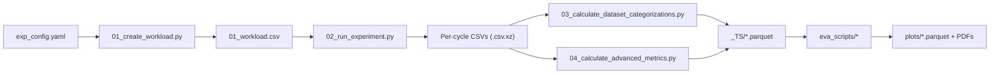

# Reproduce the Paper & Run from Scratch

**Run the exact scripts that produce the paper's figures and tables, or recompute the entire dataset from scratch on HPC/SLURM.**

---

## Quick Start

=== "Reproduce from OPARA archive"

    Download the pre-computed results from [DOI:10.25532/OPARA-862](https://doi.org/10.25532/OPARA-862) and run the evaluation scripts directly:

    ```bash
    # Setup
    git clone https://github.com/jgonsior/olympic-games-of-active-learning.git
    cd olympic-games-of-active-learning
    conda create --name ogal --file conda-linux-64.lock && conda activate ogal && poetry install

    # Download and extract data
    wget <URL_FROM_DOI_LANDING_PAGE>
    unzip full_exp_jan.zip -d /path/to/results/
    export OGAL_OUTPUT=/path/to/results
    ```

=== "Run locally (verify setup)"

    Run a small smoke test before going to HPC scale:

    ```bash
    conda create --name ogal --file conda-linux-64.lock && conda activate ogal && poetry install
    export OGAL_OUTPUT=/path/to/results

    python 01_create_workload.py --EXP_TITLE smoke_test
    python 02_run_experiment.py --EXP_TITLE smoke_test --WORKER_INDEX 0
    ls ${OGAL_OUTPUT}/smoke_test/05_done_workload.csv
    ```

=== "HPC (SLURM)"

    Run millions of experiments on an HPC cluster:

    ```bash
    python 01_create_workload.py --EXP_TITLE full_run
    sbatch ${OGAL_OUTPUT}/full_run/02_slurm.slurm
    watch -n 60 'wc -l ${OGAL_OUTPUT}/full_run/05_done_workload.csv'
    ```

---

## Full Pipeline



### Pipeline Steps

| Step | Script | Input | Output |
|------|--------|-------|--------|
| 1 | `01_create_workload.py` | `resources/exp_config.yaml` | `01_workload.csv` (Cartesian product of hyperparameters) |
| 2 | `02_run_experiment.py` | `01_workload.csv` row (by `WORKER_INDEX`) | `{STRATEGY}/{DATASET}/*.csv.xz` (per-cycle metrics) |
| 3 | `03_calculate_dataset_categorizations.py` | Dataset CSVs | `{DATASET}/{categorizer}.parquet` (14 sample-level categorizers) |
| 4 | `04_calculate_advanced_metrics.py` | Per-cycle CSVs | `{STRATEGY}/{DATASET}/{metric}.csv.xz` (AUC, distance, etc.) |
| 5 | `eva_scripts/learning_curve.py` | Per-cycle CSVs | `_TS/*.parquet` (sorted time series) |
| 6 | `eva_scripts/*` | `_TS/*.parquet` | `plots/*` (leaderboards, heatmaps, PDFs) |

---

## Post-Processing (Steps 3–5)

After experiments complete (step 2), run post-processing to compute derived metrics and build the time series files that all evaluation scripts need:

```bash
# Step 3: Compute sample-level dataset categorizations
python 03_calculate_dataset_categorizations.py --EXP_TITLE my_experiment --SAMPLES_CATEGORIZER _ALL --EVA_MODE local

# Step 4: Compute advanced metrics (AUC, distances, class distributions, etc.)
python 04_calculate_advanced_metrics.py --EXP_TITLE my_experiment --COMPUTED_METRICS _ALL --EVA_MODE local

# Step 5: Build time series parquets (required by most eva_scripts)
python -m eva_scripts.learning_curve --EXP_TITLE my_experiment

# Step 5b: Build leaderboard rankings
python -m eva_scripts.calculate_leaderboard_rankings --EXP_TITLE my_experiment
```

---

## Reproducing Paper Figures

With data ready (either from OPARA or your own run), reproduce all paper figures:

### Main Leaderboard (Table 1 / Figure 4)

```bash
python -m eva_scripts.final_leaderboard --EXP_TITLE full_exp_jan
```

**Output:** `plots/final_leaderboard/rank_sparse_zero_full_auc_weighted_f1-score.parquet`

### Three Correlation Heatmaps

| Color | What It Measures | Script |
|-------|------------------|--------|
| **Blue** | Metric correlation (Pearson) | `python -m eva_scripts.single_hyperparameter_evaluation_metric --EXP_TITLE full_exp_jan` |
| **Green** | Queried samples (Jaccard) | `python -m eva_scripts.single_hyperparameter_evaluation_indices --EXP_TITLE full_exp_jan` |
| **Orange** | Ranking invariance (Kendall τ) | `python -m eva_scripts.leaderboard_single_hyperparameter_influence --EXP_TITLE full_exp_jan` |

### Additional Figures

```bash
# Learning curves (Figure 2)
python -m eva_scripts.single_learning_curve_example --EXP_TITLE full_exp_jan

# Runtime analysis (Figure 7)
python -m eva_scripts.runtime --EXP_TITLE full_exp_jan

# All paper plots at once
python -m eva_scripts.redo_plots_for_paper --EXP_TITLE full_exp_jan
```

### Output Mapping

| Paper Figure | Script | Output File |
|--------------|--------|-------------|
| Table 1 (Leaderboard) | `final_leaderboard.py` | `plots/final_leaderboard/*.parquet` |
| Figure 2 (Learning curves) | `single_learning_curve_example.py` | `plots/single_learning_curve/*.parquet` |
| Figures 4-6 (Heatmaps) | `single_hyperparameter_*.py` | `plots/single_hyperparameter/*` |
| Figure 7 (Runtime) | `runtime.py` | `plots/runtime/*.parquet` |

### Verify Results

```python
import pandas as pd

lb = pd.read_parquet("plots/final_leaderboard/rank_sparse_zero_full_auc_weighted_f1-score.parquet")
print("Top 5 strategies (avg rank):", lb.mean(axis=0).sort_values().head(5))
```

---

## HPC Configuration

Create `.server_access_credentials.cfg`:

```ini
[HPC]
SSH_LOGIN=user@login.hpc.example.edu
DATASETS_PATH=/path/to/datasets
OUTPUT_PATH=/path/to/exp_results
SLURM_MAIL=your.email@example.edu
SLURM_PROJECT=your_project_account
PYTHON_PATH=/path/to/conda-env/bin/python

[LOCAL]
DATASETS_PATH=/path/to/datasets
OUTPUT_PATH=/path/to/exp_results
```

---

## Resume After Failure

OGAL automatically tracks progress via tracking files:

| File | Purpose |
|------|---------|
| `05_done_workload.csv` | Successfully completed experiments |
| `05_failed_workloads.csv` | Experiments that failed with errors |
| `05_started_oom_workloads.csv` | Experiments killed by OOM |

**To resume:** simply re-run `01_create_workload.py` — it automatically excludes already-completed experiments, then resubmit:

```bash
python 01_create_workload.py --EXP_TITLE my_experiment
sbatch ${OGAL_OUTPUT}/my_experiment/02_slurm.slurm
```

---

## Troubleshooting & Fix Scripts

### Common Issues

| Issue | Solution |
|-------|----------|
| `FileNotFoundError` for datasets | Check `DATASETS_PATH` in `.server_access_credentials.cfg` |
| Jobs killed (OOM) | Increase `SLURM_MEMORY`; check `05_started_oom_workloads.csv` |
| Experiments not completing | Increase `EXP_QUERY_SELECTION_RUNTIME_SECONDS_LIMIT` |
| Missing `_TS/*.parquet` | Run `python -m eva_scripts.learning_curve` first |
| Memory errors in evaluation | Use `scripts/reduce_to_dense.py` for a smaller subset |

### Fix Scripts (only needed if something breaks)

These scripts in `scripts/` are **not part of the normal pipeline** — they exist to repair data issues that can occur during large-scale HPC runs. You only need them if you encounter specific problems.

??? info "Data Validation Scripts"

    | Script | When to Use |
    |--------|-------------|
    | `scripts/validate_results_schema.py` | Verify result file formats are correct |
    | `scripts/check_if_exp_ids_are_present.py` | Verify all experiment IDs exist in metric files |
    | `scripts/find_missing_exp_ids_in_metric_files.py` | Find experiments missing from metric CSVs |
    | `scripts/find_broken_file.py` | Identify corrupted metric CSV files |
    | `scripts/exp_results_data_format_test.py` | Test that result CSV generation/format is correct |

??? info "Fix Scripts (data repair)"

    | Script | What It Fixes |
    |--------|---------------|
    | `scripts/fix_oom_workload.py` | Remove OOM experiments from done workload |
    | `scripts/fix_duplicate_header_columns.py` | Remove duplicate column headers in CSVs |
    | `scripts/fix_remove_unnamed_column.py` | Strip spurious `Unnamed: 0` columns |
    | `scripts/fix_reduce_number_precision.py` | Round numeric precision to 4 decimals (saves space) |
    | `scripts/fix_macro_f1_score_duplicates.py` | Remove duplicate columns in macro F1 files |
    | `scripts/fix_apply_runtime_limit_post_mortem.py` | Remove experiments exceeding query runtime limits |
    | `scripts/fix_early_stopping_dict_keys_too_small_error.py` | Fix malformed CSV rows from dict parsing errors |
    | `scripts/fix_check_if_dupicate_param_combinations_exist.py` | Detect duplicate parameter combinations |
    | `scripts/fix_unconverted_y_parquet.py` | Fix y_pred parquets with wrong data types |

??? info "Merge & Remove Scripts"

    | Script | What It Does |
    |--------|--------------|
    | `scripts/merge_two_workloads.py` | Merge two experimental result sets |
    | `scripts/merge_duplicate_parquets.py` | Merge duplicate y_pred parquets, keeping unique IDs |
    | `scripts/remove_oom_results_from_metric_files.py` | Strip out-of-memory results from metric files |
    | `scripts/remove_dataset_results.py` | Delete results for specific datasets |
    | `scripts/remove_duplicated_exp_ids.py` | Drop duplicate experiment entries |
    | `scripts/remove_lbfgs_mlp_results.py` | Remove LBFGS/MLP learner results |
    | `scripts/reduce_to_dense.py` | Keep only dense workload experiments in all files |

??? info "Re-run Scripts (retry failed work)"

    | Script | What It Does |
    |--------|--------------|
    | `scripts/rerun_broken_experiments.py` | Re-run experiments that failed |
    | `scripts/rerun_missing_exp_ids.py` | Retry experiments with missing result files |
    | `scripts/rerun_broken_dataset_categorizations.py` | Recompute broken dataset categorization metrics |
    | `scripts/replace_broken_parquet_csvs_with_working_file.py` | Restore broken parquets from backup files |

??? info "Conversion Scripts"

    | Script | What It Does |
    |--------|--------------|
    | `scripts/convert_metrics_csvs_to_exp_id_csvs.py` | Reorganize metric CSVs by experiment ID |
    | `scripts/convert_dataset_distances_to_parqet.py` | Convert dataset distance CSVs to parquet |
    | `scripts/convert_y_pred_to_parquet.py` | Convert y_pred CSVs to parquet format |
    | `scripts/create_auc_selected_ts.py` | Create AUC time series from selected indices |

---

## Deep Dive

- For mathematical definitions of the three correlation types, see [Correlations: Paper ↔ Code](../reference/correlations_paper_to_code.md).
- For complete data flow and architecture details, see [Architecture & Design](understand_codebase.md).

---

## Next Steps

| Goal | Page |
|------|------|
| Extend with new strategies/datasets | [Extend the Benchmark](extend_benchmark.md) |
| Analyze results | [Analyze OPARA](analyze_dataset.md) |
| Understand the architecture | [Architecture & Design](understand_codebase.md) |
