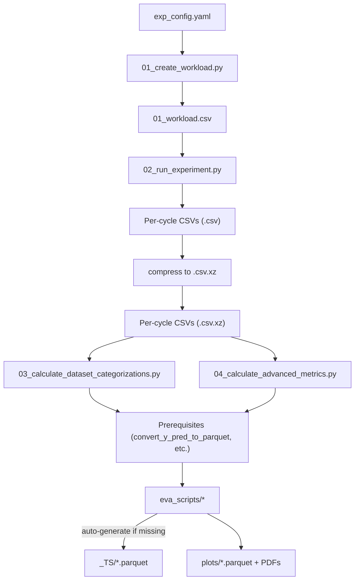

!!! info "Legacy page"
    This page is a deep dive from an earlier docs structure. **Start at [Home](../index.md) / [Getting Started](../getting_started.md)** for the recommended entry points.

# Reproduce the Paper & Run from Scratch

**Run the exact scripts that produce the paper's figures and tables, or recompute the entire dataset from scratch on HPC/SLURM.**

---

## Quick Start

| Goal | Canonical page |
|------|---------------|
| Download pre-computed results | [Use released OPARA archive](../use_opara_archive.md) |
| Run a small local test | [Run a local smoke test](../run_local_smoke_test.md) |
| Submit to HPC/SLURM | [Run at HPC scale](../run_hpc.md) |

---

## Reproducing the paper run (`full_exp_jan`)

!!! warning "Compute scale"
    The `full_exp_jan` config covers **92 datasets × 28 active-learning strategies ×
    3 learner models × 6 batch sizes × 5 train/test splits × 20 start sets × 100
    AL cycles = ~4.6 M experiments**, requiring roughly **3.6 M CPU hours** on an HPC
    cluster with hundreds of parallel SLURM jobs.  Running it on a laptop is not
    feasible.  **If you only want to verify the pipeline works locally**, use the
    built-in `test` config (2 datasets, 4 strategies, few cycles — completes in
    minutes); instructions are in the "Minimal local subset" tab below.

The paper results were produced from the single named config **`full_exp_jan`**
defined in `resources/exp_config.yaml` (line 156).  The archived results are
already published at [DOI:10.25532/OPARA-862](https://doi.org/10.25532/OPARA-862);
download them instead of re-running (see the "Reproduce from OPARA archive" tab
above).  The steps below are for reference or if you need to recompute from scratch.

=== "Full paper run (HPC/SLURM)"

    **Prerequisites:** `.server_access_credentials.cfg` with `[HPC]` keys filled in
    (see the **Configuration** section).

    ```bash
    # Step 1 — generate the 4.6 M-row workload (also writes 02_slurm.slurm)
    python 01_create_workload.py --EXP_TITLE full_exp_jan

    # Step 2 — submit to SLURM (each job picks one WORKER_INDEX from 01_workload.csv)
    RESULTS_DIR=/absolute/path/to/results  # OUTPUT_PATH from [HPC] in .server_access_credentials.cfg
    sbatch ${RESULTS_DIR}/full_exp_jan/02_slurm.slurm

    # Monitor progress (appended to 05_done_workload.csv by each worker)
    watch -n 60 'wc -l ${RESULTS_DIR}/full_exp_jan/05_done_workload.csv'

    # Step 2b — compress raw CSVs once jobs are done (can run in parallel with jobs)
    xz ${RESULTS_DIR}/full_exp_jan/*/*/**.csv

    # Step 3 — compute sample-level dataset categorizations
    python 03_calculate_dataset_categorizations.py \
        --EXP_TITLE full_exp_jan --SAMPLES_CATEGORIZER _ALL --EVA_MODE local

    # Step 4 — compute derived metrics (AUC, distances, etc.)
    python 04_calculate_advanced_metrics.py \
        --EXP_TITLE full_exp_jan --COMPUTED_METRICS _ALL --EVA_MODE local

    # Step 5 — run prerequisite conversion scripts
    python scripts/convert_y_pred_to_parquet.py --EXP_TITLE full_exp_jan
    python -m eva_scripts.calculate_dataset_dependend_random_ramp_slope \
        --EXP_TITLE full_exp_jan

    # Step 6 — build leaderboard rankings (produces paper Table 1)
    python -m eva_scripts.final_leaderboard --EXP_TITLE full_exp_jan
    ```

=== "Minimal local subset (laptop-feasible)"

    Uses the built-in `test` config: 2 datasets, 4 strategies, batch sizes 1 and 5,
    1 train/test split, 5 start sets, 3 AL cycles.  Finishes in a few minutes.

    **Prerequisites:** `.server_access_credentials.cfg` with `[LOCAL]` keys filled in.

    ```bash
    # Step 1 — generate workload (~240 rows)
    python 01_create_workload.py --EXP_TITLE test

    # Step 2 — run all workers sequentially (or loop over WORKER_INDEX values)
    RESULTS_DIR=/absolute/path/to/results  # OUTPUT_PATH from [LOCAL]
    for i in $(seq 0 9); do
        python 02_run_experiment.py --EXP_TITLE test --WORKER_INDEX $i
    done

    # Step 2b — compress
    xz ${RESULTS_DIR}/test/*/*/**.csv

    # Steps 3–5 — post-processing
    python 03_calculate_dataset_categorizations.py \
        --EXP_TITLE test --SAMPLES_CATEGORIZER _ALL --EVA_MODE local
    python 04_calculate_advanced_metrics.py \
        --EXP_TITLE test --COMPUTED_METRICS _ALL --EVA_MODE local
    python scripts/convert_y_pred_to_parquet.py --EXP_TITLE test
    python -m eva_scripts.calculate_dataset_dependend_random_ramp_slope \
        --EXP_TITLE test

    # Step 6 — generate leaderboard
    python -m eva_scripts.final_leaderboard --EXP_TITLE test
    ```

### Expected output trees

??? info "Minimal run (`test`) — single strategy/dataset combination"

    ```
    {OUTPUT_PATH}/test/
    ├── 01_workload.csv                    # ~240-row experiment queue
    ├── 05_done_workload.csv               # completed experiments (appended per worker)
    ├── 05_failed_workloads.csv            # failed experiments (if any)
    │
    ├── ALIPY_RANDOM/
    │   ├── Iris/
    │   │   ├── accuracy.csv.xz
    │   │   ├── weighted_f1-score.csv.xz
    │   │   ├── query_selection_time.csv.xz
    │   │   ├── selected_indices.csv.xz
    │   │   └── y_pred_train.csv.xz
    │   └── wine_origin/
    │       └── ...
    ├── ALIPY_UNCERTAINTY_LC/
    │   └── ...                            # same structure per strategy
    │
    ├── Iris/                              # Step 3: dataset categorizations
    │   └── COUNT_WRONG_CLASSIFICATIONS.parquet
    │
    ├── _TS/                               # Auto-generated by eva_scripts
    │   ├── full_auc_weighted_f1-score.parquet
    │   └── ...
    │
    └── plots/
        └── final_leaderboard/
            └── rank_sparse_zero_full_auc_weighted_f1-score.parquet
    ```

??? info "`full_exp_jan` — high-level layout"

    ```
    {OUTPUT_PATH}/full_exp_jan/
    ├── 01_workload.csv                    # ~4.6 M rows
    ├── 02_slurm.slurm                     # Generated SLURM submission script
    ├── 05_done_workload.csv               # ~4.6 M rows when complete
    │
    ├── {STRATEGY}/                        # 28 active strategy directories
    │   └── {DATASET}/                     # 92 dataset directories each
    │       ├── accuracy.csv.xz
    │       ├── weighted_f1-score.csv.xz
    │       ├── selected_indices.csv.xz
    │       └── ...                        # ~10 metric files per combination
    │
    ├── {DATASET}/                         # 92 dataset categorization directories
    │   └── *.parquet
    │
    ├── _TS/                               # Aggregated time-series parquets
    │   ├── full_auc_weighted_f1-score.parquet
    │   ├── selected_indices.parquet
    │   └── ...
    │
    └── plots/
        ├── final_leaderboard/             # Table 1 from paper
        ├── single_hyperparameter/         # Sensitivity heatmaps
        └── ...
    ```

---

## Full Pipeline



### Pipeline Steps

| Step | Script | Input | Output |
|------|--------|-------|--------|
| 1 | `01_create_workload.py` | `resources/exp_config.yaml` | `01_workload.csv` (Cartesian product of hyperparameters) |
| 2 | `02_run_experiment.py` | `01_workload.csv` row (by `WORKER_INDEX`) | `{STRATEGY}/{DATASET}/*.csv` (per-cycle metrics, uncompressed) |
| 2b | Compress results | `*.csv` | `*.csv.xz` (compressed per-cycle metrics) |
| 3 | `03_calculate_dataset_categorizations.py` | Dataset CSVs | `{DATASET}/{categorizer}.parquet` (14 sample-level categorizers) |
| 4 | `04_calculate_advanced_metrics.py` | Per-cycle CSVs | `{STRATEGY}/{DATASET}/{metric}.csv.xz` (AUC, distance, etc.) |
| 5 | Prerequisite scripts (`convert_y_pred_to_parquet.py`, `calculate_dataset_dependend_random_ramp_slope.py`) | Per-cycle CSVs, parquets | Converted parquets, slope data |
| 6 | `eva_scripts/*` | Per-cycle CSVs, parquets | `_TS/*.parquet` (auto-generated if missing), `plots/*` (leaderboards, heatmaps, PDFs) |

??? info "Step 0: Download Datasets"

    ```bash
    python 00_download_datasets.py
    ```

    - **Reads:** `resources/openml_datasets.yaml`, `resources/kaggle_datasets.yaml`
    - **Produces:** Dataset CSV files in `DATASETS_PATH`
    - **Also computes:** Cosine distance matrices for datasets (used later by distance metrics)

??? info "Step 2: Per-experiment output files"

    Each worker picks one row from `01_workload.csv` and runs the full AL loop. The framework runner (determined by `EXP_STRATEGY`) handles: initialization → query selection → labeling → model retraining → metric recording, repeated for all AL cycles.

    Output files per experiment in `{OUTPUT_PATH}/{STRATEGY_NAME}/{DATASET_NAME}/` (as `.csv`, then compressed to `.csv.xz`):

    | File | Contents |
    |------|----------|
    | `accuracy.csv.xz` | Per-cycle accuracy values |
    | `weighted_f1-score.csv.xz` | Per-cycle weighted F1 scores |
    | `macro_f1-score.csv.xz` | Per-cycle macro F1 scores |
    | `weighted_precision.csv.xz` | Per-cycle weighted precision |
    | `macro_precision.csv.xz` | Per-cycle macro precision |
    | `weighted_recall.csv.xz` | Per-cycle weighted recall |
    | `macro_recall.csv.xz` | Per-cycle macro recall |
    | `query_selection_time.csv.xz` | Time taken per query selection |
    | `learner_training_time.csv.xz` | Time taken per model retraining |
    | `selected_indices.csv.xz` | Which sample indices were queried |
    | `y_pred_train.csv.xz` | Model predictions on training set |
    | `y_pred_test.csv.xz` | Model predictions on test set |

    Each CSV has one row per experiment (`EXP_UNIQUE_ID`) with columns for each AL cycle iteration.

??? info "Step 3: Dataset categorizations (14 categorizers)"

    Computes sample-level features for each dataset, characterizing how "hard" or "interesting" each sample is:

    | Categorizer | What It Measures |
    |------------|------------------|
    | `COUNT_WRONG_CLASSIFICATIONS` | How often a sample is misclassified |
    | `SWITCHES_CLASS_OFTEN` | How often predicted class changes across AL cycles |
    | `CLOSENESS_TO_DECISION_BOUNDARY` | Distance to the nearest decision boundary |
    | `REGION_DENSITY` | Local density of samples |
    | `MELTING_POT_REGION` | Mixed-class region indicator |
    | `INCLUDED_IN_OPTIMAL_STRATEGY` | Whether the sample is in the optimal query set |
    | `CLOSENESS_TO_SAMPLES_OF_SAME_CLASS_kNN` | kNN distance to same-class samples |
    | `CLOSENESS_TO_SAMPLES_OF_OTHER_CLASS_kNN` | kNN distance to other-class samples |
    | `CLOSENESS_TO_CLUSTER_CENTER` | Distance to cluster centers |
    | `IMPROVES_ACCURACY_BY` | Accuracy improvement from labeling this sample |
    | `AVERAGE_UNCERTAINTY` | Mean model uncertainty for this sample |
    | `OUTLIERNESS` | Outlier score |
    | `CLOSENESS_TO_SAMPLES_OF_SAME_CLASS` | Non-kNN same-class distance |
    | `CLOSENESS_TO_SAMPLES_OF_OTHER_CLASS` | Non-kNN other-class distance |

??? info "Step 4: Advanced metrics (7 metric types)"

    Computes derived metrics from the raw per-cycle results — aggregations that summarize how each experiment performed:

    | Computed Metric | Output Files | Description |
    |----------------|--------------|-------------|
    | `STANDARD_AUC` | `full_auc_{base_metric}.csv.xz`, `ramp_up_auc_{base_metric}.csv.xz`, `plateau_auc_{base_metric}.csv.xz`, `final_value_{base_metric}.csv.xz`, `first_5_{base_metric}.csv.xz`, `last_5_{base_metric}.csv.xz` | AUC-based aggregations of the learning curve for each base metric |
    | `DISTANCE_METRICS` | Distance metric CSVs | Sample distance and similarity measures |
    | `MISMATCH_TRAIN_TEST` | Mismatch CSVs | Train/test distribution divergence |
    | `CLASS_DISTRIBUTIONS` | Class distribution CSVs | Per-cycle class balance changes |
    | `METRIC_DROP` | Metric drop CSVs | Performance drop analysis |
    | `DATASET_CATEGORIZATION` | Categorization CSVs | Dataset hardness metrics |
    | `TIMELAG_METRIC` | Timelag CSVs | Prediction lag analysis |

---

## Post-Processing (Steps 3–6)

After experiments complete (step 2), compress the raw CSV results and run post-processing.
Set `RESULTS_DIR` to the `OUTPUT_PATH` value from the `[LOCAL]` section of
`.server_access_credentials.cfg`:

```bash
RESULTS_DIR=/absolute/path/to/results  # OUTPUT_PATH from [LOCAL] in .server_access_credentials.cfg

# Step 2b: Compress raw CSV results to .csv.xz
# (02_run_experiment.py outputs .csv files that must be compressed)
xz ${RESULTS_DIR}/my_experiment/*/*/**.csv

# Step 3: Compute sample-level dataset categorizations
python 03_calculate_dataset_categorizations.py --EXP_TITLE my_experiment --SAMPLES_CATEGORIZER _ALL --EVA_MODE local

# Step 4: Compute advanced metrics (AUC, distances, class distributions, etc.)
python 04_calculate_advanced_metrics.py --EXP_TITLE my_experiment --COMPUTED_METRICS _ALL --EVA_MODE local

# Step 5: Run prerequisite conversion scripts
python scripts/convert_y_pred_to_parquet.py --EXP_TITLE my_experiment
python -m eva_scripts.calculate_dataset_dependend_random_ramp_slope --EXP_TITLE my_experiment

# Step 6: Build leaderboard rankings
python -m eva_scripts.calculate_leaderboard_rankings --EXP_TITLE my_experiment
```

!!! info "_TS/*.parquet files are generated automatically"
    The `_TS/*.parquet` time series files are **not** created by a single dedicated script. Instead, multiple evaluation scripts in `eva_scripts/` automatically generate the `_TS/*.parquet` files they need if they are missing. For example, `final_leaderboard.py`, `runtime.py`, `single_hyperparameter_evaluation_metric.py`, and others each check for the required `_TS/*.parquet` files and create them on the fly.

---

## Reproducing Paper Figures

With data ready (either from OPARA or your own run), reproduce all paper figures:

### Main Leaderboard (Table 1 / Figure 4)

```bash
python -m eva_scripts.final_leaderboard --EXP_TITLE full_exp_jan
```

**Output:** `plots/final_leaderboard/rank_sparse_zero_full_auc_weighted_f1-score.parquet`

### Three Correlation Heatmaps

| Color | What It Measures | Script |
|-------|------------------|--------|
| **Blue** | Metric correlation (Pearson) | `python -m eva_scripts.single_hyperparameter_evaluation_metric --EXP_TITLE full_exp_jan` |
| **Green** | Queried samples (Jaccard) | `python -m eva_scripts.single_hyperparameter_evaluation_indices --EXP_TITLE full_exp_jan` |
| **Orange** | Ranking invariance (Kendall τ) | `python -m eva_scripts.leaderboard_single_hyperparameter_influence --EXP_TITLE full_exp_jan` |

### Additional Figures

```bash
# Example learning curve plot (Figure 2)
python -m eva_scripts.single_learning_curve_example --EXP_TITLE full_exp_jan

# Runtime analysis (Figure 7)
python -m eva_scripts.runtime --EXP_TITLE full_exp_jan

# All paper plots at once
python -m eva_scripts.redo_plots_for_paper --EXP_TITLE full_exp_jan
```

### Output Mapping

| Paper Figure | Script | Output File |
|--------------|--------|-------------|
| Table 1 (Leaderboard) | `final_leaderboard.py` | `plots/final_leaderboard/*.parquet` |
| Figure 2 (Learning curves) | `single_learning_curve_example.py` | `plots/single_learning_curve/*.parquet` |
| Figures 4-6 (Heatmaps) | `single_hyperparameter_*.py` | `plots/single_hyperparameter/*` |
| Figure 7 (Runtime) | `runtime.py` | `plots/runtime/*.parquet` |

### Verify Results

```python
import pandas as pd

lb = pd.read_parquet("plots/final_leaderboard/rank_sparse_zero_full_auc_weighted_f1-score.parquet")
print("Top 5 strategies (avg rank):", lb.mean(axis=0).sort_values().head(5))
```

---

## Complete Eva Scripts Index

### Core Analysis Scripts

| Script | Reads | Produces | Description |
|--------|-------|----------|-------------|
| `learning_curve.py` | Per-cycle CSVs, `05_done_workload.csv` | `plots/single_learning_curve/*.parquet`, PDF | Generates an example learning curve plot for illustration. Auto-generates `_TS/*.parquet` if missing (as do most other eva_scripts). |
| `calculate_leaderboard_rankings.py` | `_TS/*.parquet` | Ranking parquets (multiple interpolation modes) | Generates strategy rankings across datasets using different metrics and interpolation methods. |
| `final_leaderboard.py` | `_TS/*.parquet`, ranking data | `plots/final_leaderboard/*.parquet` | Main leaderboard generation — ranks strategies and produces the paper's Table 1. |
| `runtime.py` | `query_selection_time.csv.xz` | `plots/runtime/query_selection_time.parquet` | Analyzes and plots query selection time distributions per strategy. |

### Correlation & Hyperparameter Analysis Scripts

| Script | Reads | Produces | Description |
|--------|-------|----------|-------------|
| `basic_metrics_correlation.py` | Per-cycle CSVs (accuracy, F1, etc.) | `plots/basic_metrics/Standard Metrics.parquet` | Pearson correlation matrix between standard ML metrics. |
| `auc_metric_correlation.py` | AUC metric parquets | `plots/AUC/auc_*.parquet` | Pearson correlation between AUC-based aggregation metrics. |
| `single_hyperparameter_evaluation_metric.py` | `_TS/*.parquet` | `plots/single_hyperparameter/*/` (Blue heatmaps) | Metric-based (Pearson) correlation — how metric outcomes change when varying one hyperparameter. |
| `single_hyperparameter_evaluation_indices.py` | `selected_indices.parquet` | `plots/single_hyperparameter/*/` (Green heatmaps) | Jaccard similarity of queried samples — do strategies select the same samples under different hyperparameters? |
| `leaderboard_single_hyperparameter_influence.py` | `_TS/*.parquet` | Single hyperparameter influence parquets | Kendall τ ranking invariance — how much does changing one hyperparameter affect strategy ordering? |
| `leaderboard_single_hyperparameter_influence_analyze.py` | Rankings CSV | Influence plots | Plots and analyzes the hyperparameter influence data. |
| `workload_reduction.py` | `_TS/*.parquet`, dense workload | Correlation/reduction stats | Analyzes how much the workload can be reduced while maintaining result quality. |
| `similar_strategies.py` | `selected_indices.parquet` | Jaccard correlation heatmaps | Strategy similarity via selected indices — which strategies behave most alike? |
| `strateg_framework_correlation.py` | Strategy metrics | Framework correlation plot | Cross-framework correlation analysis. |

### Leaderboard Variant Scripts

| Script | Reads | Produces | Description |
|--------|-------|----------|-------------|
| `leaderboard_scenarios.py` | Scenario metrics | Scenario rankings | Ranks strategies under different real-world scenarios (dataset type, start point, hyperparameter variations). |
| `leaderboard_c6_rebuttal.py` | Metric files | Kendall tau correlations, PDFs | Rebuttal analysis with bootstrap confidence intervals for ranking stability. |
| `final_leaderboard_single_cell_correlation.py` | Leaderboard parquets | Correlation stats, plots | Cell-wise correlation analysis within the leaderboard matrix. |
| `analyze_leaderboard_rankings.py` | `plots/leaderboard_invariances/leaderboard_types.csv` | Heatmap correlations | Correlates different leaderboard construction methods. |

### Learning Curve & Example Scripts

| Script | Reads | Produces | Description |
|--------|-------|----------|-------------|
| `single_learning_curve_example.py` | Sample data | Line plot | Example visualization of a single learning curve. |
| `single_learning_curve_example_auc.py` | Sample data | Line plot with AUC | Example learning curve with AUC annotation. |

### Dataset & Metric Analysis Scripts

| Script | Reads | Produces | Description |
|--------|-------|----------|-------------|
| `calc_cycle_duration_parquets.py` | Metric CSVs, `05_done_workload.csv` | Threshold plots, duration analysis | Analyzes learning cycle durations and computes duration thresholds. |
| `calculate_dataset_dependend_random_ramp_slope.py` | Selected indices time series | Leaderboard rankings CSV | Computes dataset-dependent random baseline slopes. |
| `dataset_stats.py` | — | — | Dataset statistics (placeholder). |

### Scenario & Real-World Analysis Scripts

| Script | Reads | Produces | Description |
|--------|-------|----------|-------------|
| `real_world_scenarios_corrs.py` | Scenario metrics CSV | Decomposed correlations | Real-world scenario correlation decomposition. |
| `real_world_scenarios_plots.py` | Scenario data | Scatter/correlation plots | Plots for real-world scenario analysis. |

### Publication & Output Scripts

| Script | Reads | Produces | Description |
|--------|-------|----------|-------------|
| `redo_plots_for_paper.py` | All parquet files | Combined ranking plots (PDFs) | Regenerates all publication-ready plots at once. |
| `merge_multiple_plots_single_page.py` | Plot parquets | Merged PDF | Merges multiple parquet-based plots into a single multi-page PDF. |

### Important Utility Scripts (`scripts/`)

??? info "Data Preparation Scripts"

    | Script | Description |
    |--------|-------------|
    | `scripts/create_dense_workload.py` | Generate a dense workload (all dataset × strategy combinations). |
    | `scripts/create_new_extended_dense_workload.py` | Extended version of the dense workload. |
    | `scripts/create_gaussian.py` | Generate synthetic Gaussian datasets (balanced/unbalanced). |
    | `scripts/create_xor.py` | Download XOR datasets from the LAL project. |
    | `scripts/create_auc_selected_ts.py` | Create AUC time series from selected indices data. |
    | `scripts/reduce_to_dense.py` | Remove results where the full hyperparameter grid is incomplete, creating a dense grid from sparse experimental results. |

??? info "Conversion Scripts"

    | Script | Description |
    |--------|-------------|
    | `scripts/convert_metrics_csvs_to_exp_id_csvs.py` | Reorganize metric CSVs indexed by experiment ID. |
    | `scripts/convert_dataset_distances_to_parqet.py` | Convert dataset distance CSV files to parquet format. |
    | `scripts/convert_y_pred_to_parquet.py` | Convert y_pred CSV files to parquet format (with timeout handling). |

??? info "Validation Scripts"

    | Script | Description |
    |--------|-------------|
    | `scripts/validate_results_schema.py` | Verify that result file formats match the expected schema. |
    | `scripts/check_if_exp_ids_are_present.py` | Verify all experiment IDs exist in all metric files. |
    | `scripts/find_missing_exp_ids_in_metric_files.py` | Find experiments that are missing from metric CSV files. |
    | `scripts/find_broken_file.py` | Identify corrupted or malformed metric CSV files. |
    | `scripts/exp_results_data_format_test.py` | Test that result CSV generation and format is correct. |

??? info "Export & Documentation Scripts"

    | Script | Description |
    |--------|-------------|
    | `scripts/export_strategy_catalog.py` | Export all AL strategies to JSON/CSV/Markdown with framework info. |
    | `scripts/add_github_hyperlinks.py` | Convert file references to GitHub hyperlinks in markdown. |
    | `scripts/render_mermaid.py` | Pre-render Mermaid diagrams to SVG for static fallback. |
    | `scripts/single_learning_curve.py` | Generate a single example learning curve visualization. |

---

## Correlation Metrics (Paper ↔ Code)

Three correlation metrics from the OGAL paper ([arXiv:2506.03817](https://arxiv.org/abs/2506.03817)) and their code implementations:

### Metric-based (Pearson $r$, §IV-B1)

For each value of a hyperparameter (e.g., batch size $b_i$), build a result vector $V_{b_i}(M)$ of aggregated metric values. Then compute the pairwise Pearson correlation matrix. High $r$ ≈ hyperparameter has little effect.

$$
V_{b_i}(M) = \begin{bmatrix} M_{b_i 1} \\ M_{b_i 2} \\ \vdots \end{bmatrix}
\qquad
\text{Heatmap cell} = r\!\bigl(V_{b_i}(M),\; V_{b_j}(M)\bigr)
$$

The Pearson correlation coefficient is defined as:

$$
r(X, Y) = \frac{\sum_{i=1}^{n}(X_i - \bar{X})(Y_i - \bar{Y})}{\sqrt{\sum_{i=1}^{n}(X_i - \bar{X})^2 \;\sum_{i=1}^{n}(Y_i - \bar{Y})^2}}
$$

Computed via `np.corrcoef` in `single_hyperparameter_evaluation_metric.py`.

### Queried Samples (Jaccard $J$, §IV-B2)

Union each experiment's per-cycle queried sets into $\widehat{Q}$, then compute pairwise Jaccard similarity. The heatmap shows $1 - \bar{J}$ (so 1 = identical queries).

$$
\widehat{Q} = \bigcup_{i=0}^{c} Q^i
\qquad
J(A,B) = \frac{\lvert A \cap B \rvert}{\lvert A \cup B \rvert}
$$

$J$ ranges from 0 (disjoint sets) to 1 (identical sets). Computed in `single_hyperparameter_evaluation_indices.py`.

### Ranking Invariance (Kendall $\tau_b$, §IV-B3)

Build a leaderboard (strategies × datasets), average to get a ranking vector per hyperparameter value, then compare rankings with Kendall $\tau_b$.

$$
\tau_b = \frac{n_c - n_d}{\sqrt{(n_0 - n_1)(n_0 - n_2)}}
$$

where:

- $n_c$ = concordant pairs, $n_d$ = discordant pairs
- $n_0 = n(n-1)/2$
- $n_1 = \sum_k t_k(t_k-1)/2$ (ties in $X$)
- $n_2 = \sum_l u_l(u_l-1)/2$ (ties in $Y$)

$\tau_b$ ranges from −1 (reversed rankings) to +1 (identical rankings). Computed via `scipy.stats.kendalltau` in `leaderboard_single_hyperparameter_influence.py`.

### Terminology Cross-Reference

| Paper Term | Code Alias | File Pattern |
|------------|-----------|--------------|
| Full mean AUC | `full_auc` | `full_auc_*.parquet` |
| Ramp-up AUC | `ramp_up_auc` | `ramp_up_auc_*.parquet` |
| Plateau AUC | `plateau_auc` | `plateau_auc_*.parquet` |
| Final value | `final_value` | `final_value_*.parquet` |
| Queried sample sets | `selected_indices` | `selected_indices.csv.xz` |
| Weighted F1-score | `weighted_f1-score` | `weighted_f1-score.parquet` |

---

## Configuration

OGAL reads all path and environment settings from `.server_access_credentials.cfg`
in the repository root.  **This file is required for every local and HPC run.**
It is listed in `.gitignore` so it is never committed.

Copy the committed template and replace the placeholders with your absolute paths:

```bash
cp .server_access_credentials.cfg.example .server_access_credentials.cfg
# Then edit .server_access_credentials.cfg
```

### Local-only required keys (`[LOCAL]` section)

| Key | Description |
|-----|-------------|
| `OUTPUT_PATH` | Absolute path where experiment result directories are written |
| `DATASETS_PATH` | Absolute path to the directory containing preprocessed dataset CSV files |
| `CODE_PATH` | *(Optional)* Absolute path to the repository root |

### HPC-only required keys (`[HPC]` section)

These keys are only needed when running with `--RUNNING_ENVIRONMENT hpc`.

| Key | Description |
|-----|-------------|
| `SSH_LOGIN` | SSH login for the cluster head node (e.g. `user@login.hpc.example.edu`) |
| `WS_PATH` | Absolute path to the workspace directory on the cluster file system |
| `PYTHON_PATH` | Absolute path to the Python interpreter inside the conda environment on HPC |
| `OUTPUT_PATH` | Result directory on the cluster (may differ from `[LOCAL]` path) |
| `DATASETS_PATH` | Dataset directory on the cluster (may differ from `[LOCAL]` path) |
| `SLURM_PROJECT` | SLURM account name / project allocation |
| `SLURM_MAIL` | Email address for SLURM job notifications |

Full example (also available as `.server_access_credentials.cfg.example` in the repo):

```ini
[LOCAL]
OUTPUT_PATH  = /absolute/path/to/results
DATASETS_PATH = /absolute/path/to/datasets

[HPC]
SSH_LOGIN    = your_login@your.cluster.example.edu
WS_PATH      = /absolute/path/to/workspace
PYTHON_PATH  = /absolute/path/to/conda-env/bin/python
OUTPUT_PATH  = /absolute/path/to/results
DATASETS_PATH = /absolute/path/to/datasets
SLURM_PROJECT = your_slurm_project_account
SLURM_MAIL   = your.email@example.com
```

---

## Resume After Failure

OGAL automatically tracks progress via tracking files:

| File | Purpose |
|------|---------|
| `05_done_workload.csv` | Successfully completed experiments |
| `05_failed_workloads.csv` | Experiments that failed with errors |
| `05_started_oom_workloads.csv` | Experiments killed by OOM |

**To resume:** simply re-run `01_create_workload.py` — it automatically excludes already-completed experiments, then resubmit:

```bash
python 01_create_workload.py --EXP_TITLE my_experiment
# sbatch uses the SLURM job file written to your HPC OUTPUT_PATH.
# RESULTS_DIR = OUTPUT_PATH from [HPC] section of .server_access_credentials.cfg
sbatch ${RESULTS_DIR}/my_experiment/02_slurm.slurm
```

---

## Troubleshooting & Fix Scripts

### Common Issues

| Issue | Solution |
|-------|----------|
| `FileNotFoundError` for datasets | Check `DATASETS_PATH` in `.server_access_credentials.cfg` |
| Jobs killed (OOM) | Increase `SLURM_MEMORY`; check `05_started_oom_workloads.csv` |
| Experiments not completing | Increase `EXP_QUERY_SELECTION_RUNTIME_SECONDS_LIMIT` |
| Missing `_TS/*.parquet` | These are auto-generated by evaluation scripts when missing. Ensure steps 2–5 completed successfully and that `.csv.xz` files exist. |
| Incomplete experiment grid | Use `scripts/reduce_to_dense.py` to remove results where the full hyperparameter grid is incomplete, creating a dense grid from sparse experimental results |

### Fix Scripts (only needed if something breaks)

These scripts in `scripts/` are **not part of the normal pipeline** — they exist to repair data issues that can occur during large-scale HPC runs. You only need them if you encounter specific problems.

??? info "Data Validation Scripts"

    | Script | When to Use |
    |--------|-------------|
    | `scripts/validate_results_schema.py` | Verify result file formats are correct |
    | `scripts/check_if_exp_ids_are_present.py` | Verify all experiment IDs exist in metric files |
    | `scripts/find_missing_exp_ids_in_metric_files.py` | Find experiments missing from metric CSVs |
    | `scripts/find_broken_file.py` | Identify corrupted metric CSV files |
    | `scripts/exp_results_data_format_test.py` | Test that result CSV generation/format is correct |

??? info "Fix Scripts (data repair)"

    | Script | What It Fixes |
    |--------|---------------|
    | `scripts/fix_oom_workload.py` | Remove OOM experiments from done workload |
    | `scripts/fix_duplicate_header_columns.py` | Remove duplicate column headers in CSVs |
    | `scripts/fix_remove_unnamed_column.py` | Strip spurious `Unnamed: 0` columns |
    | `scripts/fix_reduce_number_precision.py` | Round numeric precision to 4 decimals (saves space) |
    | `scripts/fix_macro_f1_score_duplicates.py` | Remove duplicate columns in macro F1 files |
    | `scripts/fix_apply_runtime_limit_post_mortem.py` | Remove experiments exceeding query runtime limits |
    | `scripts/fix_early_stopping_dict_keys_too_small_error.py` | Fix malformed CSV rows from dict parsing errors |
    | `scripts/fix_check_if_dupicate_param_combinations_exist.py` | Detect duplicate parameter combinations |
    | `scripts/fix_unconverted_y_parquet.py` | Fix y_pred parquets with wrong data types |

??? info "Merge & Remove Scripts"

    | Script | What It Does |
    |--------|--------------|
    | `scripts/merge_two_workloads.py` | Merge two experimental result sets |
    | `scripts/merge_duplicate_parquets.py` | Merge duplicate y_pred parquets, keeping unique IDs |
    | `scripts/remove_oom_results_from_metric_files.py` | Strip out-of-memory results from metric files |
    | `scripts/remove_dataset_results.py` | Delete results for specific datasets |
    | `scripts/remove_duplicated_exp_ids.py` | Drop duplicate experiment entries |
    | `scripts/remove_lbfgs_mlp_results.py` | Remove LBFGS/MLP learner results |
    | `scripts/reduce_to_dense.py` | Remove results where the full hyperparameter grid is incomplete, creating a dense grid from sparse experimental results |

??? info "Re-run Scripts (retry failed work)"

    | Script | What It Does |
    |--------|--------------|
    | `scripts/rerun_broken_experiments.py` | Re-run experiments that failed |
    | `scripts/rerun_missing_exp_ids.py` | Retry experiments with missing result files |
    | `scripts/rerun_broken_dataset_categorizations.py` | Recompute broken dataset categorization metrics |
    | `scripts/replace_broken_parquet_csvs_with_working_file.py` | Restore broken parquets from backup files |

??? info "Conversion Scripts"

    | Script | What It Does |
    |--------|--------------|
    | `scripts/convert_metrics_csvs_to_exp_id_csvs.py` | Reorganize metric CSVs by experiment ID |
    | `scripts/convert_dataset_distances_to_parqet.py` | Convert dataset distance CSVs to parquet |
    | `scripts/convert_y_pred_to_parquet.py` | Convert y_pred CSVs to parquet format |
    | `scripts/create_auc_selected_ts.py` | Create AUC time series from selected indices |

---

## Design Goals

| Goal | How |
|------|-----|
| **HPC-scale** | Each experiment independent; `WORKER_INDEX` selects one row from `01_workload.csv` |
| **Resumable** | `05_done_workload.csv` tracks completed experiments; re-running `01_create_workload.py` skips them |
| **Deterministic** | Two-seed design: global `RANDOM_SEED` seeds library loading; `EXP_RANDOM_SEED` seeds each experiment (see [Seed handling and determinism](#seed-handling-and-determinism)) |
| **Framework-agnostic** | Unified runner adapts 5+ AL frameworks (ALiPy, libact, small-text, scikit-activeml, playground) |

---

## Seed handling and determinism

OGAL uses a two-seed design (global + per-experiment) with known caveats around
third-party framework determinism.

For the full details — seed knobs, per-framework coverage, and known sources of
non-determinism — see **[Determinism & Seeds](../determinism_and_seeds.md)**.

---

## Configuration

All configuration flows through `misc/config.py`, which loads settings from multiple sources in this priority order:

1. `.server_access_credentials.cfg` — paths and HPC settings (`DATASETS_PATH`, `OUTPUT_PATH`, `SLURM_*`)
2. `resources/exp_config.yaml` — experiment grid definitions (`EXP_GRID_*` parameters)
3. CLI arguments — override any setting at runtime
4. Workload row — during execution, `02_run_experiment.py` loads one row from `01_workload.csv`

### Key Path Variables

| Config Variable | Default | Resolves To |
|----------------|---------|-------------|
| `OUTPUT_PATH` | From `.server_access_credentials.cfg` | `{OUTPUT_PATH}/{EXP_TITLE}/` |
| `CORRELATION_TS_PATH` | `_TS` | `{OUTPUT_PATH}/_TS/` |
| `EXP_ID_METRIC_CSV_FOLDER_PATH` | `metrics` | `{OUTPUT_PATH}/metrics/` |
| `OVERALL_DONE_WORKLOAD_PATH` | `05_done_workload.csv` | `{OUTPUT_PATH}/05_done_workload.csv` |

---

## Files After Each Step

```
{OUTPUT_PATH}/{EXP_TITLE}/
├── 01_workload.csv                          # Step 1: experiment queue
├── 05_done_workload.csv                     # Step 2: tracking file (appended)
├── 05_failed_workloads.csv                  # Step 2: failed experiments
├── 05_started_oom_workloads.csv             # Step 2: OOM-killed experiments
│
├── {STRATEGY}/{DATASET}/                    # Step 2: raw per-cycle metrics (.csv, compress to .csv.xz)
│   ├── accuracy.csv.xz
│   ├── weighted_f1-score.csv.xz
│   ├── macro_f1-score.csv.xz
│   ├── query_selection_time.csv.xz
│   ├── selected_indices.csv.xz
│   ├── y_pred_train.csv.xz
│   ├── y_pred_test.csv.xz
│   └── ...
│
├── {STRATEGY}/{DATASET}/                    # Step 4: advanced metrics
│   ├── full_auc_weighted_f1-score.csv.xz
│   ├── ramp_up_auc_weighted_f1-score.csv.xz
│   ├── plateau_auc_weighted_f1-score.csv.xz
│   ├── final_value_weighted_f1-score.csv.xz
│   └── ...
│
├── {DATASET}/                               # Step 3: categorizations
│   ├── COUNT_WRONG_CLASSIFICATIONS.parquet
│   ├── REGION_DENSITY.parquet
│   └── ...
│
├── _TS/                                     # Auto-generated by eva_scripts
│   ├── weighted_f1-score.parquet
│   └── ...
│
└── plots/                                   # Step 6: evaluation outputs
    ├── final_leaderboard/
    ├── single_hyperparameter/
    ├── runtime/
    └── ...
```

---

## Directory Map

```
olympic-games-of-active-learning/
├── 00_download_datasets.py         # Dataset acquisition from OpenML/Kaggle
├── 01_create_workload.py           # Workload generation (hyperparameter grid)
├── 02_run_experiment.py            # Experiment execution (one per worker)
├── 03_calculate_dataset_categorizations.py  # Sample-level features
├── 04_calculate_advanced_metrics.py         # Derived metrics (AUC, etc.)
├── 05_analyze_partially_run_workload.py     # Progress monitoring
├── 07b_create_results_without_flask.py      # Standalone HTML visualization
├── framework_runners/              # AL framework adapters
│   ├── base_runner.py              # Abstract base class (AL loop)
│   ├── alipy_runner.py             # ALiPy strategies
│   ├── libact_runner.py            # libact strategies
│   ├── smalltext_runner.py         # small-text strategies
│   ├── skactiveml_runner.py        # scikit-activeml strategies
│   ├── playground_runner.py        # Custom strategies
│   └── optimal_runner.py           # Oracle strategies
├── metrics/                        # Metric recording during experiments
│   ├── Standard_ML_Metrics.py      # accuracy, F1, precision, recall
│   ├── Timing_Metrics.py           # query_selection_time, learner_training_time
│   ├── Selected_Indices.py         # selected sample indices
│   └── Predicted_Samples.py        # y_pred_train, y_pred_test
├── resources/
│   ├── data_types.py               # ALL enums (AL_STRATEGY, COMPUTED_METRIC, etc.)
│   ├── exp_config.yaml             # Experiment grid definitions
│   └── openml_datasets.yaml        # OpenML dataset configurations
├── misc/config.py                  # Central configuration
├── eva_scripts/                    # Evaluation & plotting scripts
└── scripts/                        # Utility, fix, and maintenance scripts
```

---

## Key Abstractions

### AL_Experiment (`framework_runners/base_runner.py`)

Abstract base class for framework adapters. Key methods:

- `get_AL_strategy()` — Initialize the strategy
- `query_AL_strategy()` → indices — Select samples to query
- `al_cycle()` — Main loop: query → update → retrain → record metrics

### Monitoring (`05_analyze_partially_run_workload.py`)

Analyzes progress of a partially completed experiment run:

- Groups completed experiments by dataset/strategy/model/hyperparameters
- Calculates mean query selection time per combination
- Identifies which parameter combinations are missing

### Visualization (`07b_create_results_without_flask.py`)

Generates a standalone HTML file with interactive result visualizations (AUC tables, learning curves, runtime plots) without requiring a Flask server.

---

## "I Want to..." Quick Reference

| Goal | Where |
|------|-------|
| Change experiment grid | `resources/exp_config.yaml` |
| Change paths | `.server_access_credentials.cfg` |
| Add new strategy | `resources/data_types.py` (enum + mapping) |
| Add new dataset | `resources/openml_datasets.yaml` |
| Add new metric | `metrics/` extending `Base_Metric` |
| Generate leaderboards | `eva_scripts/final_leaderboard.py` |
| Monitor progress | `05_analyze_partially_run_workload.py` |
| Build standalone HTML results | `07b_create_results_without_flask.py` |
| Fix broken result files | See [Fix Scripts](#fix-scripts-only-needed-if-something-breaks) |

---

## Deep Dive

- For mathematical definitions of the three correlation types, see [Correlation Metrics](#correlation-metrics-paper-code) above.
- For details on all enums and how to extend the benchmark, see [Extend the Benchmark](extend_benchmark.md).

---

## Next Steps

| Goal | Page |
|------|------|
| Extend with new strategies/datasets | [Extend the Benchmark](extend_benchmark.md) |
| Analyze results | [Analyze OPARA](analyze_dataset.md) |
