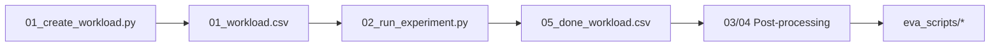

# Run from Scratch (HPC)

**You want to recompute the entire dataset from scratch—millions of experiments on HPC/SLURM, with resumability and failure handling.**

---

## What You'll Accomplish

- Run a complete AL experiment pipeline
- Scale to millions of experiments on HPC clusters
- Handle failures, resume, and track progress

---

## Quick Start

=== "Local (verify setup)"

    ```bash
    # Setup
    conda create --name ogal --file conda-linux-64.lock && conda activate ogal && poetry install
    export OGAL_OUTPUT=/path/to/results

    # Create and run one experiment
    python 01_create_workload.py --EXP_TITLE smoke_test
    python 02_run_experiment.py --EXP_TITLE smoke_test --WORKER_INDEX 0

    # Verify
    ls ${OGAL_OUTPUT}/smoke_test/05_done_workload.csv
    ```

=== "HPC (SLURM)"

    ```bash
    # Create workload (generates SLURM script)
    python 01_create_workload.py --EXP_TITLE full_run

    # Submit to cluster
    sbatch ${OGAL_OUTPUT}/full_run/02_slurm.slurm

    # Monitor
    watch -n 60 'wc -l ${OGAL_OUTPUT}/full_run/05_done_workload.csv'
    ```

---

## Pipeline at a Glance



| Script | What It Does |
|--------|--------------|
| `01_create_workload.py` | Cartesian product of hyperparameters → `01_workload.csv` |
| `02_run_experiment.py` | Runs one experiment (by `WORKER_INDEX`) |
| `03_calculate_dataset_categorizations.py` | Sample-level features |
| `04_calculate_advanced_metrics.py` | AUC, ramp-up metrics |

---

## HPC Configuration

Create `.server_access_credentials.cfg`:

```ini
[HPC]
SSH_LOGIN=user@login.hpc.example.edu
DATASETS_PATH=/path/to/datasets          # Customize to your environment
OUTPUT_PATH=/path/to/exp_results          # Customize to your environment
SLURM_MAIL=your.email@example.edu
SLURM_PROJECT=your_project_account
PYTHON_PATH=/path/to/conda-env/bin/python # Customize to your environment

[LOCAL]
DATASETS_PATH=/path/to/datasets
OUTPUT_PATH=/path/to/exp_results
```

---

## Resume After Failure

OGAL automatically tracks progress:

| File | Purpose |
|------|---------|
| `05_done_workload.csv` | Completed experiments |
| `05_failed_workloads.csv` | Failed experiments |
| `05_started_oom_workloads.csv` | OOM-killed experiments |

**To resume:**

```bash
# Regenerate workload (excludes completed)
python 01_create_workload.py --EXP_TITLE my_experiment
sbatch ${OGAL_OUTPUT}/my_experiment/02_slurm.slurm
```

---

## Post-Processing

After experiments complete:

```bash
# Compute derived metrics
python 03_calculate_dataset_categorizations.py --EXP_TITLE my_experiment --SAMPLES_CATEGORIZER _ALL --EVA_MODE local
python 04_calculate_advanced_metrics.py --EXP_TITLE my_experiment --COMPUTED_METRICS _ALL --EVA_MODE local

# Generate leaderboard
python -m eva_scripts.learning_curve --EXP_TITLE my_experiment
python -m eva_scripts.final_leaderboard --EXP_TITLE my_experiment
```

---

## Troubleshooting

| Issue | Solution |
|-------|----------|
| `FileNotFoundError` for datasets | Check `DATASETS_PATH` in config |
| Jobs killed (OOM) | Increase `SLURM_MEMORY`; check `05_started_oom_workloads.csv` |
| Experiments not completing | Increase `EXP_QUERY_SELECTION_RUNTIME_SECONDS_LIMIT` |

---

## Next Steps

| Goal | Page |
|------|------|
| Extend with new strategies/datasets | [Extend the Benchmark](extend_benchmark.md) |
| Analyze results | [Analyze OPARA](analyze_dataset.md) |
| Understand the architecture | [Architecture & Design](understand_codebase.md) |
