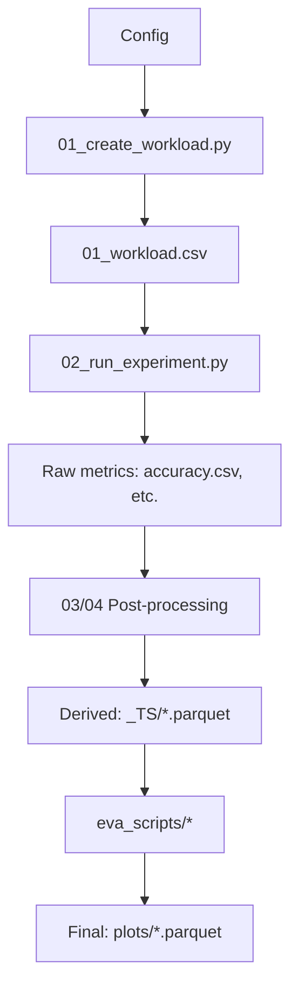

# Understand the Codebase

**You're a developer who wants to understand the complete OGAL codebase—architecture, data model, design decisions, and how all the pieces fit together.**

This guide gives you the mental model to navigate and modify any part of the system.

---

## What You'll Learn

- The pipeline architecture and how data flows through it
- Design decisions and their rationale
- Key abstractions and where to find them
- How to trace execution from config to results

---

## The Big Picture

OGAL is a **pipeline system** for running and analyzing millions of Active Learning experiments.



---

## Design Goals

| Goal | How It's Achieved |
|------|-------------------|
| **HPC-scale parallelism** | Each experiment is independent; `WORKER_INDEX` selects one row from workload |
| **Idempotent/resumable** | `05_done_workload.csv` tracks completed experiments |
| **Deterministic** | Fixed random seeds; workload is a Cartesian product |
| **Framework-agnostic** | Unified runner interface adapts 5+ AL frameworks |
| **Fast iteration** | Vectorized workload creation; append-only metrics; NPZ caching |

---

## Directory Structure

```
olympic-games-of-active-learning/
├── 00_download_datasets.py      # Step 0: Get datasets
├── 01_create_workload.py        # Step 1: Generate experiment grid
├── 02_run_experiment.py         # Step 2: Execute one experiment
├── 03_calculate_dataset_categorizations.py  # Step 3: Sample-level features
├── 04_calculate_advanced_metrics.py         # Step 4: AUC, etc.
├── 05_analyze_partially_run_workload.py     # Step 5: Progress analysis
├── 07b_create_results_without_flask.py      # Step 7: Result aggregation
│
├── datasets/                    # Dataset loaders
│   ├── __init__.py             # DATASET enum + load_dataset()
│   └── *_loader.py             # OpenML, Kaggle, local loaders
│
├── framework_runners/           # AL framework adapters
│   ├── base_runner.py          # Abstract AL_Experiment class
│   ├── alipy_runner.py         # ALiPy adapter
│   ├── libact_runner.py        # libact adapter
│   └── ...                     # small-text, scikit-activeml, playground
│
├── metrics/                     # Metric tracking
│   ├── base_metric.py          # Abstract Base_Metric class
│   ├── Standard_ML_Metrics.py  # Accuracy, F1, etc.
│   └── computed/               # Post-hoc derived metrics
│
├── misc/                        # Shared utilities
│   ├── config.py               # Central Config class
│   ├── helpers.py              # DataFrame joins, time series creation
│   └── plotting.py             # Plot styling
│
├── resources/                   # Configuration
│   ├── data_types.py           # ALL enums and mappings
│   ├── exp_config.yaml         # Experiment definitions
│   └── *_datasets.yaml         # Dataset definitions
│
├── eva_scripts/                 # Evaluation/analysis scripts
│
└── scripts/                     # Utility scripts
```

---

## Key Abstractions

### 1. Config (`misc/config.py`)

The **central configuration hub**. Loads from:

1. `.server_access_credentials.cfg` — Paths and SLURM settings
2. `resources/exp_config.yaml` — Experiment grids
3. CLI arguments — Override everything
4. Workload row — Runtime overrides when `WORKER_INDEX` is set

```python
from misc.config import Config
config = Config()
print(config.OUTPUT_PATH)  # Where results go
print(config.EXP_STRATEGY)  # Current strategy (when running)
```

### 2. Enums (`resources/data_types.py`)

All entities are enums for **compact storage** (millions of rows) and **stable keys**:

```python
from resources.data_types import AL_STRATEGY, DATASET, LEARNER_MODEL

# Strategy enum
print(AL_STRATEGY.ALIPY_RANDOM)  # AL_STRATEGY.ALIPY_RANDOM
print(AL_STRATEGY.ALIPY_RANDOM.value)  # 7

# Mapping: enum → (class, default_params)
al_strategy_to_python_classes_mapping[AL_STRATEGY.ALIPY_RANDOM]
```

### 3. AL_Experiment (`framework_runners/base_runner.py`)

Abstract base class that all framework adapters inherit:

```python
class AL_Experiment:
    def get_AL_strategy(self) -> None:
        """Initialize the AL strategy."""
        raise NotImplementedError
    
    def query_AL_strategy(self) -> SampleIndiceList:
        """Return indices of samples to query."""
        raise NotImplementedError
    
    def al_cycle(self):
        """Main AL loop: query → update → retrain → record."""
        for iteration in range(num_queries):
            selected = self.query_AL_strategy()
            self.local_train_labeled_idx.extend(selected)
            self.learner.fit(X_labeled, y_labeled)
            for metric in self.metrics:
                metric.post_retraining_of_learner_hook(self)
```

### 4. Base_Metric (`metrics/base_metric.py`)

Metrics implement hooks that fire at specific points in the AL loop:

```python
class Base_Metric:
    def pre_query_selection_hook(self, experiment): pass
    def post_query_selection_hook(self, experiment): pass
    def pre_retraining_of_learner_hook(self, experiment): pass
    def post_retraining_of_learner_hook(self, experiment): pass
    def save_metrics(self, config): pass
```

---

## Data Flow: Tracing an Experiment

### Phase 1: Workload Creation

```
exp_config.yaml → 01_create_workload.py → 01_workload.csv
```

- Cartesian product of all `EXP_GRID_*` parameters
- Each row gets a unique `EXP_UNIQUE_ID`
- Generates SLURM scripts for HPC submission

### Phase 2: Experiment Execution

```
01_workload.csv[WORKER_INDEX] → 02_run_experiment.py → <STRATEGY>/<DATASET>/*.csv
```

- `WORKER_INDEX` selects one row from workload
- Framework adapter is selected based on strategy prefix (`ALIPY_*`, `LIBACT_*`, etc.)
- Metrics are recorded per AL cycle
- Results appended to `05_done_workload.csv`

### Phase 3: Post-Processing

```
Raw CSVs → 03_*.py / 04_*.py → derived metrics + _TS/*.parquet
```

- `03_calculate_dataset_categorizations.py`: Sample-level features (density, uncertainty, etc.)
- `04_calculate_advanced_metrics.py`: AUC, ramp-up, plateau metrics

### Phase 4: Analysis

```
_TS/*.parquet → eva_scripts/* → plots/*.parquet + figures
```

- Time series parquets are the main input for evaluation scripts
- Scripts generate leaderboards, correlation heatmaps, paper figures

---

## "I Want to..." Quick Reference

| Goal | Where to Look |
|------|---------------|
| Change the experiment grid | `resources/exp_config.yaml` |
| Change local/HPC paths | `.server_access_credentials.cfg` |
| Add a new AL strategy | `resources/data_types.py` (enum + mapping) |
| Add a new dataset | `resources/openml_datasets.yaml` or `kaggle_datasets.yaml` |
| Add a new metric | Create class in `metrics/` extending `Base_Metric` |
| Add a new framework | Create runner in `framework_runners/` extending `AL_Experiment` |
| Generate leaderboards | `eva_scripts/final_leaderboard.py` |
| Understand path resolution | `misc/config.py::_pathes_magic` (lines 204-310) |

---

## Reading the Code

### Entry Points

| Script | Purpose |
|--------|---------|
| `01_create_workload.py` | Read this to understand workload generation |
| `02_run_experiment.py` | Read this to understand the main execution flow |
| `framework_runners/base_runner.py` | Read this to understand the AL loop |
| `eva_scripts/final_leaderboard.py` | Read this to understand result analysis |

### Key Functions

| Function | File | Purpose |
|----------|------|---------|
| `_generate_exp_param_grid` | `01_create_workload.py` | Creates Cartesian product |
| `al_cycle` | `framework_runners/base_runner.py` | Main AL loop |
| `_pathes_magic` | `misc/config.py` | Path resolution logic |
| `create_fingerprint_joined_timeseries_csv_files` | `misc/helpers.py` | Creates `_TS/*.parquet` |

---

## Next Steps

| Goal | Page |
|------|------|
| Run experiments | [Runbook](../reference/runbook.md) |
| Extend the benchmark | [Extend the Benchmark](extend_benchmark.md) |
| Understand correlations | [Correlations: Paper ↔ Code](../reference/correlations_paper_to_code.md) |
| Complete architecture details | [Architecture in 10 Minutes](../reference/concepts/architecture_in_10_minutes.md) |
| Contributing guidelines | [Contributing](../contributing.md) |
