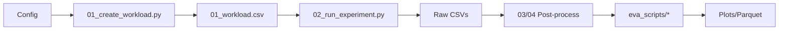

# Architecture & Design

**Deep dive into OGAL's architecture, data model, and design rationale.**

---

## The Pipeline



---

## Design Goals

| Goal | How |
|------|-----|
| **HPC-scale** | Each experiment independent; `WORKER_INDEX` selects one row |
| **Resumable** | `05_done_workload.csv` tracks completed experiments |
| **Deterministic** | Fixed seeds; Cartesian product workload |
| **Framework-agnostic** | Unified runner adapts 5+ AL frameworks |

---

## Directory Map

```
olympic-games-of-active-learning/
├── 01_create_workload.py        # Workload generation
├── 02_run_experiment.py         # Experiment execution
├── framework_runners/           # AL framework adapters
├── metrics/                     # Metric tracking
├── resources/data_types.py      # ALL enums and mappings
├── misc/config.py               # Central configuration
└── eva_scripts/                 # Evaluation scripts
```

---

## Key Abstractions

### Config (`misc/config.py`)

Central hub loading from: `.server_access_credentials.cfg` → `resources/exp_config.yaml` → CLI args → workload row.

### Enums (`resources/data_types.py`)

All entities are enums for compact storage:

```python
from resources.data_types import AL_STRATEGY
print(AL_STRATEGY.ALIPY_RANDOM.value)  # 7
```

### AL_Experiment (`framework_runners/base_runner.py`)

Abstract base class for framework adapters with the main AL loop.

---

## "I Want to..." Quick Reference

| Goal | Where |
|------|-------|
| Change experiment grid | `resources/exp_config.yaml` |
| Change paths | `.server_access_credentials.cfg` |
| Add new strategy | `resources/data_types.py` (enum + mapping) |
| Add new dataset | `resources/openml_datasets.yaml` |
| Add new metric | `metrics/` extending `Base_Metric` |
| Generate leaderboards | `eva_scripts/final_leaderboard.py` |

---

## Data Flow

1. **Workload creation:** `exp_config.yaml` → `01_create_workload.py` → `01_workload.csv`
2. **Execution:** `01_workload.csv[WORKER_INDEX]` → `02_run_experiment.py` → per-cycle CSVs
3. **Post-processing:** Raw CSVs → `03_*.py` / `04_*.py` → `_TS/*.parquet`
4. **Analysis:** `_TS/*.parquet` → `eva_scripts/*` → `plots/*.parquet`

---

## Entry Points for Reading Code

| Script | Start Here To Understand |
|--------|--------------------------|
| `01_create_workload.py` | Workload generation |
| `02_run_experiment.py` | Main execution flow |
| `framework_runners/base_runner.py` | AL loop |
| `eva_scripts/final_leaderboard.py` | Result analysis |

---

## Next Steps

| Goal | Page |
|------|------|
| Run experiments | [Run from Scratch](run_from_scratch.md) |
| Extend with new components | [Extend the Benchmark](extend_benchmark.md) |
| Understand correlations | [Correlations: Paper ↔ Code](../reference/correlations_paper_to_code.md) |
