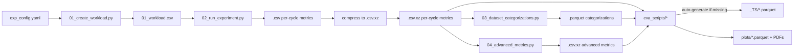

# Architecture & Design

**OGAL's pipeline, data model, and design rationale — a detailed guide to the full data flow.**

---

## The Pipeline


```mermaid
flowchart LR
    CFG["exp_config.yaml"] --> GRID["01_create_workload.py"]
    GRID --> WL["01_workload.csv"]
    WL --> RUN["02_run_experiment.py"]
    RUN --> RAW[".csv per-cycle metrics"]
    RAW --> COMP["compress to .csv.xz"]
    COMP --> XZ[".csv.xz per-cycle metrics"]
    XZ --> CAT["03_dataset_categorizations.py"]
    XZ --> ADV["04_advanced_metrics.py"]
    CAT --> NPZ[".parquet categorizations"]
    ADV --> ADVXZ[".csv.xz advanced metrics"]
    XZ --> EVA["eva_scripts/*"]
    NPZ --> EVA
    ADVXZ --> EVA
    EVA -->|"auto-generate if missing"| TS["_TS/*.parquet"]
    EVA --> ART["plots/*.parquet + PDFs"]
```

---

## Design Goals

| Goal | How |
|------|-----|
| **HPC-scale** | Each experiment independent; `WORKER_INDEX` selects one row from `01_workload.csv` |
| **Resumable** | `05_done_workload.csv` tracks completed experiments; re-running `01_create_workload.py` skips them |
| **Deterministic** | Fixed seeds; Cartesian product workload ensures full coverage |
| **Framework-agnostic** | Unified runner adapts 5+ AL frameworks (ALiPy, libact, small-text, scikit-activeml, playground) |

---

## Configuration

All configuration flows through `misc/config.py`, which loads settings from multiple sources in this priority order:

1. `.server_access_credentials.cfg` — paths and HPC settings (`DATASETS_PATH`, `OUTPUT_PATH`, `SLURM_*`)
2. `resources/exp_config.yaml` — experiment grid definitions (`EXP_GRID_*` parameters)
3. CLI arguments — override any setting at runtime
4. Workload row — during execution, `02_run_experiment.py` loads one row from `01_workload.csv`

### Key Path Variables

| Config Variable | Default | Resolves To |
|----------------|---------|-------------|
| `OUTPUT_PATH` | From `.server_access_credentials.cfg` | `{OUTPUT_PATH}/{EXP_TITLE}/` |
| `CORRELATION_TS_PATH` | `_TS` | `{OUTPUT_PATH}/_TS/` |
| `EXP_ID_METRIC_CSV_FOLDER_PATH` | `metrics` | `{OUTPUT_PATH}/metrics/` |
| `OVERALL_DONE_WORKLOAD_PATH` | `05_done_workload.csv` | `{OUTPUT_PATH}/05_done_workload.csv` |

---

## Detailed Data Flow

### Step 0: Download Datasets

```bash
python 00_download_datasets.py
```

- **Reads:** `resources/openml_datasets.yaml`, `resources/kaggle_datasets.yaml`
- **Produces:** Dataset CSV files in `DATASETS_PATH`
- **Also computes:** Cosine distance matrices for datasets (used later by distance metrics)

### Step 1: Create Workload

```bash
python 01_create_workload.py --EXP_TITLE my_experiment
```

- **Reads:** `resources/exp_config.yaml` (the `EXP_GRID_*` parameters: strategy, dataset, batch size, learner model, seed, etc.)
- **Produces:**
    - `{OUTPUT_PATH}/01_workload.csv` — Cartesian product of all hyperparameter combinations. Each row is one experiment with a unique `EXP_UNIQUE_ID`.
    - `{OUTPUT_PATH}/01_non_hpc_workload.csv` — Subset of experiments not suitable for HPC (if any)
- **Logic:** Filters out incompatible combinations (e.g., binary-only strategies on multiclass datasets), experiments that already completed (from `05_done_workload.csv`), and known OOM/failed experiments.

### Step 2: Run Experiments

```bash
python 02_run_experiment.py --EXP_TITLE my_experiment --WORKER_INDEX 0
```

Each worker picks one row from `01_workload.csv` and runs the full AL loop. The framework runner (determined by `EXP_STRATEGY`) handles: initialization → query selection → labeling → model retraining → metric recording, repeated for all AL cycles.

- **Reads:** `01_workload.csv` row at `WORKER_INDEX`, dataset from `DATASETS_PATH`
- **Produces per experiment** in `{OUTPUT_PATH}/{STRATEGY_NAME}/{DATASET_NAME}/` as `.csv` files (which must be compressed to `.csv.xz` afterwards):

| File | Contents |
|------|----------|
| `accuracy.csv.xz` | Per-cycle accuracy values |
| `weighted_f1-score.csv.xz` | Per-cycle weighted F1 scores |
| `macro_f1-score.csv.xz` | Per-cycle macro F1 scores |
| `weighted_precision.csv.xz` | Per-cycle weighted precision |
| `macro_precision.csv.xz` | Per-cycle macro precision |
| `weighted_recall.csv.xz` | Per-cycle weighted recall |
| `macro_recall.csv.xz` | Per-cycle macro recall |
| `query_selection_time.csv.xz` | Time taken per query selection |
| `learner_training_time.csv.xz` | Time taken per model retraining |
| `selected_indices.csv.xz` | Which sample indices were queried |
| `y_pred_train.csv.xz` | Model predictions on training set |
| `y_pred_test.csv.xz` | Model predictions on test set |

Each CSV has one row per experiment (`EXP_UNIQUE_ID`) with columns for each AL cycle iteration.

- **Also updates:** `{OUTPUT_PATH}/05_done_workload.csv` (appends completed experiment)

### Step 3: Dataset Categorizations

```bash
python 03_calculate_dataset_categorizations.py --EXP_TITLE my_experiment --SAMPLES_CATEGORIZER _ALL --EVA_MODE local
```

Computes sample-level features for each dataset, independent of experiment results. These categorizations characterize how "hard" or "interesting" each sample is.

- **Reads:** Dataset CSVs from `DATASETS_PATH`
- **Produces** in `{OUTPUT_PATH}/{DATASET_NAME}/`:

| Categorizer | What It Measures |
|------------|------------------|
| `COUNT_WRONG_CLASSIFICATIONS` | How often a sample is misclassified |
| `SWITCHES_CLASS_OFTEN` | How often predicted class changes across AL cycles |
| `CLOSENESS_TO_DECISION_BOUNDARY` | Distance to the nearest decision boundary |
| `REGION_DENSITY` | Local density of samples |
| `MELTING_POT_REGION` | Mixed-class region indicator |
| `INCLUDED_IN_OPTIMAL_STRATEGY` | Whether the sample is in the optimal query set |
| `CLOSENESS_TO_SAMPLES_OF_SAME_CLASS_kNN` | kNN distance to same-class samples |
| `CLOSENESS_TO_SAMPLES_OF_OTHER_CLASS_kNN` | kNN distance to other-class samples |
| `CLOSENESS_TO_CLUSTER_CENTER` | Distance to cluster centers |
| `IMPROVES_ACCURACY_BY` | Accuracy improvement from labeling this sample |
| `AVERAGE_UNCERTAINTY` | Mean model uncertainty for this sample |
| `OUTLIERNESS` | Outlier score |
| `CLOSENESS_TO_SAMPLES_OF_SAME_CLASS` | Non-kNN same-class distance |
| `CLOSENESS_TO_SAMPLES_OF_OTHER_CLASS` | Non-kNN other-class distance |

### Step 4: Advanced Metrics

```bash
python 04_calculate_advanced_metrics.py --EXP_TITLE my_experiment --COMPUTED_METRICS _ALL --EVA_MODE local
```

Computes derived metrics from the raw per-cycle results. These are aggregations that summarize how each experiment performed.

- **Reads:** Per-cycle CSVs from step 2 (e.g., `weighted_f1-score.csv.xz`, `accuracy.csv.xz`)
- **Produces** in `{OUTPUT_PATH}/{STRATEGY_NAME}/{DATASET_NAME}/`:

| Computed Metric | Output Files | Description |
|----------------|--------------|-------------|
| `STANDARD_AUC` | `full_auc_{base_metric}.csv.xz`, `ramp_up_auc_{base_metric}.csv.xz`, `plateau_auc_{base_metric}.csv.xz`, `final_value_{base_metric}.csv.xz`, `first_5_{base_metric}.csv.xz`, `last_5_{base_metric}.csv.xz` | AUC-based aggregations of the learning curve for each base metric (accuracy, weighted_f1-score, etc.) |
| `DISTANCE_METRICS` | Distance metric CSVs | Sample distance and similarity measures |
| `MISMATCH_TRAIN_TEST` | Mismatch CSVs | Train/test distribution divergence |
| `CLASS_DISTRIBUTIONS` | Class distribution CSVs | Per-cycle class balance changes |
| `METRIC_DROP` | Metric drop CSVs | Performance drop analysis |
| `DATASET_CATEGORIZATION` | Categorization CSVs | Dataset hardness metrics |
| `TIMELAG_METRIC` | Timelag CSVs | Prediction lag analysis |

### Step 5: Prerequisite Scripts

Before running evaluation scripts, run the prerequisite conversion scripts:

```bash
python scripts/convert_y_pred_to_parquet.py --EXP_TITLE my_experiment
python -m eva_scripts.calculate_dataset_dependend_random_ramp_slope --EXP_TITLE my_experiment
```

- **`convert_y_pred_to_parquet.py`** converts y_pred CSV files to parquet format for faster I/O
- **`calculate_dataset_dependend_random_ramp_slope.py`** computes dataset-dependent random baseline slopes used by the evaluation scripts

### Step 5b: Time Series (`_TS/*.parquet`) — Auto-Generated

The `_TS/*.parquet` time series files are **not** created by a single dedicated script. Instead, multiple evaluation scripts automatically generate the `_TS/*.parquet` files they need if they are missing. These scripts read all per-cycle CSVs, join them with the workload definition, and create sorted parquet files.

The following `eva_scripts` auto-generate `_TS/*.parquet` when missing:

- `final_leaderboard_single_cell_correlation.py`
- `leaderboard_single_hyperparameter_influence.py`
- `leaderboard_scenarios.py`
- `single_hyperparameter_evaluation_metric.py`
- `single_hyperparameter_evaluation_indices.py`
- `runtime.py`
- `auc_metric_correlation.py`
- `basic_metrics_correlation.py`
- `learning_curve.py`

Each script checks if the needed `_TS/*.parquet` file exists, and if not, creates it from the raw per-cycle CSVs and workload data.

- **Reads:** Per-cycle CSVs (e.g., `weighted_f1-score.csv.xz`), `05_done_workload.csv`
- **Produces** in `{OUTPUT_PATH}/_TS/`:
    - `weighted_f1-score.parquet` — Sorted time series with columns: `EXP_DATASET`, `EXP_STRATEGY`, `EXP_BATCH_SIZE`, `EXP_LEARNER_MODEL`, `EXP_TRAIN_TEST_BUCKET_SIZE`, `ix` (cycle), `metric_value`
    - Similar parquets for other metrics as needed

### Step 6: Evaluation Scripts

With prerequisites in place, all evaluation scripts can run (they will auto-generate `_TS/*.parquet` files if missing):

```bash
python -m eva_scripts.calculate_leaderboard_rankings --EXP_TITLE my_experiment
python -m eva_scripts.final_leaderboard --EXP_TITLE my_experiment
```

- **Reads:** `_TS/*.parquet`, `05_done_workload.csv`
- **Produces** in `{OUTPUT_PATH}/plots/`:
    - `plots/final_leaderboard/*.parquet` — Strategy rankings
    - `plots/single_hyperparameter/*` — Hyperparameter influence heatmaps
    - `plots/runtime/*` — Runtime analysis
    - Various PDFs for paper figures

See [Eva Scripts Catalog](../reference/eva_scripts_catalog.md) for the full list.

---

## Files After Each Step

```
{OUTPUT_PATH}/{EXP_TITLE}/
├── 01_workload.csv                          # Step 1: experiment queue
├── 05_done_workload.csv                     # Step 2: tracking file (appended)
├── 05_failed_workloads.csv                  # Step 2: failed experiments
├── 05_started_oom_workloads.csv             # Step 2: OOM-killed experiments
│
├── {STRATEGY}/{DATASET}/                    # Step 2: raw per-cycle metrics (.csv, compress to .csv.xz)
│   ├── accuracy.csv.xz
│   ├── weighted_f1-score.csv.xz
│   ├── macro_f1-score.csv.xz
│   ├── query_selection_time.csv.xz
│   ├── selected_indices.csv.xz
│   ├── y_pred_train.csv.xz
│   ├── y_pred_test.csv.xz
│   └── ...
│
├── {STRATEGY}/{DATASET}/                    # Step 4: advanced metrics
│   ├── full_auc_weighted_f1-score.csv.xz
│   ├── ramp_up_auc_weighted_f1-score.csv.xz
│   ├── plateau_auc_weighted_f1-score.csv.xz
│   ├── final_value_weighted_f1-score.csv.xz
│   └── ...
│
├── {DATASET}/                               # Step 3: categorizations
│   ├── COUNT_WRONG_CLASSIFICATIONS.parquet
│   ├── REGION_DENSITY.parquet
│   └── ...
│
├── _TS/                                     # Auto-generated by eva_scripts
│   ├── weighted_f1-score.parquet
│   └── ...
│
└── plots/                                   # Step 6: evaluation outputs
    ├── final_leaderboard/
    ├── single_hyperparameter/
    ├── runtime/
    └── ...
```

---

## Directory Map

```
olympic-games-of-active-learning/
├── 00_download_datasets.py         # Dataset acquisition from OpenML/Kaggle
├── 01_create_workload.py           # Workload generation (hyperparameter grid)
├── 02_run_experiment.py            # Experiment execution (one per worker)
├── 03_calculate_dataset_categorizations.py  # Sample-level features
├── 04_calculate_advanced_metrics.py         # Derived metrics (AUC, etc.)
├── 05_analyze_partially_run_workload.py     # Progress monitoring
├── 07b_create_results_without_flask.py      # Standalone HTML visualization
├── framework_runners/              # AL framework adapters
│   ├── base_runner.py              # Abstract base class (AL loop)
│   ├── alipy_runner.py             # ALiPy strategies
│   ├── libact_runner.py            # libact strategies
│   ├── smalltext_runner.py         # small-text strategies
│   ├── skactiveml_runner.py        # scikit-activeml strategies
│   ├── playground_runner.py        # Custom strategies
│   └── optimal_runner.py           # Oracle strategies
├── metrics/                        # Metric recording during experiments
│   ├── Standard_ML_Metrics.py      # accuracy, F1, precision, recall
│   ├── Timing_Metrics.py           # query_selection_time, learner_training_time
│   ├── Selected_Indices.py         # selected sample indices
│   └── Predicted_Samples.py        # y_pred_train, y_pred_test
├── resources/
│   ├── data_types.py               # ALL enums (AL_STRATEGY, COMPUTED_METRIC, etc.)
│   ├── exp_config.yaml             # Experiment grid definitions
│   └── openml_datasets.yaml        # OpenML dataset configurations
├── misc/config.py                  # Central configuration
├── eva_scripts/                    # Evaluation & plotting scripts
└── scripts/                        # Utility, fix, and maintenance scripts
```

---

## Key Abstractions

### Config (`misc/config.py`)

Central hub loading from: `.server_access_credentials.cfg` → `resources/exp_config.yaml` → CLI args → workload row.

### Enums (`resources/data_types.py`)

All entities are stored as integer enums for compact CSV storage:

```python
from resources.data_types import AL_STRATEGY, LEARNER_MODEL
print(AL_STRATEGY.ALIPY_RANDOM.value)  # 7
print(LEARNER_MODEL.RF.value)          # 1
```

Key enums: `AL_STRATEGY` (76 strategies), `AL_FRAMEWORK` (6 frameworks), `LEARNER_MODEL` (14 models), `COMPUTED_METRIC` (7 types), `SAMPLES_CATEGORIZER` (14 types).

### AL_Experiment (`framework_runners/base_runner.py`)

Abstract base class for framework adapters. Key methods:

- `get_AL_strategy()` — Initialize the strategy
- `query_AL_strategy()` → indices — Select samples to query
- `al_cycle()` — Main loop: query → update → retrain → record metrics

### Monitoring (`05_analyze_partially_run_workload.py`)

Analyzes progress of a partially completed experiment run:

- Groups completed experiments by dataset/strategy/model/hyperparameters
- Calculates mean query selection time per combination
- Identifies which parameter combinations are missing

### Visualization (`07b_create_results_without_flask.py`)

Generates a standalone HTML file with interactive result visualizations (AUC tables, learning curves, runtime plots) without requiring a Flask server.

---

## "I Want to..." Quick Reference

| Goal | Where |
|------|-------|
| Change experiment grid | `resources/exp_config.yaml` |
| Change paths | `.server_access_credentials.cfg` |
| Add new strategy | `resources/data_types.py` (enum + mapping) |
| Add new dataset | `resources/openml_datasets.yaml` |
| Add new metric | `metrics/` extending `Base_Metric` |
| Generate leaderboards | `eva_scripts/final_leaderboard.py` |
| Monitor progress | `05_analyze_partially_run_workload.py` |
| Build standalone HTML results | `07b_create_results_without_flask.py` |
| Fix broken result files | See [Fix Scripts](reproduce_and_run.md#fix-scripts-only-needed-if-something-breaks) |

---

## Next Steps

| Goal | Page |
|------|------|
| Run experiments / reproduce paper | [Reproduce & Run](reproduce_and_run.md) |
| Extend with new components | [Extend the Benchmark](extend_benchmark.md) |
| Full list of evaluation scripts | [Eva Scripts Catalog](../reference/eva_scripts_catalog.md) |
| Understand correlations | [Correlations: Paper ↔ Code](../reference/correlations_paper_to_code.md) |
