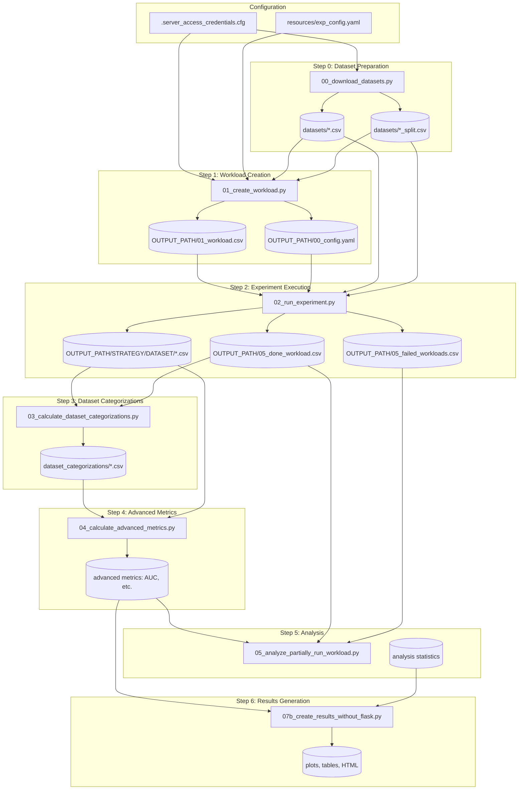

# Pipeline Documentation

This document provides a complete runbook for the OGAL sequential pipeline. Each script must be executed in order, as outputs from one step serve as inputs to the next.

!!! tip "Related Documentation"
    - **[HPC Setup](hpc.md)**: For running Step 2 at scale on HPC clusters with SLURM
    - **[Evaluation Pipeline](evaluation_pipeline.md)**: For post-processing (Steps 3-6) and generating paper figures
    - **[Results Format](results_format.md)**: For understanding output file schemas

## Paper Context

The pipeline implements the hyperparameter grid search described in [arXiv:2506.03817](https://arxiv.org/abs/2506.03817). In the paper's notation:

- **Experiment E = (𝒮, D, 𝒯, ℐ, M, b, c, ℒ)** — a single AL simulation
- **Experimental grid = 𝕊 × 𝔻 × 𝕋 × 𝕀 × 𝔹 × 𝕃** — Cartesian product of hyperparameters
- **Results R(M)** — time series of metrics M over AL cycles
- **Results R(Q)** — time series of queried sample indices

## Pipeline Data Flow



---

## Step 0: Download Datasets

**Script:** [`00_download_datasets.py`](https://github.com/jgonsior/olympic-games-of-active-learning/blob/main/00_download_datasets.py)

### Purpose

Downloads and preprocesses datasets from OpenML and Kaggle, creating standardized CSV files with train/test splits and pre-computed pairwise distances.

### Configuration

- Reads dataset definitions from:
  - [`resources/openml_datasets.yaml`](https://github.com/jgonsior/olympic-games-of-active-learning/blob/main/resources/openml_datasets.yaml)
  - [`resources/kaggle_datasets.yaml`](https://github.com/jgonsior/olympic-games-of-active-learning/blob/main/resources/kaggle_datasets.yaml)
- Output path controlled by `LOCAL_DATASETS_PATH` or `HPC_DATASETS_PATH` in `.server_access_credentials.cfg`

### Inputs

| Source | Description |
|--------|-------------|
| [`resources/openml_datasets.yaml`](https://github.com/jgonsior/olympic-games-of-active-learning/blob/main/resources/openml_datasets.yaml) | OpenML dataset IDs and parameters |
| [`resources/kaggle_datasets.yaml`](https://github.com/jgonsior/olympic-games-of-active-learning/blob/main/resources/kaggle_datasets.yaml) | Kaggle dataset names and parameters |

### Outputs

| Path | Format | Description |
|------|--------|-------------|
| `DATASETS_PATH/<dataset>.csv` | CSV | Feature matrix with `LABEL_TARGET` column (source: [`datasets/__init__.py::load_dataset`](https://github.com/jgonsior/olympic-games-of-active-learning/blob/main/datasets/__init__.py)) |
| `DATASETS_PATH/<dataset>_split.csv` | CSV | Train/test indices and start points |
| `DATASETS_PATH/<dataset>_distances.csv.gzip` | Gzipped CSV | Pairwise distance matrix (optional) |

### Usage

```bash
python 00_download_datasets.py
```

### Common Issues

- **Kaggle API credentials**: Ensure `~/.kaggle/kaggle.json` exists
- **Network connectivity**: Some datasets require stable connections
- **Disk space**: Large datasets can consume significant storage

---

## Step 1: Create Workload

**Script:** [`01_create_workload.py`](https://github.com/jgonsior/olympic-games-of-active-learning/blob/main/01_create_workload.py)

### Purpose

Generates the experiment workload by creating the Cartesian product **𝕊 × 𝔻 × 𝕋 × 𝕀 × 𝔹 × 𝕃** of all hyperparameter combinations:

- Datasets (𝔻)
- AL Strategies (𝕊)
- Learner Models (𝕃)
- Batch Sizes (𝔹)
- Train/Test Splits (𝕋)
- Start Sets (𝕀)

### Configuration

- Uses [`resources/exp_config.yaml`](https://github.com/jgonsior/olympic-games-of-active-learning/blob/main/resources/exp_config.yaml) for experiment grid definitions
- Uses `.server_access_credentials.cfg` for paths

### Inputs

| Source | Description |
|--------|-------------|
| [`resources/exp_config.yaml`](https://github.com/jgonsior/olympic-games-of-active-learning/blob/main/resources/exp_config.yaml) | Experiment grid definitions |
| `DATASETS_PATH/*.csv` | Available datasets |
| `DATASETS_PATH/*_split.csv` | Train/test split information |

### Outputs

| Path | Format | Description |
|------|--------|-------------|
| `OUTPUT_PATH/<EXP_TITLE>/01_workload.csv` | CSV | Full workload with `EXP_UNIQUE_ID` per combination |
| `OUTPUT_PATH/<EXP_TITLE>/00_config.yaml` | YAML | Saved experiment configuration |
| `OUTPUT_PATH/<EXP_TITLE>/02_slurm.slurm` | SLURM | Generated SLURM job script |
| `OUTPUT_PATH/<EXP_TITLE>/02b_run_bash_parallel.py` | Python | Local parallel runner |

### Key Configuration Fields

| Field | Type | Description |
|-------|------|-------------|
| `EXP_GRID_DATASET` | List[int\|str] | Dataset IDs or names |
| `EXP_GRID_STRATEGY` | List[str] | AL strategy names |
| `EXP_GRID_LEARNER_MODEL` | List[str] | Learner model types |
| `EXP_GRID_BATCH_SIZE` | List[int] | Batch sizes for AL queries |
| `EXP_GRID_RANDOM_SEED` | List[int] | Random seeds |
| `EXP_GRID_START_POINT` | List[int] | Initial labeled sample indices |
| `EXP_GRID_TRAIN_TEST_BUCKET_SIZE` | List[int] | Train/test split bucket indices |
| `EXP_GRID_NUM_QUERIES` | List[int] | Number of AL iterations |
| `METRICS` | List[str] | Metrics to compute per cycle |

### Usage

```bash
# Using YAML configuration
python 01_create_workload.py --EXP_TITLE test

# The experiment name "test" must exist in resources/exp_config.yaml
```

### Workload Resume Behavior

If `05_done_workload.csv` exists, the script automatically (source: [`01_create_workload.py`](https://github.com/jgonsior/olympic-games-of-active-learning/blob/main/01_create_workload.py#L105-L121) lines 105-121):

1. Loads completed experiment IDs
2. Excludes them from the new workload
3. Prints the reduction in workload size

---

## Step 2: Run Experiment

**Script:** [`02_run_experiment.py`](https://github.com/jgonsior/olympic-games-of-active-learning/blob/main/02_run_experiment.py)

### Purpose

Executes a single AL experiment based on the `WORKER_INDEX` parameter. This script is designed to be called many times in parallel, each with a different worker index.

### Configuration

- Reads workload from `OUTPUT_PATH/<EXP_TITLE>/01_workload.csv`
- `WORKER_INDEX` selects the row (0-indexed) from the workload

### Inputs

| Source | Description |
|--------|-------------|
| `01_workload.csv` | Workload definition (row selected by WORKER_INDEX) |
| `DATASETS_PATH/<dataset>.csv` | Dataset features and labels |
| `DATASETS_PATH/<dataset>_split.csv` | Train/test indices |

### Outputs

Per experiment, organized by strategy and dataset:

| Path | Format | Description |
|------|--------|-------------|
| `OUTPUT_PATH/<STRATEGY>/<DATASET>/accuracy.csv` | CSV | Accuracy per AL cycle |
| `OUTPUT_PATH/<STRATEGY>/<DATASET>/weighted_f1-score.csv` | CSV | Weighted F1 per cycle |
| `OUTPUT_PATH/<STRATEGY>/<DATASET>/selected_indices.csv` | CSV | Selected sample indices |
| `OUTPUT_PATH/<STRATEGY>/<DATASET>/query_selection_time.csv` | CSV | Query timing |
| `OUTPUT_PATH/<STRATEGY>/<DATASET>/y_pred_*.parquet` | Parquet | Predictions per cycle |

Global tracking files (source: [`misc/config.py::Config.OVERALL_*_PATH`](https://github.com/jgonsior/olympic-games-of-active-learning/blob/main/misc/config.py::Config.OVERALL_*_PATH)):

| Path | Description |
|------|-------------|
| `05_done_workload.csv` | Successfully completed experiments |
| `05_failed_workloads.csv` | Failed experiments with error types |
| `05_started_oom_workloads.csv` | OOM-killed experiments |

### Usage

```bash
# Run single experiment
python 02_run_experiment.py --EXP_TITLE test --WORKER_INDEX 0

# For HPC: SLURM job arrays handle WORKER_INDEX automatically
```

### Runtime Limits

- `EXP_QUERY_SELECTION_RUNTIME_SECONDS_LIMIT`: Per-query timeout (default: 300s; source: [`misc/config.py::Config.EXP_QUERY_SELECTION_RUNTIME_SECONDS_LIMIT`](https://github.com/jgonsior/olympic-games-of-active-learning/blob/main/misc/config.py))
- Experiments exceeding this limit are early-stopped

### Common Failures

| Error | Cause | Resolution |
|-------|-------|------------|
| `ConvergenceWarning` | Model didn't converge | Tracked in failed_workloads |
| `MemoryError` | OOM | Tracked in oom_workloads |
| `TimeoutError` | Query selection too slow | Early-stopped gracefully |

---

## Step 3: Calculate Dataset Categorizations

**Script:** [`03_calculate_dataset_categorizations.py`](https://github.com/jgonsior/olympic-games-of-active-learning/blob/main/03_calculate_dataset_categorizations.py)

### Purpose

Computes per-sample characteristics for each dataset, enabling analysis of which sample types benefit from different AL strategies.

### Configuration

- `--SAMPLES_CATEGORIZER`: Specify categorizers or use `_ALL`
- `--EVA_MODE`: `create` (generate workload), `local` (run locally), `slurm` (run on HPC)

### Available Categorizers

| Categorizer | Description |
|-------------|-------------|
| `COUNT_WRONG_CLASSIFICATIONS` | How often sample is misclassified |
| `SWITCHES_CLASS_OFTEN` | Prediction stability |
| `CLOSENESS_TO_DECISION_BOUNDARY` | Distance to decision boundary |
| `REGION_DENSITY` | Local density of samples |
| `MELTING_POT_REGION` | Mixed-class regions |
| `OUTLIERNESS` | Outlier score |
| `AVERAGE_UNCERTAINTY` | Average model uncertainty |

### Inputs

| Source | Description |
|--------|-------------|
| `OUTPUT_PATH/<STRATEGY>/<DATASET>/*.csv` | Experiment results |
| `DATASETS_PATH/*.csv` | Dataset features |

### Outputs

| Path | Format | Description |
|------|--------|-------------|
| `OUTPUT_PATH/workloads/DATASET_CATEGORIZATIONS/` | Various | Categorization results |

### Usage

```bash
# Create workload for all categorizers
python 03_calculate_dataset_categorizations.py --EXP_TITLE test --SAMPLES_CATEGORIZER _ALL --EVA_MODE create

# Run locally
python 03_calculate_dataset_categorizations.py --EXP_TITLE test --EVA_MODE local
```

---

## Step 4: Calculate Advanced Metrics

**Script:** [`04_calculate_advanced_metrics.py`](https://github.com/jgonsior/olympic-games-of-active-learning/blob/main/04_calculate_advanced_metrics.py)

### Purpose

Computes derived metrics from raw experiment results, including AUC-based metrics, time-lag analysis, and distance metrics.

### Configuration

- `--COMPUTED_METRICS`: Specify metrics or use `_ALL`
- `--EVA_MODE`: `create`, `local`, `slurm`

### Available Metrics

| Metric | Description |
|--------|-------------|
| `STANDARD_AUC` | Area under learning curve |
| `DISTANCE_METRICS` | Sample distance analysis |
| `MISMATCH_TRAIN_TEST` | Train/test distribution differences |
| `CLASS_DISTRIBUTIONS` | Class balance analysis |
| `METRIC_DROP` | Performance degradation points |
| `TIMELAG_METRIC` | Time-lag correlation analysis |

### Inputs

| Source | Description |
|--------|-------------|
| `OUTPUT_PATH/<STRATEGY>/<DATASET>/*.csv` | Per-cycle metrics |
| Dataset categorizations | From Step 3 |

### Outputs

| Path | Format | Description |
|------|--------|-------------|
| `OUTPUT_PATH/workloads/advanced_metrics/` | Various | Computed metric results |

### Usage

```bash
# Create workload for all metrics
python 04_calculate_advanced_metrics.py --EXP_TITLE test --COMPUTED_METRICS _ALL --EVA_MODE create

# Run locally
python 04_calculate_advanced_metrics.py --EXP_TITLE test --EVA_MODE local
```

---

## Step 5: Analyze Partially Run Workload

**Script:** [`05_analyze_partially_run_workload.py`](https://github.com/jgonsior/olympic-games-of-active-learning/blob/main/05_analyze_partially_run_workload.py)

### Purpose

Analyzes experiment completion status, timing statistics, and identifies patterns in success/failure rates across different parameter combinations.

### Inputs

| Source | Description |
|--------|-------------|
| `05_done_workload.csv` | Completed experiments |
| `05_failed_workloads.csv` | Failed experiments |
| `OUTPUT_PATH/<STRATEGY>/<DATASET>/query_selection_time.csv` | Timing data |

### Outputs

Analysis reports showing:

- Completion rates by strategy, dataset, learner
- Average runtime statistics
- Failure patterns

### Usage

```bash
python 05_analyze_partially_run_workload.py --EXP_TITLE test
```

---

## Step 6: Generate Results

**Script:** [`07b_create_results_without_flask.py`](https://github.com/jgonsior/olympic-games-of-active-learning/blob/main/07b_create_results_without_flask.py)

### Purpose

Generates final visualizations, tables, and HTML reports from processed experiment results.

### Inputs

| Source | Description |
|--------|-------------|
| All previous outputs | Metrics, categorizations, analysis |

### Outputs

| Path | Format | Description |
|------|--------|-------------|
| `test.html` | HTML | Interactive results visualization |
| Various plots | PDF/JPG | Publication-ready figures |

### Usage

```bash
python 07b_create_results_without_flask.py --EXP_TITLE test
```

---

## Debugging Tips

### Checking Experiment Progress

```bash
# Count completed experiments
wc -l OUTPUT_PATH/<EXP_TITLE>/05_done_workload.csv

# Check for failures
cat OUTPUT_PATH/<EXP_TITLE>/05_failed_workloads.csv | head

# Check OOM issues
cat OUTPUT_PATH/<EXP_TITLE>/05_started_oom_workloads.csv | head
```

### Rerunning Failed Experiments

Set `RERUN_FAILED_WORKLOADS: true` in configuration, then re-run Step 1 to regenerate workload excluding only successful runs.

### Verbose Logging

```bash
python 02_run_experiment.py --EXP_TITLE test --WORKER_INDEX 0 --LOG_FILE console
```

---

## Complete Example

```bash
python 00_download_datasets.py
```000000

---

## Auxiliary Scripts

Beyond the main pipeline, OGAL includes utility and evaluation scripts in two directories:

### [`scripts/`](https://github.com/jgonsior/olympic-games-of-active-learning/blob/main/scripts) - Utility Scripts

These scripts support data processing, format conversion, bug fixes, and experiment recovery:

| Category | Examples |
|----------|----------|
| **Data Conversion** | `convert_y_pred_to_parquet.py`, `convert_metrics_csvs_to_exp_id_csvs.py` |
| **Workload Management** | `create_dense_workload.py`, `reduce_to_dense.py`, `merge_two_workloads.py` |
| **Data Validation** | `find_missing_exp_ids_in_metric_files.py`, `find_broken_file.py` |
| **Bug Fixes** | `fix_duplicate_header_columns.py`, `fix_oom_workload.py` |
| **Experiment Recovery** | `rerun_broken_experiments.py`, `rerun_missing_exp_ids.py` |

**Common workflow after main pipeline:**

```bash
python 00_download_datasets.py
```111111

### [`eva_scripts/`](https://github.com/jgonsior/olympic-games-of-active-learning/blob/main/eva_scripts) - Evaluation Scripts

These scripts generate analyses, figures, and tables for the research paper. They analyze the experiment results to produce:

| Category | Examples | Paper Section |
|----------|----------|---------------|
| **Leaderboard Rankings** | `calculate_leaderboard_rankings.py`, `final_leaderboard.py` | Main results |
| **Hyperparameter Influence** | `leaderboard_single_hyperparameter_influence.py` | RQ1 analysis |
| **Correlation Analysis** | `basic_metrics_correlation.py`, `similar_strategies.py` | Metric analysis |
| **Learning Curves** | `learning_curve.py`, `single_learning_curve_example.py` | Figures |
| **Runtime Analysis** | `runtime.py` | Performance analysis |

**Example evaluation workflow:**

```bash
python 00_download_datasets.py
```222222

For complete documentation of all utility and evaluation scripts, see [Scripts Documentation](scripts.md).
