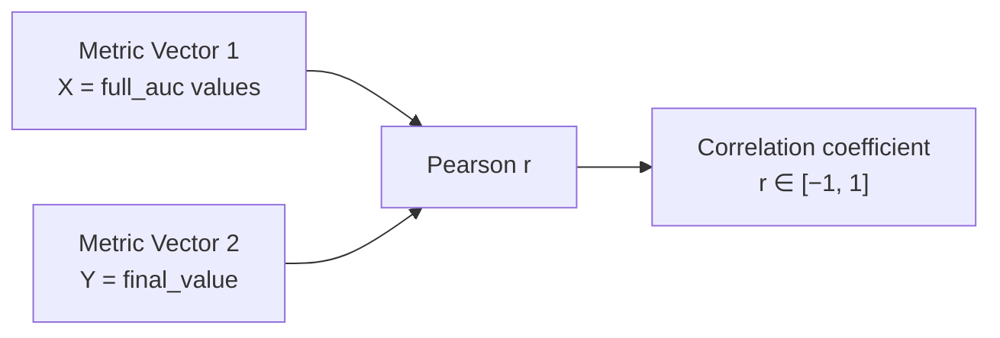
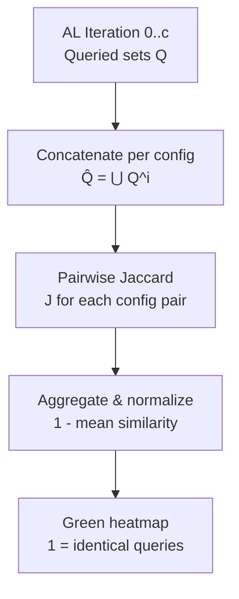
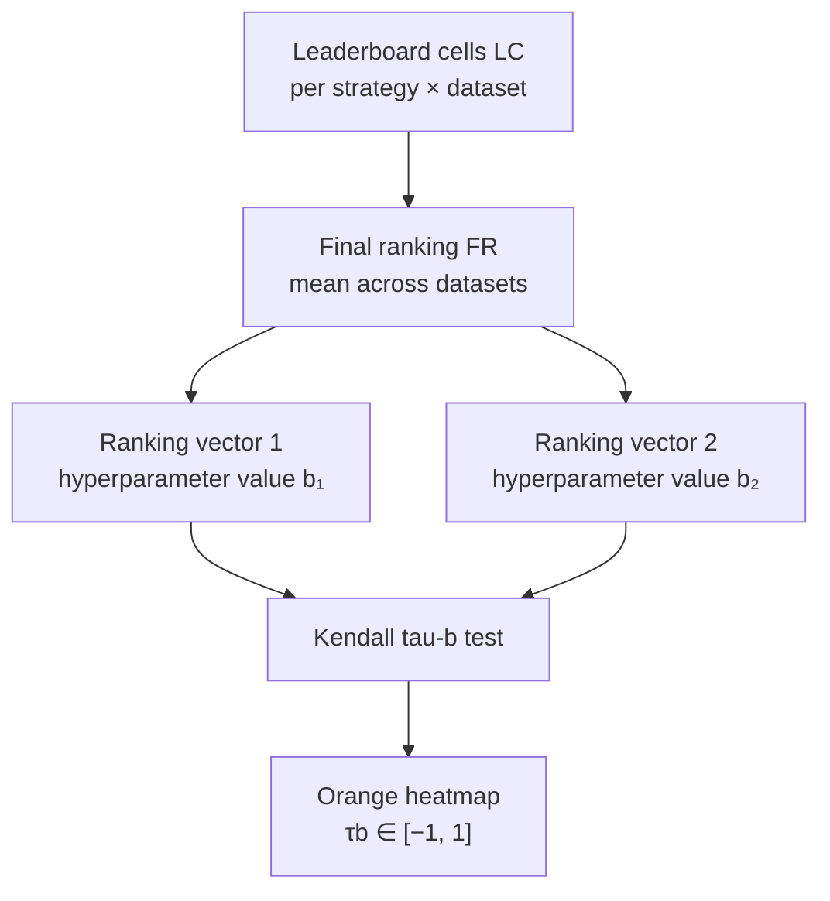

# Correlations: Paper Definitions ↔ Code

This page provides canonical definitions of the **three correlation metrics** used in the OGAL paper ([arXiv:2506.03817](https://arxiv.org/abs/2506.03817)), including their mathematical formulations (LaTeX), visual aids, and precise mappings to code implementations.

!!! tip "Related Documentation"
    - **[Evaluation Pipeline](../analyze_opara.md)**: Step-by-step guide from raw experiments to final outputs
    - **[Eva Scripts Reference](eva_scripts_catalog.md)**: Detailed catalog of all evaluation scripts

---

## Why Three Different Correlations?

OGAL evaluates active learning strategies across multiple dimensions to ensure robust comparisons:

1. **Metric-based correlation (Pearson)**: Do two strategies achieve similar performance values?
2. **Queried samples-based correlation (Jaccard)**: Do two strategies select the same samples during active learning?
3. **Leaderboard ranking invariance (Kendall tau-b)**: Do two evaluation approaches rank strategies in the same order?

Each correlation type answers a fundamentally different research question and uses different input artifacts from the OGAL pipeline.

---

## Summary Table

| Paper Term (Section) | Mathematical Core | What It Measures | Input: Vectors/Matrices | Output: Heatmap Color | Code Pointer |
|----------------------|-------------------|------------------|-------------------------|----------------------|--------------|
| **Metric-based heatmaps** (IV-B1) | Pearson $r$ on result vectors $V_b(M)$ | How metric outcomes change when varying a single hyperparameter | Vectors of aggregated metric values per hyperparameter combination | **Blue** heatmap showing $r$ correlation matrix | [`eva_scripts/workload_reduction.py`](https://github.com/jgonsior/olympic-games-of-active-learning/blob/main/eva_scripts/workload_reduction.py), [`eva_scripts/basic_metrics_correlation.py`](https://github.com/jgonsior/olympic-games-of-active-learning/blob/main/eva_scripts/basic_metrics_correlation.py) |
| **Queried samples-based heatmaps** (IV-B2) | Jaccard $J$ on query sets $\widehat{Q}$ | Agreement in which samples are selected for labeling | Vectors of concatenated queried sample sets $\widehat{Q} = \bigcup Q^i$ | **Green** heatmap showing $1 - \bar{J}$ (normalized distance) | [`eva_scripts/single_hyperparameter_evaluation_indices.py`](https://github.com/jgonsior/olympic-games-of-active-learning/blob/main/eva_scripts/single_hyperparameter_evaluation_indices.py#L260) |
| **Leaderboard ranking invariance** (IV-B3) | Kendall $\tau_b$ on final ranking vectors $FR$ | Agreement in strategy orderings across datasets | Leaderboard cells $LC$ aggregated to final rankings $FR$ | **Orange** heatmap showing $\tau_b$ rank correlation | [`eva_scripts/leaderboard_c6_rebuttal.py::kendall_tau_b_from_orders`](https://github.com/jgonsior/olympic-games-of-active-learning/blob/main/eva_scripts/leaderboard_c6_rebuttal.py#L93-L100) |

---

## 1. Metric-based Correlation (Pearson)

**Paper reference:** Section IV-B1 "Metric-based heatmaps"

### Paper Definition

Metric-based correlation quantifies how similar the outcomes of two AL experiments are when only a single hyperparameter is changed. The paper uses **Pearson correlation coefficient $r$** to compare metric result vectors.

For a given hyperparameter (e.g., batch size $\mathbb{B} = [b_1, \ldots, b_K]$), construct result vectors $V_{b_i}$ for each hyperparameter value $b_i$. Each vector contains aggregated metric values $M$ across all other fixed hyperparameters:

$$
V_{b_1}(M) = \begin{bmatrix} M_{b_1 1} \\ M_{b_1 2} \\ \vdots \end{bmatrix}, \quad 
V_{b_2}(M) = \begin{bmatrix} M_{b_2 1} \\ M_{b_2 2} \\ \vdots \end{bmatrix}
$$

where $M_{b_i j}$ denotes the metric result for the $j$-th hyperparameter combination with hyperparameter value $b_i$.

**Heatmap construction:** For all pairs of hyperparameter values, compute the Pearson correlation matrix:

$$
\begin{bmatrix}
r(V_{b_1}(M), V_{b_1}(M)) & \cdots & r(V_{b_1}(M), V_{b_K}(M)) \\
\vdots & \ddots & \vdots \\
r(V_{b_K}(M), V_{b_1}(M)) & \cdots & r(V_{b_K}(M), V_{b_K}(M))
\end{bmatrix}
$$

**Interpretation:** High correlation values (close to 1) indicate that changing the hyperparameter has minimal effect on AL outcomes. Low values indicate strong influence of the hyperparameter.

### Visual Aid



### Code Mapping

**Primary implementation:**
- **File:** [`eva_scripts/workload_reduction.py`](https://github.com/jgonsior/olympic-games-of-active-learning/blob/main/eva_scripts/workload_reduction.py)
- **Function:** Uses `scipy.stats.pearsonr` (imported at line 15)
- **Input:** Time series parquets in `CORRELATION_TS_PATH` (e.g., `_TS/full_auc_weighted_f1-score.parquet`)
- **Output:** Correlation values stored in workload reduction analysis

**Related scripts:**
- [`eva_scripts/basic_metrics_correlation.py`](https://github.com/jgonsior/olympic-games-of-active-learning/blob/main/eva_scripts/basic_metrics_correlation.py): Computes Pearson correlation matrix between standard ML metrics (accuracy, F1, precision, recall)
  - **Output:** `plots/basic_metrics/Standard Metrics.parquet`
- [`eva_scripts/auc_metric_correlation.py`](https://github.com/jgonsior/olympic-games-of-active-learning/blob/main/eva_scripts/auc_metric_correlation.py): Computes Pearson correlation between AUC-based aggregation metrics
  - **Output:** `plots/AUC/auc_*.parquet`

### How to Run

```bash
# Compute basic metric correlations (accuracy, F1, precision, recall)
python -m eva_scripts.basic_metrics_correlation --EXP_TITLE your_experiment

# Compute AUC aggregation metric correlations
python -m eva_scripts.auc_metric_correlation --EXP_TITLE your_experiment

# Workload reduction analysis (uses Pearson internally)
python -m eva_scripts.workload_reduction --EXP_TITLE your_experiment
```

**Prerequisites:**
- `05_done_workload.csv` must exist
- Time series parquets (`_TS/*.parquet`) generated by [`04_calculate_advanced_metrics.py`](https://github.com/jgonsior/olympic-games-of-active-learning/blob/main/04_calculate_advanced_metrics.py)

---

## 2. Queried Samples-based Correlation (Jaccard Similarity)

**Paper reference:** Section IV-B2 "Queried samples-based heatmaps"

### Paper Definition

Queried samples-based correlation focuses on which samples are selected for labeling, rather than the metric results. It uses the **Jaccard index $J$** to measure similarity between queried sample sets.

**Step 1: Construct query vectors.** For each hyperparameter value $b_i$, create a vector of concatenated queried sample sets across all AL cycles ($c$ iterations):

$$
V_{b_1}(Q) = \begin{bmatrix} 
\widehat{Q_{b_1 1}} = \bigcup_{i=0}^{c} Q_{b_1 1}^i \\
\widehat{Q_{b_1 2}} = \bigcup_{i=0}^{c} Q_{b_1 2}^i \\
\vdots
\end{bmatrix}, \quad
V_{b_2}(Q) = \begin{bmatrix}
\widehat{Q_{b_2 1}} = \bigcup_{i=0}^{c} Q_{b_2 1}^i \\
\widehat{Q_{b_2 2}} = \bigcup_{i=0}^{c} Q_{b_2 2}^i \\
\vdots
\end{bmatrix}
$$

where $Q^i$ represents the set of samples queried at AL iteration $i$, and $\widehat{Q}$ is the union across all iterations.

**Step 2: Compute pairwise Jaccard similarities.** For a pair of hyperparameter values $b_1$ and $b_2$, compute the Jaccard vector:

$$
V_{J_{b_1 b_2}} = \begin{bmatrix}
J(\widehat{Q_{b_1 1}}, \widehat{Q_{b_2 1}}) \\
J(\widehat{Q_{b_1 2}}, \widehat{Q_{b_2 2}}) \\
\vdots
\end{bmatrix}
$$

**Step 3: Aggregate to heatmap.** Sum the Jaccard vector and divide by its length, then subtract from 1 for consistency with metric-based heatmaps (so 1 = identical):

$$
\begin{bmatrix}
1 - \frac{\sum_{j \in V_{J_{b_1 b_1}}} j}{|V_{J_{b_1 b_1}}|} = 1 & \cdots & 1 - \frac{\sum_{j \in V_{J_{b_1 b_K}}} j}{|V_{J_{b_1 b_K}}|} \\
\vdots & \ddots & \vdots \\
1 - \frac{\sum_{j \in V_{J_{b_K b_1}}} j}{|V_{J_{b_K b_1}}|} & \cdots & 1 - \frac{\sum_{j \in V_{J_{b_K b_K}}} j}{|V_{J_{b_K b_K}}|} = 1
\end{bmatrix}
$$

**Note:** The paper uses **green color** for queried samples-based heatmaps. The Jaccard index proved more robust than rank correlation measures (Kendall tau, Spearman) due to high fluctuations in AL cycles.

### Visual Aid



### Code Mapping

**Primary implementation:**
- **File:** [`eva_scripts/single_hyperparameter_evaluation_indices.py`](https://github.com/jgonsior/olympic-games-of-active-learning/blob/main/eva_scripts/single_hyperparameter_evaluation_indices.py)
- **Function:** Line 260 computes `jaccard = len(a.intersection(b)) / len(a.union(b))` where `a` and `b` are sets of queried sample indices
- **Aggregation:** Lines 269-280 apply Jaccard calculation across all iterations and aggregate results
- **Input:** `CORRELATION_TS_PATH/selected_indices.parquet` containing arrays of queried sample IDs per iteration
- **Output:** `plots/single_hyperparameter/{TARGET}/single_indice_{TARGET}_{METRIC}_jaccard.parquet`

**Related scripts:**
- [`eva_scripts/similar_strategies.py`](https://github.com/jgonsior/olympic-games-of-active-learning/blob/main/eva_scripts/similar_strategies.py): Deprecated script that computed Jaccard between strategies (lines 104-149)
  - **Note:** Functionality now integrated into `single_hyperparameter_evaluation_indices.py`

**In code, this is called:** `selected_indices` correlation, Jaccard similarity/distance

### How to Run

```bash
# Compute Jaccard similarity for hyperparameter influence
python -m eva_scripts.single_hyperparameter_evaluation_indices --EXP_TITLE your_experiment
```

**Prerequisites:**
- `selected_indices.parquet` time series in `CORRELATION_TS_PATH`
  - Generated by [`misc/helpers.py::create_fingerprint_joined_timeseries_csv_files`](https://github.com/jgonsior/olympic-games-of-active-learning/blob/main/misc/helpers.py) with `metric_names=["selected_indices"]`
- Each experiment must have saved `selected_indices.csv.xz` files during execution

**Output interpretation:**
- Green heatmaps in paper figures show Jaccard similarity
- Higher values (closer to 1) indicate strategies select similar samples
- Used to answer: "Do hyperparameter changes affect which samples are queried?"

---

## 3. Leaderboard Ranking Invariance (Kendall tau-b)

**Paper reference:** Section IV-B3 "Leaderboard ranking invariance-based heatmaps"

### Paper Definition

Leaderboard ranking invariance compares the rankings of AL strategies under different hyperparameter values. This approach focuses on whether different evaluation choices (e.g., metrics, batch sizes) produce consistent strategy orderings.

**Step 1: Construct leaderboard.** Fix all hyperparameters except one. For each strategy $\mathcal{S}_i$ and dataset $D_j$, compute the leaderboard cell average over all configurations:

$$
LC_{\mathcal{S}_i D_j} = \frac{\sum_{M_k \in V_{D_i \mathcal{S}_j}(M)} (M_k)}{|V_{D_i \mathcal{S}_j}|}
$$

This creates a leaderboard matrix with rows = datasets, columns = strategies, cells = average metric values.

**Step 2: Compute final ranking vector.** For each strategy, average its performance across all datasets:

$$
FR = \frac{\sum_{D_i \in \mathbb{D}} LC_{\mathcal{S}_1 D_i}}{|\mathbb{D}|}
$$

Sort strategies by $FR$ to obtain an ordered **ranking vector** (list of strategy names in order of performance).

**Step 3: Correlation between rankings.** To compare two leaderboards (e.g., from different hyperparameter values), compute the **two-sided Kendall's tau-b rank correlation test**:

$$
\tau_b = \frac{n_c - n_d}{\sqrt{(n_0 - n_1)(n_0 - n_2)}}
$$

where $n_c$ = concordant pairs, $n_d$ = discordant pairs, $n_0 = \frac{n(n-1)}{2}$, and $n_1, n_2$ adjust for ties.

**Important notes from the paper:**
- Uses **ranks** instead of absolute metric values to handle cross-dataset comparability
- **Orange color** for leaderboard ranking invariance heatmaps
- Interpolates missing results with 0 (worst outcome) to handle sparse grids
- Kendall tau-b is robust to outliers and ranking distribution differences

### Visual Aid



### Code Mapping

**Primary implementation:**
- **File:** [`eva_scripts/leaderboard_c6_rebuttal.py`](https://github.com/jgonsior/olympic-games-of-active-learning/blob/main/eva_scripts/leaderboard_c6_rebuttal.py)
- **Function:** `kendall_tau_b_from_orders(order_a: list[str], order_b: list[str]) -> float` (lines 93-100)
  - Converts two ordered strategy lists to position vectors
  - Calls `scipy.stats.kendalltau(va, vb, variant="b")`
- **Helper functions:**
  - `load_rank_matrix(path: str)` (line 64): Loads rank parquet files
  - `leaderboard_order_from_matrix(R: pd.DataFrame)` (line 88): Computes mean rank and sorts to get ranking vector
- **Input:** Rank matrices from `plots/final_leaderboard/rank_*.parquet` (one per metric)
- **Output:** Tau values, facet plots, bootstrap distributions

**Related scripts:**
- [`eva_scripts/leaderboard_single_hyperparameter_influence_analyze.py`](https://github.com/jgonsior/olympic-games-of-active-learning/blob/main/eva_scripts/leaderboard_single_hyperparameter_influence_analyze.py): Computes Kendall tau to measure hyperparameter influence on leaderboard stability
- [`eva_scripts/analyze_leaderboard_rankings.py`](https://github.com/jgonsior/olympic-games-of-active-learning/blob/main/eva_scripts/analyze_leaderboard_rankings.py): General leaderboard ranking analysis with Kendall tau

**In code, this is called:** Kendall tau-b correlation, leaderboard invariance, ranking agreement

### How to Run

```bash
# Generate leaderboard rankings and compute Kendall tau-b between metrics
python -m eva_scripts.leaderboard_c6_rebuttal
```

**Prerequisites:**
- Rank matrices in `plots/final_leaderboard/rank_*.parquet`
  - Generated by [`eva_scripts/calculate_leaderboard_rankings.py`](https://github.com/jgonsior/olympic-games-of-active-learning/blob/main/eva_scripts/calculate_leaderboard_rankings.py) or [`eva_scripts/final_leaderboard.py`](https://github.com/jgonsior/olympic-games-of-active-learning/blob/main/eva_scripts/final_leaderboard.py)
- Each rank matrix must have rows=datasets, columns=strategies, values=ranks

**Output interpretation:**
- High Kendall tau-b (close to 1) means two metrics produce nearly identical strategy rankings
- Used to answer: "Is the full AUC metric redundant with final value?"
- Bootstrap confidence intervals quantify ranking stability

---

## Terminology Cross-Reference

| Paper Term | OGAL Code Alias | File Pattern |
|------------|----------------|--------------|
| Full mean AUC | `full_auc` | `full_auc_*.parquet`, `full_auc_*.csv.xz` |
| Ramp-up AUC | `ramp_up_auc` | `ramp_up_auc_*.parquet` |
| Plateau AUC | `plateau_auc` | `plateau_auc_*.parquet` |
| Final value | `final_value` | `final_value_*.parquet` |
| First 5 iterations | `first_5` | `first_5_*.parquet` |
| Last 5 iterations | `last_5` | `last_5_*.parquet` |
| Queried sample sets | `selected_indices` | `selected_indices.csv.xz`, `selected_indices.parquet` |
| Weighted F1-score | `weighted_f1-score` | `weighted_f1-score.parquet`, `weighted_f1-score.csv.xz` |

---

## Additional Resources

- **Paper:** [OGAL arXiv:2506.03817](https://arxiv.org/abs/2506.03817)
- **Dataset bundle:** [DOI 10.25532/OPARA-862](https://doi.org/10.25532/OPARA-862)
- **GitHub repository:** [jgonsior/olympic-games-of-active-learning](https://github.com/jgonsior/olympic-games-of-active-learning)
- **Documentation:** [https://jgonsior.github.io/olympic-games-of-active-learning/](https://jgonsior.github.io/olympic-games-of-active-learning/)

---

## Notes for Future Improvement

!!! warning "Paper Figure Extraction"
    If paper PDF or LaTeX sources with figures are located in the repository, extract relevant correlation diagrams and add them to `docs/assets/paper_figures/` with proper citations. Current implementation uses Mermaid diagrams as placeholders.

!!! note "Exact Paper Equation Numbers"
    The LaTeX equations above are written from general definitions. If the paper uses specific equation numbers (e.g., "Eq. 3"), cross-reference and add those labels here.

!!! note "Bootstrap Details"
    [`leaderboard_c6_rebuttal.py`](https://github.com/jgonsior/olympic-games-of-active-learning/blob/main/eva_scripts/leaderboard_c6_rebuttal.py) performs bootstrap resampling for Kendall tau confidence intervals. Add details on bootstrap methodology if described in the paper.
