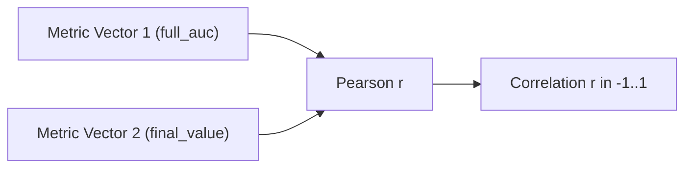
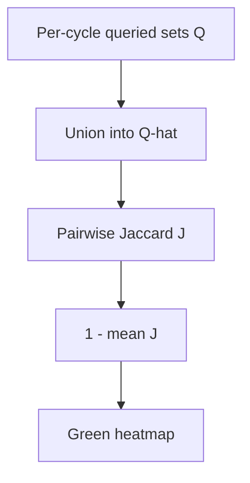
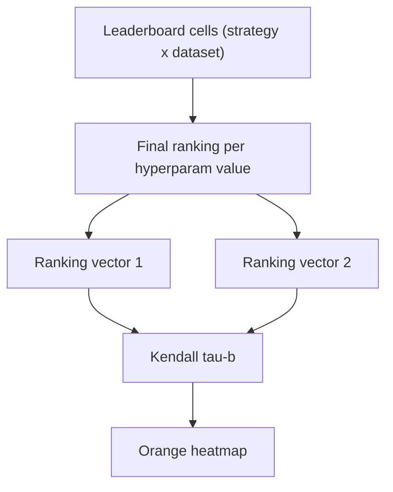

# Correlations: Paper ↔ Code

Three correlation metrics from the OGAL paper ([arXiv:2506.03817](https://arxiv.org/abs/2506.03817)) and their code implementations.

!!! tip "See also"
    [Analyze OPARA](../personas/analyze_dataset.md) · [Eva Scripts Reference](eva_scripts_catalog.md)

---

## Overview

| Correlation | Measures | Heatmap Color | Script |
|-------------|----------|---------------|--------|
| **Pearson** $r$ (§IV-B1) | Do metric outcomes change with a hyperparameter? | **Blue** | `workload_reduction.py`, `basic_metrics_correlation.py` |
| **Jaccard** $J$ (§IV-B2) | Do strategies select the same samples? | **Green** | `single_hyperparameter_evaluation_indices.py` |
| **Kendall** $\tau_b$ (§IV-B3) | Do strategy rankings stay the same? | **Orange** | `leaderboard_single_hyperparameter_influence.py`, `leaderboard_single_hyperparameter_influence_analyze.py` |

---

## 1. Metric-based (Pearson $r$)

For each value of a hyperparameter (e.g., batch size $b_i$), build a result vector $V_{b_i}(M)$ of aggregated metric values. Then compute the pairwise Pearson correlation matrix. High $r$ ≈ hyperparameter has little effect.

$$
V_{b_i}(M) = \begin{bmatrix} M_{b_i 1} \\ M_{b_i 2} \\ \vdots \end{bmatrix}
\qquad
\text{Heatmap cell} = r\!\bigl(V_{b_i}(M),\; V_{b_j}(M)\bigr)
$$


```mermaid
flowchart LR
    A["Metric Vector 1 (full_auc)"] --> C["Pearson r"]
    B["Metric Vector 2 (final_value)"] --> C
    C --> D["Correlation r in -1..1"]
```

**Run:**

```bash
python -m eva_scripts.basic_metrics_correlation --EXP_TITLE your_experiment
python -m eva_scripts.workload_reduction --EXP_TITLE your_experiment
```

**Requires:** `05_done_workload.csv`, `_TS/*.parquet` (auto-generated by evaluation scripts if missing)

---

## 2. Queried Samples (Jaccard $J$)

Union each experiment's per-cycle queried sets into $\widehat{Q}$, then compute pairwise Jaccard similarity. The heatmap shows $1 - \bar{J}$ (so 1 = identical queries).

$$
\widehat{Q} = \bigcup_{i=0}^{c} Q^i
\qquad
J(A,B) = \frac{\lvert A \cap B \rvert}{\lvert A \cup B \rvert}
$$


```mermaid
flowchart TD
    A["Per-cycle queried sets Q"] --> B["Union into Q-hat"]
    B --> C["Pairwise Jaccard J"]
    C --> D["1 - mean J"]
    D --> E["Green heatmap"]
```

**Run:**

```bash
python -m eva_scripts.single_hyperparameter_evaluation_indices --EXP_TITLE your_experiment
```

**Requires:** `selected_indices.parquet` in `CORRELATION_TS_PATH`

---

## 3. Ranking Invariance (Kendall $\tau_b$)

Build a leaderboard (strategies × datasets), average to get a ranking vector per hyperparameter value, then compare rankings with Kendall $\tau_b$.

$$
\tau_b = \frac{n_c - n_d}{\sqrt{(n_0 - n_1)(n_0 - n_2)}}
$$

where $n_c$ = concordant pairs, $n_d$ = discordant pairs.


```mermaid
flowchart TD
    A["Leaderboard cells (strategy x dataset)"] --> B["Final ranking per hyperparam value"]
    B --> C1["Ranking vector 1"]
    B --> C2["Ranking vector 2"]
    C1 --> D["Kendall tau-b"]
    C2 --> D
    D --> E["Orange heatmap"]
```

**Run:**

```bash
python -m eva_scripts.leaderboard_single_hyperparameter_influence --EXP_TITLE your_experiment
python -m eva_scripts.leaderboard_single_hyperparameter_influence_analyze --EXP_TITLE your_experiment
```

**Requires:** `plots/final_leaderboard/rank_*.parquet` (from `final_leaderboard.py`)

---

## Terminology Cross-Reference

| Paper Term | Code Alias | File Pattern |
|------------|-----------|--------------|
| Full mean AUC | `full_auc` | `full_auc_*.parquet` |
| Ramp-up AUC | `ramp_up_auc` | `ramp_up_auc_*.parquet` |
| Plateau AUC | `plateau_auc` | `plateau_auc_*.parquet` |
| Final value | `final_value` | `final_value_*.parquet` |
| Queried sample sets | `selected_indices` | `selected_indices.csv.xz` |
| Weighted F1-score | `weighted_f1-score` | `weighted_f1-score.parquet` |
