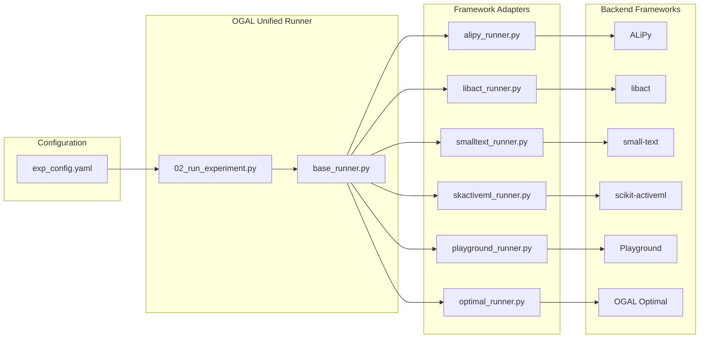

# Frameworks Reference

OGAL integrates 5 AL frameworks under a **unified wrapper** that runs strategies consistently.

---

## Framework Summary

| Framework | Strategies | Upstream | OGAL Fork | Adapter |
|-----------|------------|----------|-----------|---------|
| ALiPy | 14 | [NUAA-AL/ALiPy](https://github.com/NUAA-AL/ALiPy) | [jgonsior/ALiPy](https://github.com/jgonsior/ALiPy) | `alipy_runner.py` |
| libact | 9 | [ntucllab/libact](https://github.com/ntucllab/libact) | [jgonsior/libact](https://github.com/jgonsior/libact) | `libact_runner.py` |
| small-text | 9 | [webis-de/small-text](https://github.com/webis-de/small-text) | None (PyPI) | `smalltext_runner.py` |
| scikit-activeml | 14 | [scikit-activeml/scikit-activeml](https://github.com/scikit-activeml/scikit-activeml) | [jgonsior/scikit-activeml](https://github.com/jgonsior/scikit-activeml) | `skactiveml_runner.py` |
| Playground | 9 | [google/active-learning](https://github.com/google/active-learning) | [jgonsior/active-learning](https://github.com/jgonsior/active-learning) | `playground_runner.py` |
| OPTIMAL | 4 | N/A (OGAL-native) | N/A | `optimal_runner.py` |

---

## What's Unified

- **Consistent protocol**: Same train/test splits, seeds, budgets, and metrics across all frameworks
- **Unified output schema**: All strategies produce the same output format
- **Framework-agnostic configuration**: Configure by strategy name, not framework details

---

## Why Forks?

OGAL uses forks of ALiPy, libact, scikit-activeml, and Playground to ensure:

- Python 3.11 compatibility
- Dependency conflict resolution
- API compatibility with the experiment protocol

small-text is used directly from PyPI without modifications.

---

## Cross-References

- **[Strategy Catalog](strategy_catalog.md)**: Complete list of all strategies (strategy-first)
- **[Runbook](runbook.md)**: How experiments are executed
- **[Architecture in 10 Minutes](concepts/architecture_in_10_minutes.md)**: Configuration options
