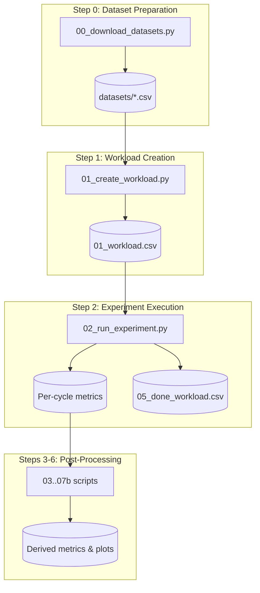

# Runbook

This is the canonical guide for running OGAL experiments, from local sanity tests to HPC-scale deployments.

!!! abstract "What you'll accomplish"
    - Run a complete AL experiment pipeline on a single machine
    - Scale to millions of experiments on HPC clusters with SLURM
    - Handle failures, resume experiments, and track progress

!!! tip "Prerequisites"
    - Anaconda/Miniconda installed
    - Git access to the repository
    - For HPC: SLURM cluster access with shared filesystem

---

## Quick Start

=== "Local (single experiment)"

    **Goal:** Verify your setup by running a minimal test.

    **Run:**

    ```bash
    # 1. Setup environment
    conda create --name al_olympics_env --file conda-linux-64.lock
    conda activate al_olympics_env
    poetry install

    # 2. Define output path (reused in all commands)
    export OGAL_OUTPUT=/path/to/results

    # 3. Create a minimal test workload
    python 01_create_workload.py --EXP_TITLE smoke_test

    # 4. Run one experiment
    python 02_run_experiment.py --EXP_TITLE smoke_test --WORKER_INDEX 0

    # 5. Verify output
    ls ${OGAL_OUTPUT}/smoke_test/
    ```

    **You should see:**

    | Artifact | Location |
    |----------|----------|
    | Completed log | `${OGAL_OUTPUT}/smoke_test/05_done_workload.csv` |
    | Metric files | `${OGAL_OUTPUT}/smoke_test/<STRATEGY>/<DATASET>/accuracy.csv` |

    !!! tip "Sanity check"
        If `05_done_workload.csv` is empty, check `05_failed_workloads.csv` for errors.

=== "HPC (SLURM array)"

    **Goal:** Submit experiments to a SLURM cluster.

    **Run:**

    ```bash
    # 1. Create workload (generates SLURM script)
    python 01_create_workload.py --EXP_TITLE full_run

    # 2. Submit SLURM job array
    sbatch ${OGAL_OUTPUT}/full_run/02_slurm.slurm

    # 3. Monitor progress
    watch -n 60 'wc -l ${OGAL_OUTPUT}/full_run/05_done_workload.csv'
    ```

    **You should see:**

    | Artifact | Description |
    |----------|-------------|
    | Growing `05_done_workload.csv` | Line count increases as jobs complete |
    | SLURM logs | Job output in your configured log directory |

    !!! tip "Sanity check"
        Run `squeue -u $USER` to verify jobs are queued or running.

---

## Pipeline Overview

OGAL follows a strict sequential pipeline. Each script's outputs feed the next:



---

## Step 0: Download Datasets

**Script:** [`00_download_datasets.py`](https://github.com/jgonsior/olympic-games-of-active-learning/blob/main/00_download_datasets.py)

Downloads and preprocesses datasets from OpenML and Kaggle.

```bash
python 00_download_datasets.py
```

??? info "Configuration"
    - Dataset definitions: `resources/openml_datasets.yaml`, `resources/kaggle_datasets.yaml`
    - Output path: `DATASETS_PATH` from `.server_access_credentials.cfg`

??? info "Outputs"
    | File | Description |
    |------|-------------|
    | `<dataset>.csv` | Feature matrix with `LABEL_TARGET` column |
    | `<dataset>_split.csv` | Pre-computed train/test indices and start points |

---

## Step 1: Create Workload

**Script:** [`01_create_workload.py`](https://github.com/jgonsior/olympic-games-of-active-learning/blob/main/01_create_workload.py)

Generates the experiment workload by creating the Cartesian product of all hyperparameter combinations.

=== "Basic usage"

    ```bash
    python 01_create_workload.py --EXP_TITLE my_experiment
    ```

=== "Using YAML config"

    ```bash
    # Experiment must be defined in resources/exp_config.yaml
    python 01_create_workload.py --USE_EXP_YAML full_exp_jan
    ```

??? info "Key Configuration Fields"
    | Field | Description |
    |-------|-------------|
    | `EXP_GRID_DATASET` | List of dataset names |
    | `EXP_GRID_STRATEGY` | List of AL strategy names |
    | `EXP_GRID_LEARNER_MODEL` | Learner models (RF, MLP, SVM) |
    | `EXP_GRID_BATCH_SIZE` | Query batch sizes |
    | `EXP_GRID_NUM_QUERIES` | Number of AL iterations |

??? info "Outputs"
    | File | Description |
    |------|-------------|
    | `01_workload.csv` | Full workload with `EXP_UNIQUE_ID` per combination |
    | `00_config.yaml` | Saved experiment configuration |
    | `02_slurm.slurm` | Generated SLURM job script |

---

## Step 2: Run Experiments

**Script:** [`02_run_experiment.py`](https://github.com/jgonsior/olympic-games-of-active-learning/blob/main/02_run_experiment.py)

Executes a single AL experiment based on the `WORKER_INDEX` parameter.

=== "Local (single)"

    ```bash
    python 02_run_experiment.py --EXP_TITLE my_experiment --WORKER_INDEX 0
    ```

=== "Local (parallel)"

    ```bash
    # Use the generated parallel runner
    python ${OGAL_OUTPUT}/my_experiment/02b_run_bash_parallel.py
    ```

=== "HPC (SLURM)"

    ```bash
    sbatch ${OGAL_OUTPUT}/my_experiment/02_slurm.slurm
    ```

!!! tip "Sanity check"
    After running, check `05_done_workload.csv` for completed experiments and `05_failed_workloads.csv` for any errors.

??? info "How WORKER_INDEX Works"
    - `WORKER_INDEX` is **0-indexed**
    - Each worker reads exactly one row from `01_workload.csv`
    - SLURM array tasks use `$SLURM_ARRAY_TASK_ID` as the index

??? info "Outputs per Experiment"
    | File | Description |
    |------|-------------|
    | `<STRATEGY>/<DATASET>/accuracy.csv` | Accuracy per AL cycle |
    | `<STRATEGY>/<DATASET>/weighted_f1-score.csv` | Weighted F1 per cycle |
    | `<STRATEGY>/<DATASET>/selected_indices.csv` | Selected sample indices |
    | `05_done_workload.csv` | Completed experiments log |
    | `05_failed_workloads.csv` | Failed experiments with errors |

---

## HPC Configuration

### Server Access Credentials

Create `.server_access_credentials.cfg` in the repository root:

```ini
[HPC]
SSH_LOGIN=user@login.hpc.example.edu
WS_PATH=/data/workspace/al_olympics
DATASETS_PATH=/data/workspace/al_olympics/datasets
OUTPUT_PATH=/data/workspace/al_olympics/exp_results
SLURM_MAIL=your.email@example.edu
SLURM_PROJECT=your_project_account
CODE_PATH=/data/workspace/al_olympics/code
PYTHON_PATH=/data/workspace/al_olympics/conda-env/bin/python

[LOCAL]
DATASETS_PATH=/home/user/ogal/datasets
CODE_PATH=/home/user/ogal/code
OUTPUT_PATH=/home/user/ogal/exp_results
```

### SLURM Array Sizing

The array size is computed from workload length:

```bash
# Get workload length
WORKLOAD_LEN=$(wc -l < ${OGAL_OUTPUT}/experiment/01_workload.csv)
WORKLOAD_LEN=$((WORKLOAD_LEN - 1))  # Subtract header

# Calculate array end (with batching)
BATCH_SIZE=100
ARRAY_END=$((WORKLOAD_LEN / BATCH_SIZE))

# SLURM directive: --array=0-${ARRAY_END}
```

??? tip "Recommended SLURM Parameters by Scale"
    | Workload Size | Array Config | Time Limit | Memory |
    |---------------|--------------|------------|--------|
    | < 100 | `--array=0-99` | 2:00:00 | 4G |
    | 100-10,000 | `--array=0-99%50` | 2:00:00 | 4G |
    | 10,000-100,000 | `--array=0-999%100` | 4:00:00 | 4G |
    | > 100,000 | `--array=0-9999%200` | 8:00:00 | 8G |

---

## Resume and Recovery

OGAL tracks experiment progress via three files:

| File | Purpose |
|------|---------|
| `05_done_workload.csv` | Successfully completed experiments |
| `05_failed_workloads.csv` | Failed experiments with error type |
| `05_started_oom_workloads.csv` | OOM-killed experiments |

### Resume After Partial Run

When you re-run `01_create_workload.py`, it automatically excludes completed experiments:

```bash
# Regenerate workload (excludes done experiments)
python 01_create_workload.py --EXP_TITLE my_experiment

# Resubmit to finish remaining
sbatch ${OGAL_OUTPUT}/my_experiment/02_slurm.slurm
```

!!! tip "Sanity check"
    Compare `wc -l 01_workload.csv` before and after regeneration. The new count should be smaller.

### Rerun Failed Experiments

Set `RERUN_FAILED_WORKLOADS: true` in your config to include failed experiments in the new workload.

---

## Post-Processing (Steps 3-6)

After experiments complete, compute derived metrics:

```bash
# Step 3: Dataset categorizations
python 03_calculate_dataset_categorizations.py \
    --EXP_TITLE my_experiment \
    --SAMPLES_CATEGORIZER _ALL \
    --EVA_MODE local

# Step 4: Advanced metrics (AUC, etc.)
python 04_calculate_advanced_metrics.py \
    --EXP_TITLE my_experiment \
    --COMPUTED_METRICS _ALL \
    --EVA_MODE local

# Step 5: Analyze completion status
python 05_analyze_partially_run_workload.py --EXP_TITLE my_experiment

# Step 6: Generate results
python 07b_create_results_without_flask.py --EXP_TITLE my_experiment
```

For full evaluation and paper figure generation, see [Analysis &amp; Dataset](../analyze_opara.md).

---

## Troubleshooting

??? warning "Missing Dataset Paths"
    **Symptom:** `FileNotFoundError` for dataset files
    
    **Resolution:** Ensure `DATASETS_PATH` in `.server_access_credentials.cfg` is accessible from compute nodes.

??? warning "OOM (Out of Memory) Errors"
    **Symptom:** Jobs killed with `OUT_OF_MEMORY` state
    
    **Resolution:**
    
    1. Increase `SLURM_MEMORY` in config
    2. OOM experiments are tracked in `05_started_oom_workloads.csv` and excluded from future runs

??? warning "Runtime Timeout Exceeded"
    **Symptom:** Experiments not completing
    
    **Resolution:** Increase `EXP_QUERY_SELECTION_RUNTIME_SECONDS_LIMIT` (default: 300s)

??? warning "Duplicate Experiment IDs"
    **Symptom:** Duplicate entries in tracking files
    
    **Resolution:** Run `python -m scripts.remove_duplicated_exp_ids` to clean up

---

## How-To Recipes

For specific tasks, see the how-to guides:

- [Local Sanity Run](#quick-start) — Verify setup with a minimal test
- [SLURM Run](#hpc-configuration) — Deploy to HPC cluster
- [Resume &amp; Failures](#resume-and-recovery) — Handle partial runs and errors

---

## Reference

For detailed configuration and output schemas:

- [Results Format](results_schema.md) — Output paths and file schemas
- [Strategy Catalog](strategy_catalog.md) — All AL strategies
- [Configuration Reference](concepts/configuration_spine.md) — Config keys and paths
