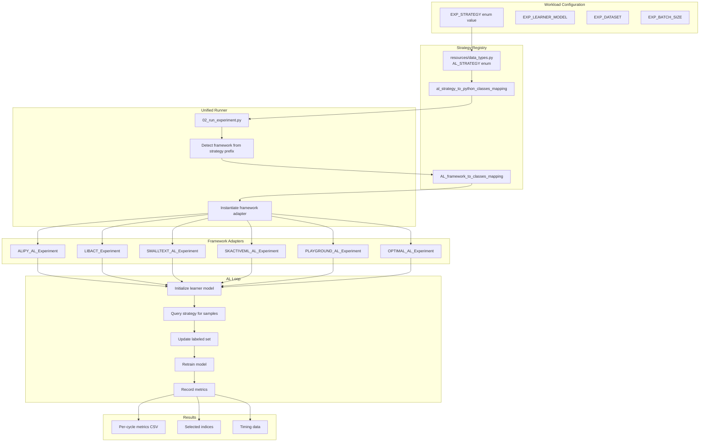

# Strategy Catalog (Strategy-First Reference)

This is the **canonical strategy catalog** for OGAL. It documents all AL strategies in a strategy-first manner — researchers care about "Which exact strategy implementation was used?" more than "Which framework name".

!!! tip "Key Insight"
    OGAL provides a **unified API** that runs strategies from multiple AL frameworks under a consistent protocol. You configure strategies by name (e.g., `ALIPY_UNCERTAINTY_LC`), and OGAL handles the framework-specific dispatch internally.

---

## Strategy Dispatch Flow

How OGAL dispatches a workload item to the correct strategy:



(source: [`resources/data_types.py::AL_STRATEGY`](https://github.com/jgonsior/olympic-games-of-active-learning/blob/main/resources/data_types.py), `al_strategy_to_python_classes_mapping`, `AL_framework_to_classes_mapping`)

---

## Complete Strategy Catalog

The following table lists all strategies available in OGAL. Each strategy is identified by its enum name (used in config files) and maps to a specific implementation class.

### Uncertainty-Based Strategies

| ID | Strategy Name | Framework | Class | Notes |
|---:|---------------|-----------|-------|-------|
| 1 | `ALIPY_RANDOM` | ALiPy | `alipy.query_strategy.QueryInstanceRandom` | Baseline random sampling |
| 2 | `ALIPY_UNCERTAINTY_LC` | ALiPy | `alipy.query_strategy.QueryInstanceUncertainty` | Least Confident |
| 33 | `ALIPY_UNCERTAINTY_MM` | ALiPy | `alipy.query_strategy.QueryInstanceUncertainty` | Max Margin |
| 34 | `ALIPY_UNCERTAINTY_ENTROPY` | ALiPy | `alipy.query_strategy.QueryInstanceUncertainty` | Entropy-based |
| 35 | `ALIPY_UNCERTAINTY_DTB` | ALiPy | `alipy.query_strategy.QueryInstanceUncertainty` | Distance to Boundary (binary only) |
| 9 | `LIBACT_UNCERTAINTY_LC` | libact | `libact.query_strategies.UncertaintySampling` | Least Confident |
| 36 | `LIBACT_UNCERTAINTY_SM` | libact | `libact.query_strategies.UncertaintySampling` | Smallest Margin |
| 37 | `LIBACT_UNCERTAINTY_ENT` | libact | `libact.query_strategies.UncertaintySampling` | Entropy |
| 19 | `PLAYGROUND_MARGIN` | Playground | `playground.sampling_methods.margin_AL.MarginAL` | Margin sampling |
| 39 | `SMALLTEXT_LEASTCONFIDENCE` | small-text | `small_text.LeastConfidence` | Least Confident |
| 40 | `SMALLTEXT_PREDICTIONENTROPY` | small-text | `small_text.PredictionEntropy` | Prediction Entropy |
| 41 | `SMALLTEXT_BREAKINGTIES` | small-text | `small_text.BreakingTies` | Breaking Ties |
| 50 | `SMALLTEXT_RANDOM` | small-text | `small_text.RandomSampling` | Random baseline |
| 63 | `SKACTIVEML_US_MARGIN` | scikit-activeml | `skactiveml.pool.UncertaintySampling` | Margin sampling |
| 64 | `SKACTIVEML_US_LC` | scikit-activeml | `skactiveml.pool.UncertaintySampling` | Least Confident |
| 65 | `SKACTIVEML_US_ENTROPY` | scikit-activeml | `skactiveml.pool.UncertaintySampling` | Entropy |
| 66 | `SKACTIVEML_EXPECTED_AVERAGE_PRECISION` | scikit-activeml | `skactiveml.pool.UncertaintySampling` | Expected Average Precision |

(source: [`resources/data_types.py::AL_STRATEGY`](https://github.com/jgonsior/olympic-games-of-active-learning/blob/main/resources/data_types.py#L131-L208), lines 131-208; `al_strategy_to_python_classes_mapping`, lines 210-350)

### Committee-Based Strategies

| ID | Strategy Name | Framework | Class | Notes |
|---:|---------------|-----------|-------|-------|
| 23 | `ALIPY_QBC` | ALiPy | `alipy.query_strategy.QueryInstanceQBC` | Query by Committee |
| 10 | `LIBACT_QBC` | libact | `libact.query_strategies.QueryByCommittee` | Query by Committee |
| 60 | `SKACTIVEML_QBC` | scikit-activeml | `skactiveml.pool.QueryByCommittee` | Query by Committee |
| 75 | `SKACTIVEML_QBC_VOTE_ENTROPY` | scikit-activeml | `skactiveml.pool.QueryByCommittee` | Vote Entropy variant |

(source: [`resources/data_types.py::al_strategy_to_python_classes_mapping`](https://github.com/jgonsior/olympic-games-of-active-learning/blob/main/resources/data_types.py))

### Diversity/Density-Based Strategies

| ID | Strategy Name | Framework | Class | Notes |
|---:|---------------|-----------|-------|-------|
| 3 | `ALIPY_GRAPH_DENSITY` | ALiPy | `alipy.query_strategy.QueryInstanceGraphDensity` | Graph-based density |
| 4 | `ALIPY_CORESET_GREEDY` | ALiPy | `alipy.query_strategy.QueryInstanceCoresetGreedy` | Greedy coreset |
| 28 | `ALIPY_DENSITY_WEIGHTED` | ALiPy | `alipy.query_strategy.QueryInstanceDensityWeighted` | Density-weighted uncertainty |
| 11 | `LIBACT_DWUS` | libact | `libact.query_strategies.DWUS` | Density-Weighted Uncertainty |
| 15 | `PLAYGROUND_GRAPH_DENSITY` | Playground | `playground.sampling_methods.graph_density.GraphDensitySampler` | Graph density |
| 18 | `PLAYGROUND_KCENTER_GREEDY` | Playground | `playground.sampling_methods.kcenter_greedy.kCenterGreedy` | k-Center Greedy |
| 21 | `PLAYGROUND_MCM` | Playground | `playground.sampling_methods.represent_cluster_centers.RepresentativeClusterMeanSampling` | Representative Cluster Mean |
| 22 | `PLAYGROUND_UNIFORM` | Playground | `playground.sampling_methods.uniform_sampling.UniformSampling` | Uniform (random baseline) |
| 43 | `SMALLTEXT_EMBEDDINGKMEANS` | small-text | `small_text.EmbeddingKMeans` | Embedding K-Means |
| 44 | `SMALLTEXT_GREEDYCORESET` | small-text | `small_text.GreedyCoreset` | Greedy Coreset |
| 45 | `SMALLTEXT_LIGHTWEIGHTCORESET` | small-text | `small_text.LightweightCoreset` | Lightweight Coreset |
| 67 | `SKACTIVEML_DWUS` | scikit-activeml | `skactiveml.pool.UncertaintySampling` | Density-Weighted |

(source: [`resources/data_types.py::al_strategy_to_python_classes_mapping`](https://github.com/jgonsior/olympic-games-of-active-learning/blob/main/resources/data_types.py))

### Hybrid/Meta Strategies

| ID | Strategy Name | Framework | Class | Notes |
|---:|---------------|-----------|-------|-------|
| 16 | `PLAYGROUND_HIERARCHICAL_CLUSTER` | Playground | `playground.sampling_methods.hierarchical_clustering_AL.HierarchicalClusterAL` | Hierarchical Clustering |
| 17 | `PLAYGROUND_INFORMATIVE_DIVERSE` | Playground | `playground.sampling_methods.informative_diverse.InformativeClusterDiverseSampler` | Informative + Diverse |
| 20 | `PLAYGROUND_MIXTURE` | Playground | `playground.sampling_methods.mixture_of_samplers.MixtureOfSamplers` | Mixture of Samplers |
| 30 | `LIBACT_HIERARCHICAL_SAMPLING` | libact | `libact.query_strategies.multiclass.HierarchicalSampling` | Hierarchical Sampling |
| 31 | `LIBACT_ALBL` | libact | `libact.query_strategies.ActiveLearningByLearning` | Active Learning by Learning |
| 32 | `PLAYGROUND_BANDIT` | Playground | `playground.sampling_methods.bandit_discrete.BanditDiscreteSampler` | Bandit-based |
| 46 | `SMALLTEXT_CONTRASTIVEAL` | small-text | `small_text.ContrastiveActiveLearning` | Contrastive AL |
| 47 | `SMALLTEXT_DISCRIMINATIVEAL` | small-text | `small_text.DiscriminativeActiveLearning` | Discriminative AL |
| 70 | `SKACTIVEML_DAL` | scikit-activeml | `skactiveml.pool.DiscriminativeAL` | Discriminative AL |
| 74 | `SKACTIVEML_MCPAL` | scikit-activeml | `skactiveml.pool.ProbabilisticAL` | Probabilistic AL |

(source: [`resources/data_types.py::al_strategy_to_python_classes_mapping`](https://github.com/jgonsior/olympic-games-of-active-learning/blob/main/resources/data_types.py))

### Expected Error Reduction Strategies

| ID | Strategy Name | Framework | Class | Notes |
|---:|---------------|-----------|-------|-------|
| 24 | `ALIPY_EXPECTED_ERROR_REDUCTION` | ALiPy | `alipy.query_strategy.QueryExpectedErrorReduction` | Expected Error Reduction |
| 29 | `LIBACT_EER` | libact | `libact.query_strategies.multiclass.EER` | Expected Error Reduction |
| 54 | `SKACTIVEML_MC_EER_LOG_LOSS` | scikit-activeml | `skactiveml.pool.MonteCarloEER` | Monte Carlo EER (Log Loss) |
| 55 | `SKACTIVEML_MC_EER_MISCLASS_LOSS` | scikit-activeml | `skactiveml.pool.MonteCarloEER` | Monte Carlo EER (Misclass) |
| 56 | `SKACTIVEML_VOI_UNLABELED` | scikit-activeml | `skactiveml.pool.ValueOfInformationEER` | Value of Information (Unlabeled) |
| 57 | `SKACTIVEML_VOI_LABELED` | scikit-activeml | `skactiveml.pool.ValueOfInformationEER` | Value of Information (Labeled) |
| 58 | `SKACTIVEML_VOI` | scikit-activeml | `skactiveml.pool.ValueOfInformationEER` | Value of Information |

(source: [`resources/data_types.py::al_strategy_to_python_classes_mapping`](https://github.com/jgonsior/olympic-games-of-active-learning/blob/main/resources/data_types.py))

### Query-Specific Strategies

| ID | Strategy Name | Framework | Class | Notes |
|---:|---------------|-----------|-------|-------|
| 12 | `LIBACT_QUIRE` | libact | `libact.query_strategies.QUIRE` | QUIRE |
| 76 | `SKACTIVEML_QUIRE` | scikit-activeml | `skactiveml.pool.Quire` | QUIRE |
| 69 | `SKACTIVEML_COST_EMBEDDING` | scikit-activeml | `skactiveml.pool.CostEmbeddingAL` | Cost Embedding AL |

(source: [`resources/data_types.py::al_strategy_to_python_classes_mapping`](https://github.com/jgonsior/olympic-games-of-active-learning/blob/main/resources/data_types.py))

### Advanced Strategies

| ID | Strategy Name | Framework | Class | Notes |
|---:|---------------|-----------|-------|-------|
| 25 | `ALIPY_BMDR` | ALiPy | `alipy.query_strategy.QueryInstanceBMDR` | Batch Mode Deep Representation (binary only) |
| 26 | `ALIPY_SPAL` | ALiPy | `alipy.query_strategy.QueryInstanceSPAL` | Self-Paced AL (binary only) |
| 27 | `ALIPY_LAL` | ALiPy | `alipy.query_strategy.QueryInstanceLAL` | Learning Active Learning (binary only, not HPC) |

(source: [`resources/data_types.py::al_strategy_to_python_classes_mapping`](https://github.com/jgonsior/olympic-games-of-active-learning/blob/main/resources/data_types.py), `al_strategies_which_only_support_binary_classification`)

### Oracle/Optimal Strategies

These are OGAL-native implementations for oracle baselines:

| ID | Strategy Name | Framework | Class | Notes |
|---:|---------------|-----------|-------|-------|
| 6 | `OPTIMAL_BSO` | OPTIMAL | `optimal_query_strategies.BSO_optimal.Beeam_Search_Optimal` | Beam Search Optimal |
| 7 | `OPTIMAL_TRUE` | OPTIMAL | `optimal_query_strategies.true_optimal.True_Optimal` | True Optimal |
| 8 | `OPTIMAL_GREEDY_10` | OPTIMAL | `optimal_query_strategies.greedy_optimal.Greedy_Optimal` | Greedy with 10 pre-selections |
| 38 | `OPTIMAL_GREEDY_20` | OPTIMAL | `optimal_query_strategies.greedy_optimal.Greedy_Optimal` | Greedy with 20 pre-selections |

(source: [`resources/data_types.py::al_strategy_to_python_classes_mapping`](https://github.com/jgonsior/olympic-games-of-active-learning/blob/main/resources/data_types.py))

---

## Strategy Selection Notes

### Binary-Only Strategies

The following strategies only support binary classification:

- `ALIPY_LAL` (Learning Active Learning)
- `ALIPY_UNCERTAINTY_DTB` (Distance to Boundary)
- `ALIPY_BMDR` (Batch Mode Deep Representation)
- `ALIPY_SPAL` (Self-Paced AL)

(source: [`resources/data_types.py::al_strategies_which_only_support_binary_classification`](https://github.com/jgonsior/olympic-games-of-active-learning/blob/main/resources/data_types.py#L353-L358), lines 353-358)

### Strategies Requiring Decision Boundary Model

- `PLAYGROUND_MCM` (Representative Cluster Mean Sampling)
- `ALIPY_UNCERTAINTY_DTB` (Distance to Boundary)

(source: [`resources/data_types.py::al_strategies_which_require_decision_boundary_model`](https://github.com/jgonsior/olympic-games-of-active-learning/blob/main/resources/data_types.py#L360-L363), lines 360-363)

### Strategies Not Suitable for HPC

- `ALIPY_LAL` (requires interactive training)

(source: [`resources/data_types.py::al_strategies_not_suitable_for_hpc`](https://github.com/jgonsior/olympic-games-of-active-learning/blob/main/resources/data_types.py#L365-L367), lines 365-367)

---

## Using Strategies in Config

To use a strategy in your experiment configuration ([`resources/exp_config.yaml`](https://github.com/jgonsior/olympic-games-of-active-learning/blob/main/resources/exp_config.yaml)):

```yaml
my_experiment:
  EXP_GRID_STRATEGY:
    - ALIPY_RANDOM
    - ALIPY_UNCERTAINTY_LC
    - SKACTIVEML_US_MARGIN
    - SMALLTEXT_EMBEDDINGKMEANS
  # ... other config
```

The strategy name must match an `AL_STRATEGY` enum value exactly.

---

## Minimal Code Example: Strategy Dispatch

This shows how OGAL dispatches strategies internally:

```python
# From resources/data_types.py - Strategy enum defines all available strategies
class AL_STRATEGY(IntEnum):
    ALIPY_RANDOM = 1
    ALIPY_UNCERTAINTY_LC = 2
    # ... 50+ strategies
    SKACTIVEML_QUIRE = 76

# Mapping from enum to (class, default_params)
al_strategy_to_python_classes_mapping = {
    AL_STRATEGY.ALIPY_RANDOM: (QueryInstanceRandom, {}),
    AL_STRATEGY.ALIPY_UNCERTAINTY_LC: (
        QueryInstanceUncertainty, 
        {"measure": "least_confident"}
    ),
    # ...
}

# From framework_runners/base_runner.py - Unified experiment interface
class AL_Experiment(ABC):
    @abstractmethod
    def get_AL_strategy(self):
        """Each framework adapter implements strategy instantiation."""
        pass
    
    @abstractmethod
    def query_AL_strategy(self) -> SampleIndiceList:
        """Query the strategy for samples to label."""
        pass
```

(source: [`resources/data_types.py::AL_STRATEGY`](https://github.com/jgonsior/olympic-games-of-active-learning/blob/main/resources/data_types.py), `al_strategy_to_python_classes_mapping`; [`framework_runners/base_runner.py::AL_Experiment`](https://github.com/jgonsior/olympic-games-of-active-learning/blob/main/framework_runners/base_runner.py))

---

## Exporting the Strategy Catalog

To regenerate this catalog from code:

```bash
python scripts/export_strategy_catalog.py --format markdown
python scripts/export_strategy_catalog.py --format json
python scripts/export_strategy_catalog.py --format csv
```

(source: [`scripts/export_strategy_catalog.py`](https://github.com/jgonsior/olympic-games-of-active-learning/blob/main/scripts/export_strategy_catalog.py))

---

## Cross-References

- **[Eva Scripts](eva_scripts_catalog.md)**: Analyze experiment results with evaluation scripts
- **[Results Format](results_schema.md)**: Output file schemas and structure
- **[Data Enrichment](data_enrichment.md)**: Add new results to the shared dataset
- **[Frameworks](frameworks.md)**: Backend framework details and fork information
- **[Configuration](concepts/configuration_spine.md)**: Experiment configuration reference
