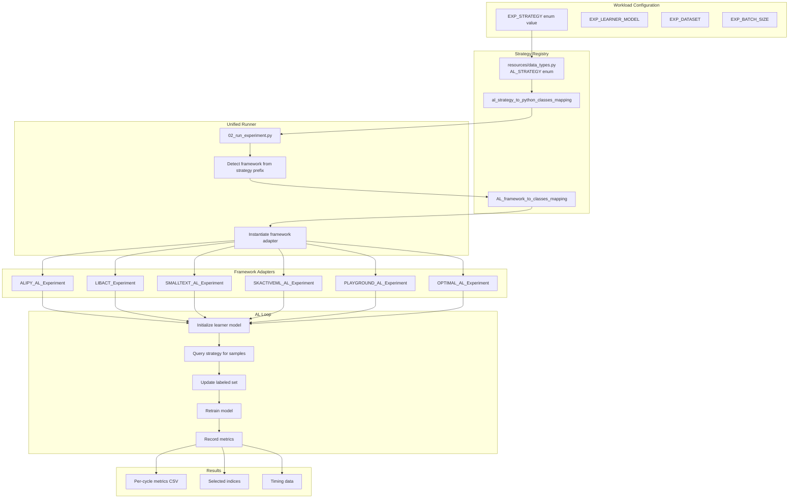

# Strategy Catalog

OGAL provides 50+ AL strategies from 5 frameworks under a unified API.

## Strategy Dispatch Flow

How OGAL dispatches a workload item to the correct strategy:



---

## Quick Reference

| Family | Examples | Frameworks |
|--------|----------|------------|
| **Uncertainty** | Least Confident, Entropy, Margin | ALiPy, libact, small-text, scikit-activeml |
| **Committee** | Query by Committee | ALiPy, libact, scikit-activeml |
| **Diversity/Density** | Coreset, K-Center, Density-weighted | ALiPy, libact, small-text, Playground |
| **Hybrid/Meta** | ALBL, Contrastive AL, Discriminative AL | libact, small-text, scikit-activeml |
| **Expected Error** | EER, Monte Carlo EER | ALiPy, libact, scikit-activeml |
| **Oracle** | Greedy Optimal, True Optimal | OGAL native |

## Using Strategies

```yaml
# resources/exp_config.yaml
my_experiment:
  EXP_GRID_STRATEGY:
    - ALIPY_UNCERTAINTY_LC    # Least Confident (ALiPy)
    - LIBACT_QUIRE            # QUIRE (libact)
    - SMALLTEXT_EMBEDDINGKMEANS  # Embedding K-Means (small-text)
    - SKACTIVEML_QBC          # Query by Committee (scikit-activeml)
```

## Export Full Catalog

```bash
# Generate complete strategy list
python -c "
from resources.data_types import AL_STRATEGY, al_strategy_to_python_classes_mapping
import csv
with open('strategy_catalog.csv', 'w', newline='') as f:
    writer = csv.writer(f)
    writer.writerow(['ID', 'Strategy', 'Framework'])
    for s in AL_STRATEGY:
        fw = s.name.split('_')[0]
        writer.writerow([s.value, s.name, fw])
print('Exported to strategy_catalog.csv')
"
```

## Strategy Constraints

| Constraint | Strategies |
|------------|------------|
| **Binary-only** | `ALIPY_LAL`, `ALIPY_UNCERTAINTY_DTB`, `ALIPY_BMDR`, `ALIPY_SPAL` |
| **Not HPC-suitable** | `ALIPY_LAL` |

## Cross-References

- [Frameworks](frameworks.md) — Backend framework details
- [Results Schema](results_schema.md) — Output file formats
- [Runbook](runbook.md) — Running experiments
