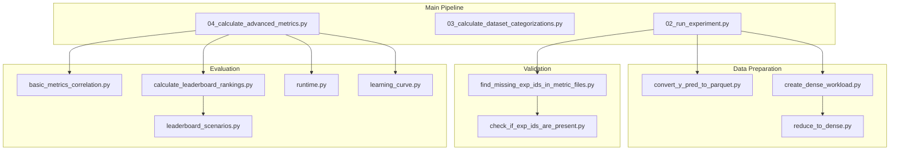

# Utility Scripts & Evaluation Scripts

This document describes the utility scripts in [`scripts/`](https://github.com/jgonsior/olympic-games-of-active-learning/blob/main/scripts) and evaluation scripts in [`eva_scripts/`](https://github.com/jgonsior/olympic-games-of-active-learning/blob/main/eva_scripts). These scripts support the main pipeline with data processing, bug fixes, and result analysis/visualization.

!!! tip "Canonical Evaluation Guide"
    For a step-by-step guide to running evaluation scripts in the correct order and generating paper figures, see **[Evaluation Pipeline](evaluation_pipeline.md)**.

## Overview

The OGAL framework includes two auxiliary script directories:

| Directory | Purpose |
|-----------|---------|
| [`scripts/`](https://github.com/jgonsior/olympic-games-of-active-learning/blob/main/scripts) | Data processing, format conversion, bug fixes, and maintenance utilities |
| [`eva_scripts/`](https://github.com/jgonsior/olympic-games-of-active-learning/blob/main/eva_scripts) | Evaluation, visualization, and analysis for generating paper figures/tables |

## Scripts Directory (`scripts/`)

### Data Processing & Conversion

These scripts handle format conversions and data transformations:

| Script | Purpose | When to Use |
|--------|---------|-------------|
| `convert_y_pred_to_parquet.py` | Convert prediction CSVs to Parquet format | After experiments complete, for efficient storage |
| `convert_metrics_csvs_to_exp_id_csvs.py` | Reorganize metrics by experiment ID | For analysis requiring per-experiment grouping |
| `convert_dataset_distances_to_parqet.py` | Convert distance matrices to Parquet | After distance computation |
| `create_auc_selected_ts.py` | Create AUC time series for selected indices | Before correlation analysis |

### Workload Management

Scripts for creating and managing experiment workloads:

| Script | Purpose | Data Dependency |
|--------|---------|-----------------|
| `create_dense_workload.py` | Create a "dense" subset of workload with complete results | Requires `05_done_workload.csv` |
| `reduce_to_dense.py` | Reduce result files to dense workload subset | Requires dense workload from above |
| `create_new_extended_dense_workload.py` | Extend dense workload with additional experiments | Requires existing dense workload |
| `merge_two_workloads.py` | Merge results from two separate experiment runs | When combining HPC job results |

### Data Integrity & Validation

Scripts for checking data integrity and finding issues:

| Script | Purpose |
|--------|---------|
| `find_missing_exp_ids_in_metric_files.py` | Identify experiments missing from metric files |
| `find_broken_file.py` | Find corrupted CSV/Parquet files |
| `check_if_exp_ids_are_present.py` | Verify all expected experiment IDs exist |
| `exp_results_data_format_test.py` | Validate result file formats |

### Bug Fixes & Data Repair

These scripts fix known issues in result data. They are **not always necessary** but useful when encountering specific problems:

| Script | Purpose | When to Use |
|--------|---------|-------------|
| `fix_duplicate_header_columns.py` | Remove duplicate header rows in CSVs | If CSV files have repeated headers |
| `fix_macro_f1_score_duplicates.py` | Remove duplicate F1-score entries | If duplicates appear in metric files |
| `fix_oom_workload.py` | Clean OOM workload file (remove completed) | After OOM experiments are rerun |
| `fix_reduce_number_precision.py` | Reduce floating point precision | To reduce file sizes |
| `fix_remove_unnamed_column.py` | Remove pandas "Unnamed: 0" columns | If CSVs have index columns |
| `fix_unconverted_y_parquet.py` | Fix unconverted prediction files | If Parquet conversion failed |
| `fix_apply_runtime_limit_post_mortem.py` | Apply runtime limits retroactively | To exclude slow experiments |
| `fix_check_if_dupicate_param_combinations_exist.py` | Check for duplicate configurations | To identify duplicate experiment runs |
| `fix_early_stopping_dict_keys_too_small_error.py` | Fix early stopping data issues | If early stopping metadata is corrupt |

### Result Cleanup & Maintenance

| Script | Purpose |
|--------|---------|
| `remove_duplicated_exp_ids.py` | Remove duplicate experiment entries |
| `remove_dataset_results.py` | Remove results for specific datasets |
| `remove_lbfgs_mlp_results.py` | Remove results using LBFGS MLP solver |
| `remove_oom_results_from_metric_files.py` | Remove OOM experiments from metrics |
| `replace_broken_parquet_csvs_with_working_file.py` | Replace corrupted files with backups |
| `merge_duplicate_parquets.py` | Merge duplicate Parquet files |

### Experiment Recovery

Scripts for rerunning failed or incomplete experiments:

| Script | Purpose | Data Dependency |
|--------|---------|-----------------|
| `rerun_broken_experiments.py` | Create workload to rerun failed experiments | Requires `05_failed_workloads.csv` |
| `rerun_missing_exp_ids.py` | Rerun experiments with missing IDs | Requires `07_missing_exp_ids.csv` |
| `rerun_broken_dataset_categorizations.py` | Rerun failed dataset categorizations | Requires categorization error logs |

### Synthetic Dataset Generation

| Script | Purpose |
|--------|---------|
| `create_gaussian.py` | Generate Gaussian synthetic datasets |
| `create_xor.py` | Generate XOR/checkerboard synthetic datasets |

### Visualization

| Script | Purpose |
|--------|---------|
| `single_learning_curve.py` | Plot a single learning curve |

---

## Evaluation Scripts Directory (`eva_scripts/`)

These scripts generate the analyses, figures, and tables used in the research paper. They analyze the 4.6+ million experiment results.

### Leaderboard & Ranking Analysis

Scripts for computing and analyzing AL strategy leaderboards:

| Script | Purpose | Paper Section |
|--------|---------|---------------|
| `calculate_leaderboard_rankings.py` | Compute strategy rankings across datasets | Leaderboard tables |
| `final_leaderboard.py` | Generate final aggregated leaderboard | Main results |
| `final_leaderboard_single_cell_correlation.py` | Correlation between leaderboard cells | Ranking stability |
| `analyze_leaderboard_rankings.py` | Statistical analysis of rankings | Ranking analysis |
| `leaderboard_scenarios.py` | Leaderboard under different scenarios | Robustness analysis |
| `leaderboard_c6_rebuttal.py` | Leaderboard analysis for paper rebuttal | Supplementary |

### Hyperparameter Influence Analysis

Scripts analyzing how hyperparameters affect AL experiment outcomes:

| Script | Purpose | Paper Section |
|--------|---------|---------------|
| `leaderboard_single_hyperparameter_influence.py` | Single hyperparameter impact on leaderboard | RQ1 analysis |
| `leaderboard_single_hyperparameter_influence_analyze.py` | Detailed analysis of hyperparameter influence | RQ1 analysis |
| `single_hyperparameter_evaluation_indices.py` | Evaluate indices by single hyperparameter | Hyperparameter sensitivity |
| `single_hyperparameter_evaluation_metric.py` | Evaluate metrics by single hyperparameter | Hyperparameter sensitivity |
| `workload_reduction.py` | Analyze workload reduction strategies | Minimal experiment design |

### Correlation Analysis

Scripts computing correlations between metrics, strategies, and results:

| Script | Purpose |
|--------|---------|
| `basic_metrics_correlation.py` | Correlation matrix of standard ML metrics |
| `auc_metric_correlation.py` | Correlation of AUC-based metrics |
| `similar_strategies.py` | Identify similar/redundant AL strategies |
| `strateg_framework_correlation.py` | Correlation between framework implementations |
| `real_world_scenarios_corrs.py` | Correlations in real-world scenarios |

### Learning Curve Analysis

| Script | Purpose |
|--------|---------|
| `learning_curve.py` | Generate aggregated learning curves |
| `single_learning_curve_example.py` | Single dataset learning curve example |
| `single_learning_curve_example_auc.py` | Single learning curve with AUC |

### Runtime Analysis

| Script | Purpose |
|--------|---------|
| `runtime.py` | Analyze and visualize strategy runtimes |
| `calc_cycle_duration_parquets.py` | Calculate AL cycle durations |

### Dataset Analysis

| Script | Purpose |
|--------|---------|
| `dataset_stats.py` | Compute dataset statistics |
| `calculate_dataset_dependend_random_ramp_slope.py` | Calculate random strategy ramp-up slope (threshold for ramp-up vs plateau phase) |

### Visualization & Publication Plots

These scripts generate and polish the figures used in the research paper:

| Script | Purpose | Output |
|--------|---------|--------|
| `real_world_scenarios_plots.py` | Plots for real-world scenario analysis | PDFs |
| `merge_multiple_plots_single_page.py` | Combine multiple heatmaps into one figure | `*_merged.pdf` |
| `redo_plots_for_paper.py` | **Publication-ready plots** with correct styling | PDFs |

#### Paper Figure Generation Workflow

The paper figures are generated in two stages:

1. **Raw plots** — Generated by individual eva_scripts (Parquet + initial PNG/PDF)
2. **Publication-ready plots** — `redo_plots_for_paper.py` re-renders with proper:
   - Font sizes (scaled for paper column widths)
   - Axis labels (matching paper terminology)
   - Color schemes (seaborn style)
   - Legend positioning
   - PDF export at 300 DPI

#### `redo_plots_for_paper.py` Workflow

This script reads intermediate Parquet files from `OUTPUT_PATH/plots/` and generates publication PDFs:

```python
# Key parquet files processed by redo_plots_for_paper.py:
parquet_files = [
    "runtime/query_selection_time.parquet",           # Figure: Runtime bar chart
    "basic_metrics/Standard Metrics.parquet",         # Figure: Metric correlation
    "AUC/auc_weighted_f1-score.parquet",             # Figure: AUC correlation
    "final_leaderboard/rank_*.parquet",              # Figure: Final leaderboard heatmap
    "single_learning_curve/*.parquet",               # Figure: Learning curve examples
    "single_hyperparameter/*/single_hyper_*.parquet", # Figure: Hyperparameter influence
    "leaderboard_single_hyperparameter_influence/*.parquet", # Figure: Kendall τ heatmaps
]
```

#### Running Plot Generation

```bash
# Step 1: Generate raw plots (run individual eva_scripts first)
python -m eva_scripts.runtime --EXP_TITLE full_exp_jan
python -m eva_scripts.basic_metrics_correlation --EXP_TITLE full_exp_jan
python -m eva_scripts.single_learning_curve_example --EXP_TITLE full_exp_jan
python -m eva_scripts.single_hyperparameter_evaluation_metric --EXP_TITLE full_exp_jan
python -m eva_scripts.leaderboard_single_hyperparameter_influence_analyze --EXP_TITLE full_exp_jan
python -m eva_scripts.final_leaderboard --EXP_TITLE full_exp_jan

# Step 2: Polish for publication
python -m eva_scripts.redo_plots_for_paper --EXP_TITLE full_exp_jan

# Step 3: Merge related plots (optional)
python -m eva_scripts.merge_multiple_plots_single_page --EXP_TITLE full_exp_jan
```

---

## Script Dependencies & Execution Order

Many scripts have **data dependencies** on outputs from other scripts or the main pipeline. Here's the recommended execution flow:



### Typical Workflow

1. **After main pipeline (Steps 0-4)**:
   ```bash
   # Convert predictions to Parquet (optional, saves space)
   python -m scripts.convert_y_pred_to_parquet --EXP_TITLE your_experiment
   
   # Check for missing experiment IDs
   python -m scripts.find_missing_exp_ids_in_metric_files --EXP_TITLE your_experiment
   ```

2. **Create dense workload (for large experiments)**:
   ```bash
   # Create subset with complete hyperparameter coverage
   python -m scripts.create_dense_workload --EXP_TITLE your_experiment
   
   # Reduce all files to dense subset
   python -m scripts.reduce_to_dense --EXP_TITLE your_experiment
   ```

3. **Run evaluation scripts**:
   ```bash
   # Compute metric correlations
   python -m eva_scripts.basic_metrics_correlation --EXP_TITLE your_experiment
   
   # Calculate leaderboard rankings
   python -m eva_scripts.calculate_leaderboard_rankings --EXP_TITLE your_experiment
   
   # Analyze hyperparameter influence
   python -m eva_scripts.leaderboard_single_hyperparameter_influence --EXP_TITLE your_experiment
   
   # Generate runtime analysis
   python -m eva_scripts.runtime --EXP_TITLE your_experiment
   ```

---

## Common Configuration

Most scripts use the shared `Config` class and accept common arguments:

```bash
python -m scripts.SCRIPT_NAME --EXP_TITLE experiment_name [--EVA_MODE mode]
```

### EVA_MODE Options

Many evaluation scripts support different execution modes:

| Mode | Description |
|------|-------------|
| `create` | Generate workload for HPC execution |
| `local` | Execute locally |
| `slurm` | Submit to SLURM scheduler |
| `single` | Run a single item (for debugging) |
| `combine` | Combine results from parallel execution |

### Example

```bash
# Create evaluation workload for HPC
python -m eva_scripts.leaderboard_scenarios --EXP_TITLE full_exp --EVA_MODE create --SCENARIOS min_hyper

# Run locally
python -m eva_scripts.leaderboard_scenarios --EXP_TITLE full_exp --EVA_MODE local --SCENARIOS min_hyper

# Combine results after HPC run
python -m eva_scripts.leaderboard_scenarios --EXP_TITLE full_exp --EVA_MODE combine --SCENARIOS min_hyper
```

---

## Output Locations

Scripts typically output to subdirectories of `OUTPUT_PATH/<EXP_TITLE>/`:

| Output Type | Location |
|-------------|----------|
| Dense workloads | `06_dense_workload.csv` |
| Missing IDs | `07_missing_exp_ids.csv` |
| Leaderboard results | `plots/final_leaderboard/` |
| Correlation plots | `plots/basic_metrics/` |
| Runtime analysis | `plots/runtime/` |
| Learning curves | `plots/single_learning_curve/` |
| Hyperparameter analysis | `plots/leaderboard_single_hyperparameter_influence/` |
| Single hyperparameter | `plots/single_hyperparameter/<PARAM>/` |
| AUC metrics | `plots/AUC/` |

---

## Relationship to Paper Results

The [`eva_scripts/`](https://github.com/jgonsior/olympic-games-of-active-learning/blob/main/eva_scripts) directly produce the figures and tables in the research paper ([arXiv:2506.03817](https://arxiv.org/abs/2506.03817)):

### Paper Figures Mapping

| Paper Figure | Description | Script(s) | Output Files |
|--------------|-------------|-----------|--------------|
| Fig. 2 | Learning curves (cluttered vs ambiguous) | `single_learning_curve_example.py` | `single_learning_curve/*.parquet` |
| Fig. 3 | Aggregation metrics illustration | `single_learning_curve_example.py` | `single_learning_curve/single_exemplary_learning_curve.parquet` |
| Fig. 4+ | Metric-based heatmaps (blue) | `single_hyperparameter_evaluation_metric.py` | `single_hyperparameter/*/single_hyper_*.parquet` |
| Fig. 4+ | Queried samples heatmaps (green) | `single_hyperparameter_evaluation_indices.py` | `single_hyperparameter/*/single_indice_*.parquet` |
| Fig. 4+ | Leaderboard invariance heatmaps (orange) | `leaderboard_single_hyperparameter_influence_analyze.py` | `leaderboard_single_hyperparameter_influence/*_kendall.parquet` |
| Final Table | Final leaderboard rankings | `final_leaderboard.py`, `calculate_leaderboard_rankings.py` | `final_leaderboard/rank_*.parquet` |
| Runtime | Runtime bar chart | `runtime.py` | `runtime/query_selection_time.parquet` |

### Research Questions Mapping

| RQ | Question | Script(s) |
|----|----------|-----------|
| **RQ1** | What influence do hyperparameters have? | `single_hyperparameter_evaluation_*.py`, `leaderboard_single_hyperparameter_influence*.py` |
| **RQ2** | Which hyperparameters should be included? | `leaderboard_scenarios.py`, `workload_reduction.py` |

### Complete Figure Generation Workflow

```bash
# 1. Generate all intermediate data
python -m eva_scripts.single_learning_curve_example --EXP_TITLE full_exp_jan
python -m eva_scripts.runtime --EXP_TITLE full_exp_jan
python -m eva_scripts.basic_metrics_correlation --EXP_TITLE full_exp_jan
python -m eva_scripts.auc_metric_correlation --EXP_TITLE full_exp_jan
python -m eva_scripts.single_hyperparameter_evaluation_indices --EXP_TITLE full_exp_jan
python -m eva_scripts.single_hyperparameter_evaluation_metric --EXP_TITLE full_exp_jan
python -m eva_scripts.leaderboard_single_hyperparameter_influence_analyze --EXP_TITLE full_exp_jan
python -m eva_scripts.final_leaderboard --EXP_TITLE full_exp_jan

# 2. Generate publication-quality PDFs
python -m eva_scripts.redo_plots_for_paper --EXP_TITLE full_exp_jan

# 3. Merge related heatmaps into single pages
python -m eva_scripts.merge_multiple_plots_single_page --EXP_TITLE full_exp_jan
```

### Paper Terminology in Scripts

The scripts use paper notation for hyperparameters:

| Paper Symbol | Config Parameter | Heatmap Prefix |
|--------------|------------------|----------------|
| 𝔻 | `EXP_DATASET` | `EXP_DATASET_*` |
| 𝕊 | `EXP_STRATEGY` | `EXP_STRATEGY_*` |
| 𝕃 | `EXP_LEARNER_MODEL` | `EXP_LEARNER_MODEL_*` |
| 𝔹 | `EXP_BATCH_SIZE` | `EXP_BATCH_SIZE_*` |
| 𝕋 | `EXP_TRAIN_TEST_BUCKET_SIZE` | `EXP_TRAIN_TEST_BUCKET_SIZE_*` |
| 𝕀 | `EXP_START_POINT` | `EXP_START_POINT_*` |
